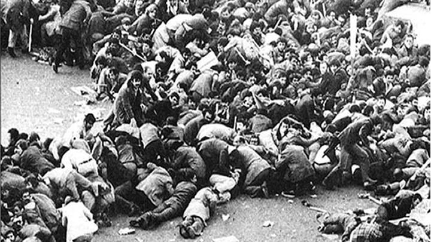
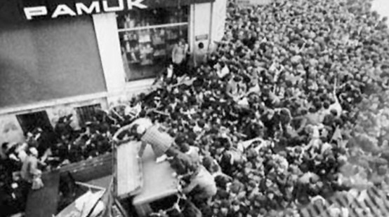
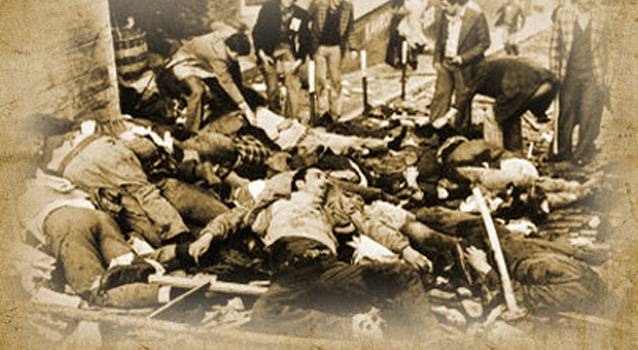

1 mayıs birçok ülkede İşçi Bayramı olarak kutlanıyor. İlk kez 1856 yılında Avustralya'da başlayan bu olay 1889 yılında İşçi Bayramı olarak kabul edildi ve günümüze kadar geldi. 1 Mayıs Türkiye'de ilk kez 1923 yılında yasal olarak "İşçi Bayramı" olarak kabul edildi. Ancak 1924 yılında kitlesel kutlama yasaklandı. Yine de devam eden bu kutlamalar 1977 yılında kana bulandı. Türkiye'nin failleri bulunamayan en kanlı olaylarından biri olarak tarihe geçti. Bu olayda 34 kişi hayatını kaybetmiş 136 kişide yaralanmıştı. Peki ya bu olay nasıl oldu?

1 Mayıs 1977'de Disk önderliğinde Taksim Meydanı'nda organizasyon düzenledi. Organizasyona çevre çevre illerden yaklaşık 500 bin kişi katıldı. Katılım yüksek olduğundan kortejlerin alana girmesi uzun sürmüştü. Bu nedenle miting uzamıştı. Disk üyesi sendikalar yerleştikten sonra dönemin Disk başkanı Kemal Türkler konuşmasına başladı. Konuşmanın sonuna doğru aniden silah sesleri duyuldu. Bölgedeki Sular İdaresi binasının ve Etap Marmara Oteli'nin çeşitli katlarından ateş ediliyordu. Açılan ateş sonucu halk paniğe kapıldı. İnsanlar panik halinde kaçışırken bölgedeki polis panzerleri de halkın üzerine doğru giderek onları sıkıştırmaya başladı. Panzerler halkı Kazancı Yokuşu'na doğru itiyordu. Kazancı Yokuşu'nu ise bir kamyon kapatmış durumdaydı. Kazancı Yokuşu'ndan kaçmak isteyen halk tekrar açılan ateşler sonucu iyice paniklemişti. Panikleyen halk birbirini ezerek kaçmaya devam etti. Bu esnada birçok insan ezilerek, vurularak ve panzer altında kalarak hayatını kaybetti. Ölenlerin 28'i ezilerek, 5'i vurularak 1 kişi ise panzer altında kalarak can verdi. 130 kişi ise yaralandı. Ölenlerin çoğu Kazancı Yokuşu'nu kapatan kamyon yüzünden sıkışarak ölmüşlerdi.

      

Bu olaydan sonra 470 kişi gözaltına alındı ancak yine de hiçbirinin olayla bir ilgisi bulunamadı. Bu kanlı olaya kimlerin sebep olduğu, otelden kimlerin ateş açtığı bulunamadı. 34 insanın feci şekilde hayatını kaybettiği bu olay Türkiye tarihine failleri bulunamayan kanlı olaylardan biri olarak kazındı.

