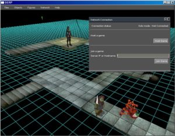
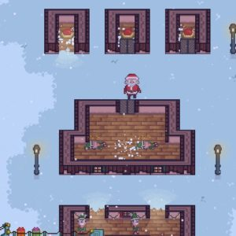
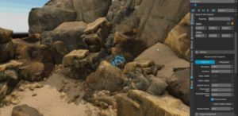
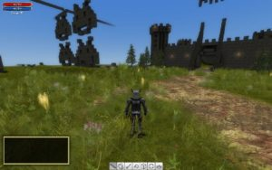
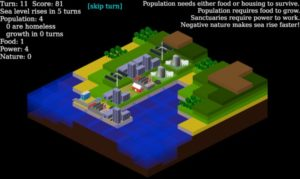
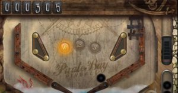
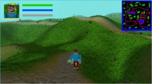
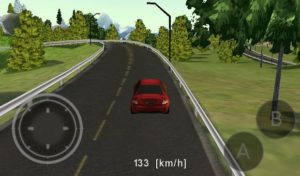
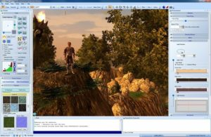

Oyun yapmak eğlenceli bir etkinlik, bu işi kolaylaştıracak bir dünya oyun motoru var. Bu yazımı size daha fazla seçenek göstermek ve rehber olabilmek için yazdım. Hedeflediğiniz platforma oyun geliştirebilmeniz için onlarca ücretsiz alternatif var. Sonuçta sizden ücret talep eden popüler oyun motorları kaderiniz değil, hem belki de aklınızdaki oyunu geliştirmek için yeni bir yazılım dili de öğrenmeniz gerekmiyor.

Bu yazıyı okuyan kişisel, eğitimsel veya ticari amaçlarla oyun geliştirecek kişilere önerim, öncelikli olarak platformlara, sonrasında lisanslamaya göre arşive göz gezdirmeleridir.

Başlamadan önce şu bilgiyi vereyim, buradaki bilgiler kütüphane/yazılımların web sitelerinden alındı, fakat bu yazıyı siz gelecekte okuyor olabilirsiniz. Bu yüzden buradaki, en başta lisanslama gibi bilgileri kendiniz teyit etmeden bir işe girişmeyin.

Arşivi okumadan önce, burada geçen bazı kavramlar hakkında kısa bilgiler vermek istiyorum.

#### Lisans Türleri

<table><tbody><tr><td><strong>Adı</strong></td><td><h5><strong>Açıklaması</strong></h5></td></tr><tr><td><h5>BSD</h5></td><td>(Berkeley Source Distribution) GPL lisanslaması gibi açık kaynak ve ücretsizdir. GPL'e göre farkı şudur, ürettiğiniz yazılımı paylaşırken GPL sertifikalı veya ücretsiz dağıtmak zorunda değilsiniz. Kendi seçtiğiniz lisanslamayla dağıtabilirsiniz.</td></tr><tr><td><h5>GPL</h5></td><td>(General Public License) Açık kaynak ve ücretsizdir. Kodu kullanabilir, derleyebilir ve paylaşabilirsiniz. Fakat sizin de GPL lisanslama yapmanız ve paylaştığınız ürünün elde ettiğiniz kod gibi ücretsiz olması gerekir.</td></tr><tr><td><h5>Proprietary</h5></td><td>Çoğunlukla ücretsizdir. Fakat en kısıtlı lisanslama olabilir. Düzenlenilemez veya yeniden paylaşılamaz. Tüm hakları saklıdır.</td></tr><tr><td><h5>MIT</h5></td><td>Ücretsiz ve açık kaynaklıdır. Üretilen yazılımın dağıtımı, alt-lisanslama yapması, ücret karşı satılması mümkündür. Fakat, orjinal MIT lisansı dağıtımda içerilmeli, bunun sayesinde orjinal dağıtıma referans verilmiş olmalıdır.&nbsp;</td></tr><tr><td><h5>Commercial</h5></td><td>Değişken bir lisans türüdür. Tek seferlik ödeme, belirli sürede bir ödeme veya belirli bir koşul altında ödeme isteyebilir. Üretilen yazılımın satılışı için herhangi bir koşulla ücret istenilebilir. Fakat cüzi bir miktar para ödedikten sonra üretilen yazılımın dağıtımının tüm haklarına da sahip olabilirsiniz. Bu bilgiler için kullanacağınız yazılımın web sitesinden destek alınız.</td></tr><tr><td><h5>Public Domain</h5></td><td>Açık kaynaklı ve ücretsizdir. En rahat lisanslama tipidir, eğer bu lisanlama varsa, yazılımı kullanıp kendi ürettiğiniz şeyi özgürce dağıtabilirsiniz.</td></tr><tr><td><h5>LGPL</h5></td><td>(Lesser General Public License) Belli bir kısmı açık kaynak olabilir, ücretsizdir. Eğer kütüphaneyi sadece derler ve kullanırsanız, kendi çalışmanızı istediğiniz lisanslamayla paylaşabilirsiniz, fakat eğer kütüphanede bir değişiklik yaparsanız veya kod öbeği çalarsanız, LGPL'deki gibi sınırlamalar olan bir lisansla paylaşmanız gerekir.</td></tr><tr><td><h5>Creative Commons</h5></td><td>Eserin, orjinal sahibinden itibaren katkı sağlayan herkese atıf yapıldığı takdirde izin alınmadan kullanımını serbest bırakabilen lisanslama türüdür. Çeşitli ek kısıtları olabilir, eğer bu lisanslamaya sahip bir yazılım kullanacaksanız, lütfen kullanacağınız yazılımın web sitesinden gerekli ek bilgiyi alın.</td></tr><tr><td><h5>Zlib</h5></td><td>Açık kaynak ve ücretsizdir. Fakat özgün yazılımı sizin yazdığınızı ve üretilen yazılımın özgün olduğunu iddia edemez, aynı zamanda kullandığınız yazılımın lisans dosyalarını silemezsiniz.</td></tr></tbody></table>

#### Yazılım Türleri

<table><tbody><tr><td><h5><strong>Adı</strong></h5></td><td><h5><strong>Açıklaması</strong></h5></td></tr><tr><td><h5>Oyun Motoru</h5></td><td>Temelinde bir grafik kütüphanesi, render kütüphanesi buna benzer araçları bulunan, çoğunlukla kullanıcı arayüzü bulunan, oyun yapmaya yönelik geliştirme ortamlarıdır.</td></tr><tr><td><h5>Geliştirme Kütüphanesi</h5></td><td>Kullanılan programlama dilinde yazılımcının yükünü hafifletmek için çeşitli grafik ve sese yönelik araçları bulunan yazılım kütühaneleri için veya Framework'ler için kullanılmıştır.</td></tr><tr><td><h5>3D Grafik Motoru</h5></td><td>Direkt olarak oyun yapmaya yönelik olmayan, 3d render ve grafik kütüphaneleri bulunduran, çoğunlukla kullanıcı arayüzü olan yazılımlardır.</td></tr><tr><td><h5>SDK</h5></td><td>Bir oyunun geliştirilebilmesi için gerekli araçları bulunduran, fakat bunlar için bir kullanıcı arayüzü bulundurmayan yazılım kütüphaneleridir.</td></tr><tr><td><h5>Grafiksel Roman Motoru</h5></td><td>Resim ve yazılardan oluşan, interaktif oyunlar yapmak için kullanılan, kullanıcı arayüzü bulunan yazılımlardır.</td></tr><tr><td><h5>Oyun Yapma Oyunu</h5></td><td>Genellikle oyun oynar gibi oyun yapabildiğiniz, geliştirme ortamı daraltılıp "level design" yönüne ağırlık verilmiş, az bir kısmının programlamaya kısıtlı olarak izin verdiği oyun yapma yazılımlarıdır.</td></tr></tbody></table>

#### Agar Engine

**Tür:** Geliştirme Kütüphanesi

**Dil:** ANSI C

**Çıkış Yılı:** Bu konuda detaylı bilgi bulamadım. Bulabildiğim en eski tarih 2003 yılı. Halen daha güncel.

**Nedir:** Agar veya libAgar bir açık kaynak çok platformlu arayüz geliştirme aracıdır. Grafiksel Kullanıcı Arayüzleri oluşturmak için bir dizi kütüphanedir.

**Platformlar:** Ürettiği uygulamalar X11, Windows, MacOS X, SDL ve buradaki diğer yapılar üzerinde native olarak çalışmaktadır. Ayrıca Framebuffer’lara, SDL ve OpenGL’e de eklenebilir ve bir pencere yöneticisi olarak kullanılabilir.

**Lisanslama:** BSD

**Web Sitesi:** [http://libagar.org/](http://libagar.org/)

**Topluluk Sayfası:** [http://libagar.org/lists.html](http://libagar.org/lists.html)

#### **Allegro Engine**

**Tür:** Geliştirme Kütüphanesi

**Dil:** C ve C++ (gcc, clang, MSVC)

**Çıkış Yılı:** Geçmişinde DOS/DJGPP için çıkan Allegro 2.0’a kadar ilerleyebildim, o da 1996 yılında çıkmış.

**Nedir:** Allegro multimedia ve oyun programlamayı hedeflemiş çok platformlu bir kütüphanedir. Pencere oluşturma, kullancıdan girdi alma, veri yükleme, grafik çizme, ses oynatma vb. alt seviye işleri halledebilmektedir.

**Platformlar:** Windows, Linux, Mac OSX, iPhone, Android

**Lisanslama:** İsteyen herkes ticari amaç dahil olmak üzere kullanabilir, tabi bunun ufak koşulları var buradan bu koşullara ulaşabilirsiniz.

**Web Sitesi:** [https://liballeg.org/](https://liballeg.org/)

**Topluluk Sayfası:** [https://www.allegro.cc/](https://www.allegro.cc/)

#### **Axiom Engine**

 

**Tür:** 3D Grafik Motoru

**Dil:** C#

**Çıkış Yılı:** 2006

**Nedir:** Axiom 3D Render Motoru tamamen obje yönelimli 3D grafik motorudur. Hedef platform olarak .NET framework kullanmaktadır. OGRE grafik motorunun bir portudur.

**Platformlar:** DirectX, OpenGL, XNA, Windows, Linux, Android, iPhone, Windows Phone

**Lisanslama:** LGPL

**Web Sitesi:** [http://axiomengine.sourceforge.net/wiki/index.php/Main\_Page](http://axiomengine.sourceforge.net/wiki/index.php/Main_Page)

**Topluluk Sayfası:** [http://axiomengine.sourceforge.net/forums/](http://axiomengine.sourceforge.net/forums/)

#### **Catmother Engine**

**Tür:** 3D Grafik Motoru

**Dil:** C++

**Çıkış Yılı:** 2002

**Nedir:** Cat Mother Ltd. Firmasının geliştirdiği motor. Firma kapatılınca motor açık kaynak olarak sunuldu. Ayrıca Dead Justice isimli bir oyunu demo olarak da dunuyorlar web sitesinde.

**Platformlar:** DirectX9, Windows

**Lisanslama:** Kaynak kodu BSD, içerik GPL

**Web Sitesi:** [http://catmother.sourceforge.net/](http://catmother.sourceforge.net/)

#### **Crystal Space 3D**

 

**Tür:** SDK

**Dil:** C++

**Çıkış Yılı:** 1997

**Nedir:** 3D uygulamalar geliştirmek için oluşturulmuş bir framework.

**Platformlar:** Linux, Unix, Windows, Mac OSX

**Lisanslama:** GNU LGPL

**Web Sitesi:** [https://sourceforge.net/projects/crystal/](https://sourceforge.net/projects/crystal/)

**Topluluk:** [https://sourceforge.net/p/crystal/discussion/](https://sourceforge.net/p/crystal/discussion/)

#### **Drag\[en\]gine**

![Drag[en]gine motoruyla yapılmış bir oyun](images/dragengine-2-sabahlatan-300x188.jpg) ![Drag[en]gine motorundan bir görsel](../images/dragengine-1-sabahlatan-300x201.jpg)

**Tür:** Oyun Motoru

**Dil:** DragonScript, Smalltalk, Python (Seçilen Scripting modülüne göre)

**Çıkış Yılı:** 2007

**Nedir:** Drag\[en\]gine tam teşekküllü bir oyun motorudur. Ayırt edici özelliği, ilginç bir şekilde yapısı bir işletim sistemine benzemektedir. Modules isimli modülünün bütün fonksiyonelliği aygıt sürücülerilerine bağlıdır. Motor kendi başına system kernel yönetici modülü gibidir, sistemin en alt seviyesindeki kaynaklar kullanılabilir. Bu yüzden geliştirici alt seviye sorunlardan etkilenmeyecektir. Modüller ekleyerek motorun özellikleri değiştirilebilmektedir.

**Platformlar:** Windows, Linux

**Lisanslama:** LGPL

**Web Sitesi:** [https://dragengine.rptd.ch/](https://dragengine.rptd.ch/)

**Topluluk:** [https://www.moddb.com/engines/dragengine/articles](https://www.moddb.com/engines/dragengine/articles)

#### **001 Game Creator**

 

**Tür:** Oyun Motoru

**Dil:** Grafiksel

**Çıkış Yılı:** 2015

**Nedir:** Geliştiricilerin prototiplerini hızlıca üretebileceği, çapraz platform, tek ve çok oyunculu oyunlar tasarlayabileceği bir oyun geliştirme ortamıdır.

**Platformlar:** Windows, HTML5, Native Android/iOS

**Lisanslama:** Commercial 

**Web Sitesi:** [https://001gamecreator.com/](https://001gamecreator.com/)

**Topluluk:** [https://steamcommunity.com/app/347400](https://steamcommunity.com/app/347400)

#### **LITIengine**

 

**Tür:** Oyun Motoru

**Dil:** Java

**Çıkış Yılı:** 2017

**Nedir:** LITIengine bedava, açık kaynaklı ve öğrenmesi basit bir 2D Java oyun motorudur. 2D Fizik Motoru, 2D Render Motoru, 2D Ses Motoru, Partikül Sistemi ve Tiled Map(.tmx) desteği mevcuttur.

**Platformlar:** Linux, Windows, Mac OSX

**Lisanslama:** MIT

**Web Sitesi:** [https://litiengine.com/](https://litiengine.com/)

**Topluluk:** [https://forum.litiengine.com/](https://forum.litiengine.com/)

#### **Build Engine**

 

**Tür:** Oyun Motoru

**Dil:** C

**Çıkış Yılı:** 1995

**Nedir:** 3D Realms, Duke Nukem 3D, Blood, Shadow Warrior, Redneck Rampage gibi oyunların yapıldığı oyun motorudur. Build Engine 2D bir grid görünümünde sahte 3D oyunlar oluşturmanıza yardımcı olan bir oyun motorudur.

**Platformlar:** Linux, Windows, Mac OSX

**Lisanslama:** Proprietary

**Web Sitesi:** [http://advsys.net/ken/buildsrc/](http://advsys.net/ken/buildsrc/)

**Topluluk:** [https://www.moddb.com/engines/build/articles](https://www.moddb.com/engines/build/articles)

#### **Tyrano Builder**

 

**Tür:** Grafiksel Roman Motoru

**Dil:** TyranoScript

**Çıkış Yılı:** 2015

**Nedir:** TyranoBuilder ve TyranoScript görsel romanlar oluşturmak için yapılmıuş bir grafiksel roman motorudur.

**Platformlar:** Windows, Mac OS

**Lisanslama:** Commercial 

**Web Sitesi:** [https://tyranobuilder.com/](https://tyranobuilder.com/)

**Topluluk:** [https://steamcommunity.com/app/345370](https://steamcommunity.com/app/345370)

#### Ren'Py Engine

 

**Tür:** Grafiksel Roman Motoru

**Dil:** Python tabanlı bir script dili

**Çıkış Yılı:** 2012

**Nedir:** Ren’Py 2D hikaye oyunları hazırlamak için oluşturulmuş çapraz platform grafiksel roman motorudur.  Bu zmaana kadar 1500’ün üzerinde görsel roman, oyun vb çalışmalarda kullanılmıştır.

**Platformlar:** HTML5, Linux, Windows, Mac OSX, Android, iOS

**Lisanslama:** MIT

**Web Sitesi:** [https://renpy.org/](https://renpy.org/)

**Topluluk:** [https://www.moddb.com/engines/renpy/articles](https://www.moddb.com/engines/renpy/articles)

#### CopperCube Engine

 

**Tür:** Oyun Motoru

**Dil:** JavaScript

**Çıkış Yılı:** 2014

**Nedir:** Render için OpenGL, Direct3D, WebGL ve Stage3D kullanabilen çapraz platform, kullanması kolay bir oyun motorudur.

**Platformlar:** Linux, Windows, Mac OSX, WebGL

**Lisanslama:** Commercial 

**Web Sitesi:** [https://www.ambiera.com/coppercube/](https://www.ambiera.com/coppercube/)

**Topluluk:** [https://www.ambiera.com/forum.php](https://www.ambiera.com/forum.php)

#### Bright Engine

 

**Tür:** Oyun Motoru, 3D Grafik Motoru

**Dil:** C++

**Çıkış Yılı:** 2017

**Nedir:** Halen geliştirme sürecinde olan, oyun veya animasyon sahneleri oluşturma için kullanılabilecek render motorudur.

**Platformlar:** Windows, Linux

**Lisanslama:** Commercial

**Web Sitesi:** [https://gajatixstudios.co.uk/](https://gajatixstudios.co.uk/)

**Topluluk:** [https://gajatixstudios.co.uk/community/forums](https://gajatixstudios.co.uk/community/forums)

#### Genesis3D

 

**Tür:** Oyun Motoru

**Dil:** C++

**Çıkış Yılı:** 1999

**Nedir:** İlk açık kaynaklı oyun ve render motorlarından biridir.

**Platformlar:** Windows

**Lisanslama:** Creative Commons

**Web Sitesi:** [http://genesis3d.com/](http://genesis3d.com/)

**Topluluk:** [http://genesis3d.com/forum/](http://genesis3d.com/forum/)

#### Esenthel Engine

 

**Tür:** Oyun Motoru

**Dil:** C++

**Çıkış Yılı:** 2008

**Nedir:** Esenthel ismini Essential(Esas) ve Essence(Esans) kelimelerinden almıştır. Motor geniş bir topluluğa sahip, bu yüzden dokümantasyon ve ders bulmak kolay. Ürettiğiniz içerikleri satabildiğiniz bir Esenther Store’u var. Yapılan çalışmalar genellikle 3D oyunlar.

**Platformlar:** Linux, Windows, Mac OSX, VR, Web, Mobile

**Lisanslama:** Commercial

**Web Sitesi:** [http://www.esenthel.com/](http://www.esenthel.com/)

**Topluluk:** [https://www.esenthel.com/forum/](https://www.esenthel.com/forum/)

#### LÖVE 2D

 

**Tür:** Geliştirme Kütüphanesi (Framework)

**Dil:** Lua

**Çıkış Yılı:** 2008

**Nedir:** LÖVE, Lua dilinde 2D oyunlar geliştirmenize olanak sağlayan açık kaynaklı bir frameworktür.

**Platformlar:** Linux, Windows, Mac OSX

**Lisanslama:** Zlib

**Web Sitesi:** [http://love2d.org/](http://love2d.org/)

**Topluluk:**  [http://love2d.org/forums/](http://love2d.org/forums/)

#### RPG in a Box Engine

 

**Tür:** Oyun Motoru

**Dil:** Özelleştirilmiş

**Çıkış Yılı:** 2019

**Nedir:** 3D grid(\*) bazlı, voxel tarzlı RPG ve macera türünde oyun yapmak istiyorsanız, RPG in a Box’ da tam bu iş için yapılmış.

**Platformlar:** Linux, Windows, Mac OSX

**Lisanslama:** Commercial

**Web Sitesi:** [https://www.rpginabox.com/](https://www.rpginabox.com/)

**Topluluk:** [https://steamcommunity.com/app/498310/discussions](https://steamcommunity.com/app/498310/discussions)

#### ggez

 

**Tür:** Geliştirme Kütüphanesi (Framework)

**Dil:** Rust

**Çıkış Yılı:** 2015

**Nedir:** ggez, LÖVE framework yapısında Rust için oluşturulmuş bir hafif, kızlı ve çapraz platform olan bir 2D oyun geliştirme frameworküdür. Bu demektir ki, 2D çizim, ses, kaynak yükleme, olay işleme gibi işlemlerin hepsini yapabilmektedir.

**Platformlar:** Linux, Windows, Mac OSX

**Lisanslama:** MIT

**Web Sitesi:** [https://ggez.rs/](https://ggez.rs/)

**Topluluk:** [https://github.com/ggez/ggez/issues](https://github.com/ggez/ggez/issues)

#### ENIGMA Development Environment

 

**Tür:**  Oyun Motoru

**Dil:** Özelleştirilmiş(EDL, isimli GML ve C++ karışımı bir dil)

**Çıkış Yılı:** 2007

**Nedir:** ENIGMA, açık kaynaklı çapraz platform oyun geliştirme ortamıdır. Popüler oyun motoru Game Maker’dan türetilmiştir. LateralGM gibi bir IDE tarafından veya komut satırı arayüzü tarafından(CLI) kullanılabilir.

**Platformlar:** Linux, Windows, Mac OSX

**Lisanslama:** GPL

**Web Sitesi:** [https://enigma-dev.org/](https://enigma-dev.org/)

**Topluluk:** [https://enigma-dev.org/forums/](https://enigma-dev.org/forums/)

#### nCine Engine

 

**Tür:**  Oyun Motoru

**Dil:** C, C++, Lua

**Çıkış Yılı:** 2019

**Nedir:** nCine C++ ile yazılmış çapraz platform bir 2D oyun motorudur.

**Platformlar:** Linux, Windows, Mac OSX, Android, Web, Emscripten

**Lisanslama:** MIT

**Web Sitesi:** [https://ncine.github.io/](https://ncine.github.io/)

#### FOnline Engine

 

**Tür:** Oyun Motoru

**Dil:** Mono C#, Native C++, AngelScript

**Çıkış Yılı:** 2010

**Nedir:** FOnline Fallout ve Fallout 2 tarzında oyunlar yapılması için geliştirilmiş bir oyun motorudur. 

**Platformlar:** Linux, Windows

**Lisanslama:** Proprietary

**Web Sitesi:** [https://fonline.ru/](https://fonline.ru/)

#### BlitzMax Engine

 

**Tür:** Oyun Motoru

**Dil:** BlitzMax Source Code

**Çıkış Yılı:** 2004

**Nedir:** İçinde BlitzMax derleyici, BlitzMax modülleri, Max2D grafik modülü, IDE, debug aracı, örnek kodlar ve dokümentasyon içeren bir 2D oyun motorudur.

**Platformlar:** Linux, Windows, Mc OSX, Mobil, Raspberry Pi, Nintendo Switch

**Lisanslama:** Commercial

**Web Sitesi:** [https://blitzmax.org/](https://blitzmax.org/)

**Topluluk:** [https://blitzmax.org/docs/en/community/resources/](https://blitzmax.org/docs/en/community/resources/)

#### Wade Engine

 

**Tür:** Oyun Motoru

**Dil:** JavaScript, CSS, HTML

**Çıkış Yılı:** 2013

**Nedir:** HTML5 ile oyunlar ve uygulamalar yapan, güzel tasarlanmış, işinizi bayağı kolaylaştıracak şaşırtıcı derecede ilginç bir oyun motorudur. Chrome browser üzerinde çalışıyor, bu yüzden her yerde ulaşmanız mümkün. 

**Platformlar:** Windows, Mac, Linux, Web, Mobile,  iPad, AndroidTab, AndroidConsole, Metro, MetroTab, XONE, X360, PS4, WiiU

**Lisanslama:** Proprietary

**Web Sitesi:** [http://clockworkchilli.com/](http://clockworkchilli.com/)

**Topluluk:** [http://clockworkchilli.com/forum](http://clockworkchilli.com/forum)

#### LambdaHack

**Tür:** Geliştirme Kütüphanesi

**Dil:** Haskell

**Çıkış Yılı:** 2019

**Nedir:** ASCII oyunlar yapmanıza olanak sağlayan oyun motoru kütüphanesidir.

**Platformlar:** Linux, Windows, Mac OSX, Web

**Lisanslama:** BSD

**Web Sitesi:** [https://github.com/LambdaHack/LambdaHack](https://github.com/LambdaHack/LambdaHack)

**Topluluk:** [https://github.com/LambdaHack/LambdaHack/issues](https://github.com/LambdaHack/LambdaHack/issues)

#### OGS Engine

**Tür:** Oyun Motoru

**Dil:** C

**Çıkış Yılı:** 2018

**Nedir:** GoldSource oyun motoru reimplementasyonu olan OGS, orjinal idTech 2 oyun motoru (NetQuake,QuakeWorld,Quake 2) kaynak kodu üzerine ters mühendislik yapılmadan yazılmış bir oyun motorudur.

**Platformlar:** Windows

**Lisanslama:** GPL

**Web Sitesi:** [https://gitlab.com/BlackPhrase/OGS](https://gitlab.com/BlackPhrase/OGS)

**Topluluk:** [https://gitlab.com/BlackPhrase/OGS/-/issues](https://gitlab.com/BlackPhrase/OGS/-/issues)

#### Orx Portable Engine

 

**Tür:** Oyun Motoru

**Dil:** C/C++

**Çıkış Yılı:** 2010

**Nedir:** Orx açık kaynaklı, taşınabilir, hafif, eklenti tabanlı, kullanımı basit bir 2D oyun motorudur

**Platformlar:** Linux, Windows, Mac OSX, Mobil, iPad, AndroidTab

**Lisanslama:** ZLIB

**Web Sitesi:** [https://orx-project.org/](https://orx-project.org/)

**Topluluk:** [https://forum.orx-project.org/](https://forum.orx-project.org/)

#### OpenMW

 

**Tür: ** Oyun Motoru

**Dil:** C++

**Çıkış Yılı:** 2008

**Nedir:** The Elder Scrolls 3: Morrowind oyununu bilirsiniz. Morrowind oyununun üzerinde geliştrime yapılabilmesi için oluşturulmuş bağımsız bir oyun motorudur.

**Platformlar:** Linux, Windows, Mac OSX

**Lisanslama:** GPL

**Web Sitesi:** [https://openmw.org/en/](https://openmw.org/en/)

**Topluluk:** [https://forum.openmw.org/](https://forum.openmw.org/)

#### Gideros Engine

 

**Tür:** Oyun Motoru

**Dil:** Lua

**Çıkış Yılı:** 2011

**Nedir:** Gideos çapraz platform oyunlar yapmanıza olanak sağlar. Bedava ve açık kaynaklıdır. Gideros ile online olarak da çalışmalar yapabilirsiniz.

**Platformlar:** Windows, Mac OSX, Mobile, iOS, iPad, Android, AndroidTab, AndroidConsole, Metro, MetroTab

**Lisanslama:** MIT

**Web Sitesi:** [http://giderosmobile.com/](http://giderosmobile.com/)

**Topluluk:** [http://forum.giderosmobile.com/](http://forum.giderosmobile.com/)

#### Construct 3

 

**Tür:**  Oyun Motoru

**Dil:** JavaScript

**Çıkış Yılı:** 2017

**Nedir:** 100000 den fazla kullanıcısı olan çapraz platform bir oyun motorudur.

**Platformlar:** Windows, Mac, Linux, Web, iOS, Android, XONE

**Lisanslama:** Commercial 

**Web Sitesi:** [https://www.construct.net/en](https://www.construct.net/en)

**Topluluk:** [https://www.construct.net/en/forum](https://www.construct.net/en/forum)

#### Lightweight Java Game Library (LWJGL)

 

**Tür:** Geliştirme Kütüphanesi

**Dil:** Java

**Çıkış Yılı:** 2002

**Nedir:** OpenGL, OpenAL kullanan her türlü Java oyunu geliştirmek için hazırlanılmış bir kütüphanedir.

**Platformlar:** Linux, Windows, Mac OSX

**Lisanslama:** BSD

**Web Sitesi:** [http://lwjgl.org/](http://lwjgl.org/)

**Topluluk:** [http://forum.lwjgl.org/](http://forum.lwjgl.org/)

#### Limon Engine

 

**Tür:** Oyun Motoru

**Dil:** C++

**Çıkış Yılı:** 2018

**Nedir:** Engin Manap isimli bir Türk önderliğinde geliştirilen FPS türünde oyunlar yapmak üzere geliştirilmiş bir 3D oyun motorudur.

**Platformlar:** Linux, Windows, Mac OSX

**Lisanslama:** LGPL

**Web Sitesi:** [http://limonengine.com/](http://limonengine.com/)

**Topluluk:** [https://github.com/enginmanap/limonEngine/issues](https://github.com/enginmanap/limonEngine/issues)

#### Smile Game Builder

 

**Tür:** Oyun Yapma Oyunu

**Çıkış Yılı:** 2016

**Nedir:** Windows için herhangi bir programlama yapmadan RPG türünde oyunlar yapmanızı sağlayan bir motordur.

**Platformlar:** Windows

**Lisanslama:** Commercial

**Web Sitesi:** [http://smilegamebuilder.com/en/](http://smilegamebuilder.com/en/)

**Topluluk:** [https://www.facebook.com/smilegamebuilder/](https://www.facebook.com/smilegamebuilder/)

#### BABYLON.js

 

**Tür:** Geliştirme Kütüphanesi

**Dil:** JavaScript

**Çıkış Yılı:** 2013

**Nedir:** Çapraz platform oyunlar tasarlamak için bir geliştirme kütüphanesidir.

**Platformlar:** Windows, Mac, Linux, VR, AR, Web, iOS, Android, XONE

**Lisanslama:** MIT

**Web Sitesi:** [https://www.babylonjs.com/](https://www.babylonjs.com/)

**Topluluk:** [https://forum.babylonjs.com/](https://forum.babylonjs.com/)

#### Intersect Engine

 

**Tür:** Oyun Motoru

**Dil:** C#

**Nedir:** Intersect 2D MMORPG yapmak için üretilmiş bir oyun motorudur.

**Platformlar:** Windows

**Lisanslama:** GPL

**Web Sitesi:** [https://www.freemmorpgmaker.com/](https://www.freemmorpgmaker.com/)

**Topluluk:** [https://www.ascensiongamedev.com/](https://www.ascensiongamedev.com/)

#### Leadwerks Engine

 

**Tür:** Oyun Motoru

**Dil:** C++, Lua

**Çıkış Yılı:** 2014

**Nedir:** Leadwerks 3D oyunlar tasarlamanızı kolaylaştıracak bir oyun motorudur.

**Platformlar:** Windows, Linux

**Lisanslama:** Commercial

**Web Sitesi:** [https://www.leadwerks.com/](https://www.leadwerks.com/)

**Topluluk:** [https://www.leadwerks.com/community/](https://www.leadwerks.com/community/)

**M.U.G.E.N**

 

**Tür:** Oyun Yapma Oyunu

**Çıkış Yılı:** 2001

**Nedir:** Bu zamana kadar pek çok M.U.G.E.N oyunuyla karşılaşmış olduğunuza eminim. Aslında 2D platform dövüş oyunu olarak tasarlanmış bir oyunu düzenliyor, kendi karakter, animasyon ve seslerinizi ekliyor gibisiniz.

**Platformlar:** Linux, Windows, DOS, XBOX, PS3

**Lisanslama:** GPL

**Web Sitesi:**  [http://www.elecbyte.com/mugendocs-11b1/mugen.html](http://www.elecbyte.com/mugendocs-11b1/mugen.html)

#### HaxePunk Engine

 

**Tür:** Oyun Motoru

**Dil:** Haxe

**Çıkış Yılı:** 2011

**Nedir:** HaxePunk, FlashPunk oyun motoru üzerine bina edilmiş, çapraz platform oyunlar hazırlamak için yapılmış açık kaynaklı bir oyun motorudur.

**Platformlar:** Windows, Mac, Linux, Flash, iOS, iPad, Android, AndroidTab, AndroidConsole

**Lisanslama:** MIT

**Web Sitesi:** [http://haxepunk.com/](http://haxepunk.com/)

**Topluluk:** [http://forum.haxepunk.com/](http://forum.haxepunk.com/)

#### Irrlicht 3D Engine

 

**Tür:** Oyun Motoru

**Dil:** C++, .NET

**Çıkış Yılı:** 2004

**Nedir:** Irrlicht Engine açık kaynaklı, yüksek performanslı, gerçek zamanlı 3D bir oyun motorudur. D3D, OpenGL ve kendi render yazılımıyla çalışır ve çapraz platformludur.

**Platformlar:** Linux, Windows, Mac OSX

**Lisanslama:** GPL

**Web Sitesi:** [http://irrlicht.sourceforge.net/](http://irrlicht.sourceforge.net/)

**Topluluk:** [http://irrlicht.sourceforge.net/forum/](http://irrlicht.sourceforge.net/forum/)

#### INSTEAD3 Engine

 

**Tür:** Oyun Motoru

**Dil:** Lua

**Çıkış Yılı:** 2014

**Nedir:** Asıl amacı görsel roman, yazı tabanlı oyunlar yapmak olan bir oyun motorudur, fakat 2D oyunlar geliştirmek için de kullanılabilir. Çapraz platform ve ücretsizdir.

**Platformlar:** Windows, Mac, Linux, Web, iOS, iPad, Android

**Lisanslama:** MIT

**Web Sitesi:** [https://instead3.syscall.ru/en/](https://instead3.syscall.ru/en/)

**Topluluk:** [https://www.moddb.com/engines/instead/articles](https://www.moddb.com/engines/instead/articles)

#### Lumix Engine

 

**Tür:** Oyun Motoru

**Dil:** Lua

**Çıkış Yılı:** 2014

**Nedir:** Lumix Engine açık kaynaklı, eklenti tabanlı, 3D oyun motorudur. Kullanıcı dostu bir arayüzü vardır.

**Platformlar:** Linux, Windows

**Lisanslama:** MIT

**Web Sitesi:** [https://mikulasflorek.itch.io/lumix-engine](https://mikulasflorek.itch.io/lumix-engine)

**Topluluk:** [https://github.com/nem0/lumixengine/issues](https://github.com/nem0/lumixengine/issues)

#### 3D GameStudio A8

 

**Tür:** Oyun Motoru

**Dil:** lite-C

**Çıkış Yılı:** 2010

**Nedir:** Birden fazla modülden oluşan bir 3D oyun motorudur. SüperCan, KABUS 22, C4 ROBOT gibi oyunlar bu oyun motoruyla yapılmıştır.

**Platformlar:** Windows

**Lisanslama:** Commercial

**Web Sitesi:** [http://www.3dgamestudio.com/](http://www.3dgamestudio.com/)

**Topluluk:** [https://opserver.de/ubb7/](https://opserver.de/ubb7/)

#### Run3 Engine

 

**Tür:** Oyun Motoru

**Dil:** Lua

**Çıkış Yılı:** 2017

**Nedir:** FPS tarzı oyunlar geliştirmek için yapılmış 3d oyun motorudur.

**Platformlar:** Windows

**Lisanslama:** MIT

**Web Sitesi:** [https://sgl-team.3dn.ru/index/run3\_game\_engine/0-4](https://sgl-team.3dn.ru/index/run3_game_engine/0-4)

**Topluluk:** [https://sgl-team.3dn.ru/forum/](https://sgl-team.3dn.ru/forum/)

#### PlayCanvas Engine

 

**Tür:** Oyun Motoru

**Dil:** JavaScript

**Çıkış Yılı:** 2013

**Nedir:** Tamamen tarayıcıda WebGL sayesinde çalışan 3D oyun motorudur.

**Platformlar:** Windows, Mac, Linux, Web, Mobile, iOS, iPad, Android, AndroidTab, AndroidConsole, Metro, MetroTab

**Lisanslama:** Commercial

**Web Sitesi:** [https://playcanvas.com/](https://playcanvas.com/)

**Topluluk:** [https://forum.playcanvas.com/](https://forum.playcanvas.com/)

#### CryENGINE

 

**Tür:** Oyun Motoru

**Dil:** Lua

**Çıkış Yılı:** 2004

**Nedir:** Grafiksel anlamda geliştiriciye büyük kolaylık sağlayan, 3D oyunlar yapmak için tasarlanmış bir oyun motorudur.

**Platformlar:** Windows

**Lisanslama:** Commercial

**Web Sitesi:** [https://www.cryengine.com/](https://www.cryengine.com/)

**Topluluk:** [https://forum.cryengine.com/](https://forum.cryengine.com/)

#### Eclipse Origins

 

**Tür: ** Oyun Motoru

**Çıkış Yılı:** 2013

**Nedir:** 2D Online RPG türünde oyunlar yapmak için tasarlanmış bir oyun motorudur. Halihazırda bir oyun olarak gelen Eclipse Origins’I düzenleyerek kendi online oyununuzu oluşturursunuz. XtremeWolrds motoruna aşırı derecede benzemektedir.

**Platformlar:** Windows

**Lisanslama:** Commercial

**Web Sitesi:** [https://www.eclipseorigins.com/](https://www.eclipseorigins.com/)

#### LANCE

 

**Tür:** Geliştirme Kütüphanesi

**Dil:** JavaScript

**Çıkış Yılı:** 2017

**Nedir:** Lance NODE.js tabanlı bir oyun sunucusudur.  Geliştiricilerin üzerinden networking yükünü almak için tasarlanmıştır.

**Platformlar:** VR, Web

**Lisanslama:** MIT

**Web Sitesi:** [http://lance.gg/](http://lance.gg/)

**Topluluk:** [https://stackoverflow.com/questions/tagged/lance](https://stackoverflow.com/questions/tagged/lance)

#### BYOND (Dream Maker)

 

**Tür:** Oyun Motoru

**Dil:** Dream Maker

**Çıkış Yılı:** 2000

**Nedir:** Dream Maker, BYOND platformunda 2D multiplayer oyunlar geliştirmek için oluşturulmuş bir programlama dilidir. BYOND hem oyun motoru hem de oyunların paylaşıldığı çalıştırma ortamıdır.

**Platformlar:** Linux, Windows, Mac OSX

**Lisanslama:** Public Domain

**Web Sitesi:** [http://www.byond.com/](http://www.byond.com/)

**Topluluk:** [http://www.byond.com/forum/](http://www.byond.com/forum/)

#### Div GO Engine

 

**Tür:** Oyun Motoru

**Dil:** Özelleştirilmiş

**Çıkış Yılı:** 2015

**Nedir:** Tarayıcınız üzerinden 2D veya 3D oyun yapmanızı sağlayan bir oyun motorudur.

**Platformlar:** Linux, Windows, Mac OSX, Web

**Lisanslama:** MIT

**Web Sitesi:** [https://www.divgo.net/](https://www.divgo.net/)

**Topluluk:** [https://forum.bennugd.org/index.php?board=103.0](https://forum.bennugd.org/index.php?board=103.0)

#### Kivy

 

**Tür:** Geliştirme Kütüphanesi

**Dil:** Python

**Çıkış Yılı:** 2011

**Nedir:** Kivy, gösrel olarak istediğinizi tasarlayabileceğiniz, çok platformlu bir Python kütüphanesidir.

**Platformlar:** Windows, Mac, Linux, iOS, Android

**Lisanslama:** MIT

**Web Sitesi:** [https://kivy.org/#home](https://kivy.org/#home)

**Topluluk:** [https://www.facebook.com/kivyframework](https://www.facebook.com/kivyframework)

#### IMPACT JS

 

**Tür:** Oyun Motoru

**Dil:** JavaScript

**Çıkış Yılı:** 2011

**Nedir:** Impact JS masaüstü veya mobil tarayıcılar için HTML5 oyunlar yapmanızı sağlayan bir oyun motorudur.

**Platformlar:** Windows, Mac, Linux, Web, Mobile, iOS, iPad, Android, AndroidTab, AndroidConsole, WiiU, Wii

**Lisanslama:** Commercial

**Web Sitesi:** [https://impactjs.com/](https://impactjs.com/)

**Topluluk:** [https://impactjs.com/forums](https://impactjs.com/forums)

#### Xenko Engine

 

**Tür:** Oyun Motoru

**Dil:** C#

**Çıkış Yılı:** 2014

**Nedir:** Xenko çapraz platform bir 3D oyun motorudur. Grafiksel anlamda sağladığı destek ve kullanıcı dostu arayüze sahiptir.

**Platformlar:** Windows, iOS, iPad, Android

**Lisanslama:** Proprietary

**Web Sitesi:** [https://xenko.com/](https://xenko.com/)

**Topluluk:** [https://xenko.com/community/](https://xenko.com/community/)

#### DarkBASIC Professional Engine

 

**Tür:** Oyun Motoru

**Dil:** BASIC

**Çıkış Yılı:** 2004

**Nedir:** BASIC diliyle 3D oyunlar yapabileceğiniz bir oyun motoru kütüphanesidir.

**Platformlar:** Windows

**Lisanslama:** Commercial

**Web Sitesi:** [https://www.thegamecreators.com/product/dark-basic-pro-open-source](https://www.thegamecreators.com/product/dark-basic-pro-open-source)

**Topluluk:** [https://github.com/TheGameCreators/Dark-Basic-Pro/issues](https://github.com/TheGameCreators/Dark-Basic-Pro/issues)

#### NeoAxis Engine

 

**Tür:** Oyun Motoru

**Dil:** C#, Görsel

**Çıkış Yılı:** 2006

**Nedir:** 3D oyun yapımına yönelik hazırlanmış, güncel bir oyun motorudur.

**Platformlar:** Windows, Mac OSX

**Lisanslama:** Proprietary

**Web Sitesi:** [https://www.neoaxis.com/](https://www.neoaxis.com/)

**Topluluk:** [https://www.neoaxis.com/community\_hub](https://www.neoaxis.com/community_hub)

#### Ambrose3D Engine

**Tür:** Oyun Motoru

**Dil:** C/C++

**Çıkış Yılı:** 2007

**Nedir:** OpenGL ve SDL tabanlı basit ama işe yarar bir 3D oyun motorudur.

**Platformlar:** Linux, Windows, Mac OSX

**Lisanslama:** GPL

**Web Sitesi:** [http://sol.gfxile.net/ambrose3d/](http://sol.gfxile.net/ambrose3d/)

#### CorEngine

 

**Tür:** Oyun Motoru

**Dil:** Lua/C

**Çıkış Yılı:** 2014

**Nedir:** OpenGL kullanan bir 3D oyun motorudur.

**Platformlar:** Windows

**Lisanslama:** LGPL

**Web Sitesi:** [http://corengine.sourceforge.net/](http://corengine.sourceforge.net/)

**Topluluk:** [https://sourceforge.net/p/corengine/forum/](https://sourceforge.net/p/corengine/forum/)

#### GamePlay 3D

 

**Tür:** Geliştirme Kütüphanesi

**Dil:** C++

**Çıkış Yılı:** 2011

**Nedir:** Açık kaynaklı, çapraz platform 2D ve 3D oyun geliştirme kütüphanesidir.

**Platformlar:** Windows, Mac, Linux, iOS, iPad, Android

**Lisanslama:** Public Domain

**Web Sitesi:** [http://gameplay3d.org/](http://gameplay3d.org/)

**Topluluk:** [http://gameplay3d.org/forums/](http://gameplay3d.org/forums/)

#### Adventure Game Engine

 

**Tür:** Oyun Motoru

**Dil:** Görsel

**Çıkış Yılı:** 2012

**Nedir:** Adventure Game Engine, Macera(Adventure) türünde oyunlar yapmak için geliştirilmiş çapraz platform bir oyun motorudur.

**Platformlar:** Windows, Mac, Linux, iOS, iPad, Android

**Lisanslama:** Proprietary

**Web Sitesi:** [http://www.seccia.com/software#age](http://www.seccia.com/software#age)

**Topluluk:** [https://steamcommunity.com/app/848340](https://steamcommunity.com/app/848340)

#### Flowlab Engine

 

**Tür:** Oyun Motoru

**Dil:** Görsel

**Çıkış Yılı:** 2012

**Nedir:** Çapraz platform bir oyun motorudur. Programlama dili yerine görsel ve ilişkisel bir arayüz kullanır.

**Platformlar:** Windows, Mac, Linux, Web, Flash, Mobile, Android

**Lisanslama:** Proprietary

**Web Sitesi:** [http://flowlab.io/](http://flowlab.io/)

**Topluluk:** [http://forum.flowlab.io/sso](http://forum.flowlab.io/sso)

#### Hero Engine

 

**Tür:** Oyun Motoru

**Dil:** HeroScript Language(HSL)

**Çıkış Yılı:** 2012

**Nedir:** 3D MMO oyunları üretmek için geliştirlmiş bir oyun motorudur.

**Platformlar:** Windows

**Lisanslama:** Proprietary

**Web Sitesi:** [http://www.heroengine.com/](http://www.heroengine.com/)

**Topluluk:** [http://hewiki.heroengine.com/wiki/Main\_Page](http://hewiki.heroengine.com/wiki/Main_Page)

#### jMonkey Engine

 

**Tür:** Oyun Motoru

**Dil:** Java

**Çıkış Yılı:** 2009

**Nedir:** Java için, çapraz platform olan bir 3D oyun motorudur.

**Platformlar:** Windows, Mac, Linux, VR, iOS, iPad, Android, AndroidTab, AndroidConsole

**Lisanslama:** BSD

**Web Sitesi:** [https://jmonkeyengine.org/](https://jmonkeyengine.org/)

**Topluluk:** [https://hub.jmonkeyengine.org/](https://hub.jmonkeyengine.org/)

#### Ogre Engine

 

**Tür:** 3D Grafik Motoru

**Dil:** C++

**Çıkış Yılı:** 2005

**Nedir:** Ogre 3D oyunlar da yapabileceğiniz bir grafik motorudur.

**Platformlar:** Linux, Windows, Mac OSX

**Lisanslama:** MIT

**Web Sitesi:** [https://www.ogre3d.org/](https://www.ogre3d.org/)

**Topluluk:** [https://forums.ogre3d.org/](https://forums.ogre3d.org/)

#### Panda3D Engine

 

**Tür:** Oyun Motoru

**Dil:** C++, Python

**Çıkış Yılı:** 2002

**Nedir:** Panda3D, bir oyun motoru, framework ve 3D render yazılımıdır. Açık kaynaklı ve tamamen ücretsizdir.

**Platformlar:** Linux, Windows, Mac OSX

**Lisanslama:** BSD

**Web Sitesi:** [https://www.panda3d.org/](https://www.panda3d.org/)

**Topluluk:** [https://discourse.panda3d.org/](https://discourse.panda3d.org/)

#### Retribution Engine

 

**Tür:**  Oyun Motoru

**Dil:** C++

**Çıkış Yılı:** 2012

**Nedir:** Ücretsiz, FPS oyun yapımı için geliştirlmiş bir motordur.

**Platformlar:** Windows

**Lisanslama:** GPL

**Web Sitesi:** [http://www.apgardner.karoo.net/retrib/index.html](http://www.apgardner.karoo.net/retrib/index.html)

**Topluluk:** [https://sourceforge.net/p/retribengine/discussion/](https://sourceforge.net/p/retribengine/discussion/)

#### Adventure Game Studio (AGS)

 

**Tür:** Oyun Yapma Oyunu

**Dil:** Yok

**Çıkış Yılı:** 2009

**Nedir:** Açık kaynaklı Macera(Adventure) türünd eoyunlar yapmanızı ciddi anlamda kolaylaştıran bir oyun yapma oyunudur.

**Platformlar:** Linux, Windows, Mac OSX

**Lisanslama:** Public Domain

**Web Sitesi:** [https://www.adventuregamestudio.co.uk/](https://www.adventuregamestudio.co.uk/)

**Topluluk:** [https://www.adventuregamestudio.co.uk/site/community/](https://www.adventuregamestudio.co.uk/site/community/)

#### Game Maker (Game Maker Studio)

 

**Tür:** Oyun Motoru

**Dil:** Gaem Maker Language (GML)

**Çıkış Yılı:** 1999

**Nedir:** Game Maker, hafif, 2D ve 3D oyunlar geliştirebileceğiniz. Çapraz platform desteği bulunan, kendi özelleştirilmiş dili bulunan bir oyun motorudur.

**Platformlar:** Windows, Mac, Linux, VR, AR, Web, iOS, Android, Metro, XONE, PS4, PS3, VITA

**Lisanslama:** Commercial

**Web Sitesi:** [https://www.yoyogames.com/](https://www.yoyogames.com/)

**Topluluk:** [https://www.yoyogames.com/community](https://www.yoyogames.com/community)

#### Unity3D Engine

 

**Tür:** Oyun Motoru

**Dil:** Görsel, C#, UnityScript(Unity JavaScript benzeri dili)

**Çıkış Yılı:** 2005

**Nedir:** Unity 3D, hem 2D hem de 3D oyunlar yapabileceğiniz, çok güçlü bir topluluğu olan, çapraz platform oyunlar geliştirebileceğiniz oyun motorudur.

**Platformlar:** Windows, Mac, Linux, VR, AR, Web, Flash, iOS, iPad, Android, X360, PS3, WiiU, Wii

**Lisanslama:** Commercial

**Web Sitesi:** [https://unity.com/products](https://unity.com/products)

**Topluluk:** [https://unity.com/community](https://unity.com/community)

#### Unreal Engine 4

 

**Tür:** Oyun Motoru

**Dil:** Görsel (Blueprint), C++

**Çıkış Yılı:** 2014

**Nedir:** Unreal Engine 4, 2D veya 3D oyunlar geliştirebileceğiniz, çok güçlü bir topluluğu olan, çapraz platform oyun motorudur. Görsel programlama yapısı pek çok motora göre daha gelişmiştir.

**Platformlar:** Windows, Mac, Linux, VR, AR, iOS, XONE, X360, PS4, PS3

**Lisanslama:** Commercial

**Web Sitesi:** [https://www.unrealengine.com/en-US/](https://www.unrealengine.com/en-US/)

**Topluluk:** [https://forums.unrealengine.com/](https://forums.unrealengine.com/)

#### Godot Engine

 

**Tür:** Oyun Motoru

**Dil:** GDScript (Python’a benzer bir dildir), C++, C#, Rust, Nim, D

**Çıkış Yılı:** 2014

**Nedir:** Godot Engine, tamamen ücretsiz, 2D ve 3D oyunlar geliştirebileceğiniz, güçlü bir topluluğu olan, çapraz platform oyun motorudur.

**Platformlar:** Windows, Mac, Linux, Web, iOS, iPad, Android, AndroidTab, PS4, PS3, VITA

**Lisanslama:** MIT

**Web Sitesi:** [https://godotengine.org/](https://godotengine.org/)

**Topluluk:** [https://godotengine.org/community](https://godotengine.org/community)

#### FPS Creator (FPSC)

 

**Tür:** Oyun Yapma Oyunu

**Dil:** FPI(Özelleştirilmiş, basit bir dil)

**Çıkış Yılı:** 2005

**Nedir:** Eskiden ücretli bir yazılım olan FPS Creator, bir süre sonar TheGameCreators tarafından ücretsiz olarak dağıtıldı.  Tüm amacı 3D FPS oyunları hazırlanılabilmesi. Normade yazılımdaki objeleri bir level editörde yerleştirip oyun olarak çıktı alıyorsunuz, fakat siz de objeler ve aktörler için kendi scriptlerinizi yazabilir, kendi materyallerinizi ve objelerinizi yerleştirip bir nevi kısıtlı bir oyun motoru olarak kullanabilirsiniz.

**Platformlar:** Windows

**Lisanslama:** (Yazılımı indirmek ve yapilan oyunların satılması serbest)

**Web Sitesi:** [https://www.thegamecreators.com/product/fps-creator-classic-open-source](https://www.thegamecreators.com/product/fps-creator-classic-open-source)

**Topluluk:** [https://forum.thegamecreators.com/](https://forum.thegamecreators.com/)

#### Source SDK

 

**Tür:** Oyun Motoru

**Dil:** C++, VScript

**Çıkış Yılı:** 2004

**Nedir:** Left 4 Dead, Half Life 2 gibi oyunların yapımında kullanılmış ve oyun yapımcılar için kullanıma açılmış bir SDK’dır. 3D oyunlar yapmaya yönelik tasarlanmıştır.

**Platformlar:** Windows, Mac, Linux, VR

**Lisanslama:** Commercial

**Web Sitesi:** [https://developer.valvesoftware.com/wiki/SDK\_Installation](https://developer.valvesoftware.com/wiki/SDK_Installation)

**Topluluk:** [https://steamcommunity.com/app/211](https://steamcommunity.com/app/211)

#### S2ENGINE

 

**Tür:** Oyun Motoru

**Dil:** Görsel

**Çıkış Yılı:** 2011

**Nedir:** S2ENGINE, 3D oyunlar geliştirmek için bir oyun motorudur. Görsel programlama scripti ile oyun geliştirmek kolaylaştırılmıştır. Tek seferlik ucuz bir ücret ödedikten sonra oyunlarınızı geliştirebilir, lisans sorunu yaşamadan paylaşabilirsiniz. Steam üzerinden satışı yapılmaktadır.

**Platformlar:** Windows

**Lisanslama:** Commercial

**Web Sitesi:** [https://store.steampowered.com/app/443970/S2ENGINE\_HD/?l=turkish](https://store.steampowered.com/app/443970/S2ENGINE_HD/?l=turkish)

**Topluluk:** [https://steamcommunity.com/app/443970](https://steamcommunity.com/app/443970)

#### libGDX

 

**Tür:** Geliştirme Kütüphanesi

**Dil:** Java

**Çıkış Yılı:** 2009

**Nedir:** libGDX bir Java oyun geliştirme frameworkudur. Çapraz platform desteği vardır, hem 2D, hemde 3D oyunlar geliştirilmesine olanak sağlar.

**Platformlar:** Windows, Mac, Linux, iOS, iPad, Android, AndroidTab

**Lisanslama:** Commercial

**Web Sitesi:** [https://libgdx.badlogicgames.com/](https://libgdx.badlogicgames.com/)

**Topluluk:** [https://libgdx.badlogicgames.com/community.html](https://libgdx.badlogicgames.com/community.html)

#### GameGuru

 

**Tür:** Oyun Yapma Oyunu

**Dil:** Lua

**Çıkış Yılı:** 2015

**Nedir:** GameGuru’yu FPSCreator’un yeni versiyonu gibi düşünün. Hiç programlama yapmadan kendi 3D oyununuzu oluşturabilirsiniz. Lua dili ile bu programı bir oyun motoru olarak kullanma şansınız da var.

**Platformlar:** Windows

**Lisanslama:** Commercial

**Web Sitesi:** [https://www.game-guru.com/](https://www.game-guru.com/)

**Topluluk:** [https://forum.game-guru.com/](https://forum.game-guru.com/)

#### AppGameKit Engine

 

**Tür:** Oyun Motoru

**Dil:** BASIC

**Çıkış Yılı:** 2011

**Nedir:** Yeni başlayanlar için alışması kolay, 2D ve 3D oyunlar yapabileceğiniz, çapraz platform bir oyun motorudur.

**Platformlar:** Windows, Mac, Linux, VR, Web, iOS, Android

**Lisanslama:** Commercial

**Web Sitesi:** [https://www.appgamekit.com/](https://www.appgamekit.com/)

**Topluluk:** [https://forum.thegamecreators.com/](https://forum.thegamecreators.com/)

#### MonoGame

 

**Tür:** Geliştirme Kütüphanesi

**Dil:** C#

**Çıkış Yılı:** 2009

**Nedir:** Çapraz platform oyunlar yapabileceğiniz, XNA üzerine geliştirlmiş bir geliştirme kütüphanesidir.

**Platformlar:** Windows, Mac, Linux, iOS, Android, Metro, XONE, PS4, VITA, Switch

**Lisanslama:** BSD

**Web Sitesi:** [https://www.monogame.net/](https://www.monogame.net/)

**Topluluk:** [https://community.monogame.net/](https://community.monogame.net/)

Yukarıda belirttiğimiz oyun motorları dışında aşağıdakiler de görülmeye değerdir.

#### Diğer Çalışmalar

**PrBoom:** Yıllardır geliştirilen Doom kaynak kodu üzerine geliştirilmiş, Boom olarak da bilinen çalışmanın üzerine geliştirilmiş çalışma. Web Sitesi: [http://prboom.sourceforge.net/](http://prboom.sourceforge.net/)

**DarkPlaces:** Quake Motoru üzerine yapılmış, grafisel, format desteği, bağlantı kütüphaneleri açısından geliştirilmiş QuakeC programlama dili ile script yazabildiğiniz bir eklenti. Web Sitesi: [https://www.moddb.com/engines/darkplaces-engine/downloads](https://www.moddb.com/engines/darkplaces-engine/downloads)

**CUBE (Cube, Cube 2: Sauerbraten):** Sahte 3D, tek ve çok oyunucu seçenekleri olan bir oyuna obje ekleyip çıkararak oyun tasarlıyorsunuz. Yani prensip olarak bir oyun yapma oyunu. Web Sitesi: [http://cubeengine.com/](http://cubeengine.com/)

**Raycasting Game Maker:** Sahte 3D oyunlar oluşturmak için, açık kaynaklı bir oyun motoru. Web Sitesi: [https://www.moddb.com/engines/raycasting-game-maker](https://www.moddb.com/engines/raycasting-game-maker)

**3D Rad:** Windows platformuna 3D oyunlar hazırlayabileceğiniz bir SDK. Web sitesi artık yok, şu adresten ulaşabilirsiniz: [https://www.moddb.com/engines/3d-rad](https://www.moddb.com/engines/3d-rad)

**Lugdunon:** Editleyip kendi oyununuza çevirebileceğiniz bir online RPG oyunu. Web sitesi: [https://lugdunon.net/](https://lugdunon.net/)

**Stratagus:** RTS türünde oyunlar yapabilmeniz için üretilmiş bir oyun motorudur. GPL lisanslaması altındadır. Web Sitesi: [http://stratagus.sourceforge.net](http://stratagus.sourceforge.net/)/

**Daedalus:** Çeşitli labirentler oluşturmak için oluşturulmuş bir motordur, kendine özgü bir dili de vardır. Web Sitesi: [http://www.astrolog.org/labyrnth/daedalus.htm](http://www.astrolog.org/labyrnth/daedalus.htm)

**ZetaGlest:** ZetaGlest gerçek zamanlı, online strateji oyunları yapmak için yapılmış bir oyun motorudur. MegaGlest oyunu üzerine geliştirilen bir projedir. Web Sitesi: [https://zetaglest.github.io/docs/](https://zetaglest.github.io/docs/)

**TES3MP:** TES3MP, OpenMW üzerinde çok oyunculu desteği sağlayan bir eklenti modülüdür. GPL lisanslamaya sahiptir. Web Sitesi: [https://tes3mp.com/](https://tes3mp.com/)

**Colyseus:** Colyseus, Node.js için bir  Multiplayer Oyun Sunucusudur, asıl amacı oyun geliştiricilerinin networking yükünü almaktır. MIT Lisanslamasına sahiptir. Web Sitesi: [https://colyseus.io/](https://colyseus.io/)

**Game Develop:** Açık kaynaklı, çapraz platform, öğrenimi kolay bir 2d oyun yapma oyunudur. Web Sitesi: [https://gdevelop-app.com/](https://gdevelop-app.com/)

**Wintermute Engine:** 2D ve 3D Macrea(Adventure) türünde oyunlar oluşturmak için yapılmış bir oyun motorudur. Web Sitesi: [http://dead-code.org/home/](http://dead-code.org/home/)

**Unigine 2:** Daha çok simülasyon yapımına yönelmiş 3D gerçek zamanlı bir oyun motorudur. Web Sitesi: [https://unigine.com/](https://unigine.com/)

**The Game Pencil Engine:** Çapraz platform, açık kaynaklı bir oyun motorudur. Web Sitesi: [https://pawbyte.com/gamepencilengine/](https://pawbyte.com/gamepencilengine/)

**Torque Game Engine:** 3D ve 2D olmak üzere iki ayrı geliştirme ortamı olan oyun motorudur. Web Sitesi: [http://www.garagegames.com/](http://www.garagegames.com/)

**Houdini Engine:** Öğrenciler ve hobi için kullananlara ücretsiz olarak verilen 3D oyun motorudur. Neredeyse bütün güncel platformlara çıktı alabilirsiniz. Web Sitesi: [https://www.sidefx.com/](https://www.sidefx.com/)

**Delta3D:** Amerikan Naval Postgraduate Okulu’ tarafından geliştirilmiş bir 3d oyun motorudur. Açık aynaklıdır ve LGPL lisanslaması mevcuttur. Web Sitesi: [https://github.com/delta3d/delta3d](https://github.com/delta3d/delta3d)

**Epee Engine:** SDL ve Tinyxml kullanan 2D oyunlar geliştirmek için kullanılan ücretsiz bir motor. Web Sitesi: [http://epeeengine.org/](http://epeeengine.org/)

**Eternity Engine:** Doom tabanlı bir motordur. Web Sitesi: [https://github.com/team-eternity/eternity](https://github.com/team-eternity/eternity)

**Exult:** Ultima tarsi oyunlar yapabileceğiniz bir motordur. Web Sitesi: [http://exult.sourceforge.net/](http://exult.sourceforge.net/)

**FIFE Engine:** Açik kaynaklı, çapraz platform, izometrik oyunlar yapmak için tasarlanan bir oyun motorudur. Web Sitesi: [https://www.fifengine.net/](https://www.fifengine.net/)

**GemRB:** Bioware’nin Infinity Engine’inin açık kaynaklı implementasyonudur. Web Sitesi: [http://www.gemrb.org/wiki/doku.php?id=start](http://www.gemrb.org/wiki/doku.php?id=start)

**Horde3D:** Açık kaynaklı, küçük bir 3D render motorudur. Web Sitesi: [http://www.horde3d.org/](http://www.horde3d.org/)

**KonsolScript:** 2005 yılından beri geliştirilen birçapraz platform oyun programlama dilidir. Web Sitesi: [http://konsolscript.sourceforge.net/web/](http://konsolscript.sourceforge.net/web/)

**Nebula Device:** Alman firması Radon Labs tarafındna geliştirilmiş 3D oyun motorudur. Web Sitesi: [https://sourceforge.net/projects/nebuladevice/](https://sourceforge.net/projects/nebuladevice/)

**PLIB:** C/C++ kullanan ücretsiz bir 3D oyun motorudur. Web Sitesi: [http://plib.sourceforge.net/](http://plib.sourceforge.net/)

**vbGORE:** Açık kaynaklı, 2D online RPG oyunları hazırlamanız için yapılmış bir motordur. Web Sitesi: [http://www.vbgore.com/Main\_Page](http://www.vbgore.com/Main_Page)

**Baja Engine:** 2D/3D oyunlar yapabileceğiniz, BSD lisanslı oyun motorudur. Web Sitesi: [http://www.bajaengine.com/](http://www.bajaengine.com/)

**Daybreak motor:** Sahne yönelimli, esnek bir 3D oyun motorudur. XNA framework kullanır. Web Sitesi: [https://archive.codeplex.com/?p=dbm](https://archive.codeplex.com/?p=dbm)

**FlatRedBall:** 2D oyunlar geliştirmek için, cross platform bir oyun motorudur. Web Sitesi: [http://flatredball.com/](http://flatredball.com/)

**Pentagram:** Ultima benzeri oyunlar yapmak için tapılmış üzretsiz bir proje. Web Sitesi: [http://pentagram.sourceforge.net/](http://pentagram.sourceforge.net/)

**Clickteam Fusion:** Multimedia Fusion motorunun güncel hali, 2D oyunlar geliştirmek için tasarlanmış bir motor. Web Sitesi: [https://www.clickteam.com/](https://www.clickteam.com/)

**Stencyl:** 2D oyunlar yapmak için geliştirilmiş bir motor. Web Sitesi: [http://www.stencyl.com/](http://www.stencyl.com/)

**Slick2D:** 2D oyunlar yapmak için geliştirilmiş bir Java oyun kütüphanesidir. Web Sitesi: [https://slick.ninjacave.com/](https://slick.ninjacave.com/)

**Imperial Game Engine 2.5:** 3D oyunlar geliştirmek için tasarlanılmış bir oyun motorudur, güncel değildir. Web Sitesi: [https://www.moddb.com/engines/imperial-game-engine-25](https://www.moddb.com/engines/imperial-game-engine-25)

**Visionaire Studio:** Macera(Adventure) türünde oyunlar geliştirmek için bir oyun motorudur. Web Sitesi: https://www.visionaire-studio.net/

**Urho3D:** OGRE ve Horde3D motorlarından esinlenerek yapılmış 2D ve 3D oyun motoru. MIT lisanslamasına sahip. Web Sitesi: [https://urho3d.github.io/](https://urho3d.github.io/)

**Phaser:** MIT lisanslamasına sahip, çapraz platform 2D oyunlar yapmak için hazırlanmış bir framework.  Web Sitesi: [http://phaser.io/](http://phaser.io/)

**Twine:** GPL lisanslamasına sahip, etkileşimli hikayeler oluşturmak için geliştirilmiş bir motor. Web Sitesi: [https://twinery.org/](https://twinery.org/)

**SugarBombEngine:** OpenMW ve id Tech 4 kaynakları üzerinden geliştirilmiş, GPL lisanslamasına sahip bir çalışma. Web Sitesi: [https://github.com/BlackPhrase/SugarBombEngine](https://github.com/BlackPhrase/SugarBombEngine)

**Corona Labs Engine:** 2D oyun geliştirmek için çapraz platform bir oyun motorudur. Web Sitesi: [https://coronalabs.com/](https://coronalabs.com/)

**XNA:** Microsoft’un geliştirdiği meşhur ve güncel bir geliştirme kütüphanesidir. Web Sitesi: [https://www.microsoft.com/en-us/download/details.aspx?id=23714](https://www.microsoft.com/en-us/download/details.aspx?id=23714)

**Three.js:** 2D ve 3D oyunlar yapabileceğiniz, bir JavaScript kütüphanesidir. Web Sitesi: [https://threejs.org/](https://threejs.org/)

**O.H.R.RPG.C.E.:** GPL lisanslamasına sahip 2D RPG oyunlar yapmanız için bir oyun motorudur. Web Sitesi: [http://rpg.hamsterrepublic.com/ohrrpgce/Main\_Page](http://rpg.hamsterrepublic.com/ohrrpgce/Main_Page)

**Blender Game Engine:** Blender, GPL lisanslamasına sahip bir 3D modelleme, render, animasyon programı olmasıyla birlikte aynı zamanda bir oyun motorudur. Görselleştirilmiş dili yanında, Python da kullanabilirsiniz. Web Sitesi: [https://www.blender.org/](https://www.blender.org/)
