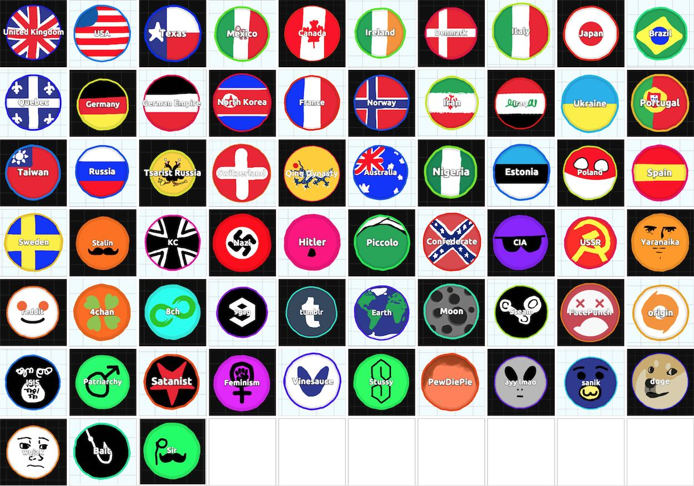

Agar.io son zamanlarda patlayan basit, pratik ve çoğu kişi tarafından bağımlılık yaptığı söylenen multiplayer bir tarayıcı oyunu. Oynamak için yalnızca mouse hareketleri ve iki tuş kullanıyorsunuz. Oyundaki temel amaç elbette en çok puanı alarak liderler listesine yerleşebilmek. Bunu yapmak için etraftaki nesneleri yiyerek erişebileceğiniz en büyük boyuta erişerek ilerlemeniz gerekiyor. Sonrasında işin içerisine ufak stratejiler giriyor. Diğer oyuncuları ne kadar büyük boyutlara erişmiş olurlarsa olsunlar alt etmeniz mümkün.

Oyunda her oyuncu farklı birer hücreyi yönlendiriyor. Bir isim girdikten sonra oynayacağınız server'ı seçerek oyuna başlıyorsunuz ve hücrenize rastgele bir renk atanıyor. Dünyanın farklı bölgeleri için farklı serverlar mevcut. Bireysel oyunun dışında isterseniz rastgele belirlenen renklere göre takımların yer aldığı oyun türünü de seçebiliyorsunuz. Oyuna başladığınızda çok küçük bir boyuta sahip oluyorsunuz. Hücreniz mouse'u çektiğiniz yöne doğru hareket ediyor. Etrafta bulunan ufak parçaların üzerine gelip, onları yiyerek yavaş yavaş boyutunuzu büyütüyorsunuz. Küçükken çok daha hızlı hareket edebiliyorken boyut büyüdükçe hücre yavaşlamaya başlıyor. Bu açıdan küçük hücrelerin rakiplerinden kaçabilmesi çok daha kolay. Boyutunuzu büyüttüğünüzde kendinizden küçük boyuttaki oyuncuları yiyebiliyorsunuz. Boyutunuz büyürken bir yandan da puanınız artıyor. Bir noktadan sonra hücre ne kadar nesne yerse yesin büyümesi duruyor. Bu andan itibaren daha zor işlere atılmanız gerekiyor.

Oyun alanının çeşitli bölgelerinde yeşil diken benzeri nesneler mevcut. Bunlar orta boy büyüklükte ve kendine çarpan kendinden büyük hücreleri ufak parçalara ayırırken kendinden küçük hücreler ise bu nesnelerin içine girip orada saklanabiliyor. Büyük boyuta erişmiş bir rakibi tuzağa düşürmek için kullanılması uygun.

Space tuşu ile hücrenizi iki eşit parçaya ayırabiliyorsunuz. İkiye bölünen hücrenin bir parçası mouse'un olduğu yöne doğru fırlayacaktır. Bu bölgede yeni parçadan küçük boyutta rakip varsa onu yiyorsunuz. Bu fırlatma bir anda gerçekleşiyor ve mouse takibiyle elde edilemeyecek bir hızda o noktaya erişebiliyorsunuz. Bu şekilde puanınızı tekrar arttırmaya başlamanız mümkün oluyor. Bölünen parçalar yan yana hareket edecek ve eğer birbirleriyle temas edecek kadar yakınlarsa bir süre sonra tekrar birleşecektir.

W tuşu ise yem atmaya yarıyor. Hücrenizden ufak, cansız parçaları mouse doğrultusuna atıyorsunuz. Bu özelliği birkaç farklı amaç için kullanmanız mümkün. Rakibinizi beslemek çok mantıklı durmasa da kimisi kendisini besleyen ile takım gibi hareket etmeye razı. Bunun dışında bu özelliği rakibini besleyip büyüterek hızını azaltmak için kullananlar mevcut. Fakat bu özellik için en mantıklı ve pek fazla bilinmeyen kullanım daha önce de bahsi geçen yeşil dikenlere yem atarak onların bir parça fırlatmasını sağlamak. Ekranı kaplayacak kadar büyük boyutta bir rakibiniz olduğunu düşünün. Bu dikenlerin arkasındasınız ve dikeni besliyorsunuz. Diken belli bir boyuta eriştikten sonra bölünecek ve kendinden bir parçayı yemi attığınız yöne doğru fırlatacaktır. Orada bulunan rakip hücre ise parçalara ayrılacak, siz de o parçaları toplayarak bir anda çok büyük boyutlara erişebileceksiniz.

Oyunda kimi hücrelerin üzerinde renkten ziyade resim olduğunu göreceksiniz. Bu resimleri kullanabilmek için tek yapmanız gereken resme uygun ismi oyuna girerken yazmak. Örneğin hücrenizde nick olarak "Poland" kullanırsanız Polandball, "Sir" kullanırsanız bir sör illustrasyonu, "Moon" kullanırsanız Ay resmi çıkacaktır.

Oyun gerçek zamanlı bir HTML 5 oyunu ve iyi bir internet bağlantısı gerektiriyor. İnternet bağlantınızın yeterince hızlı olmadığı bir zamanda oyunu oynayacak olursanız fazlasıyla zorlayacaktır, çoğu zaman hareket dahi edemeyeceksinizdir. Oyunu oynamaya başlamak için tek yapmanız gereken agar.io adresine girmek.
