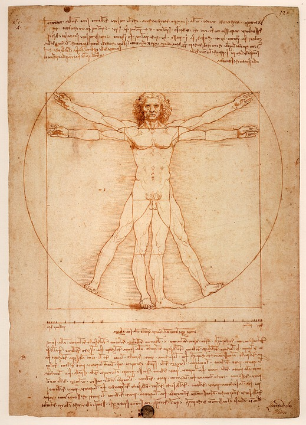
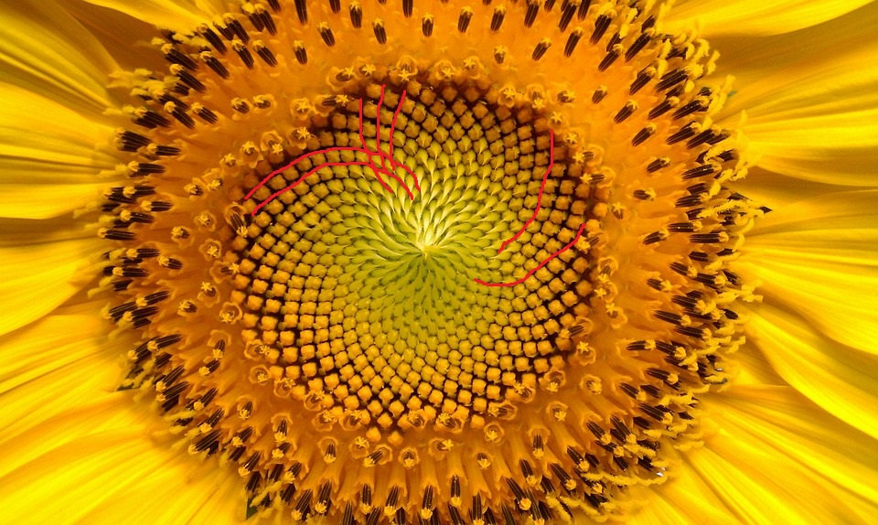
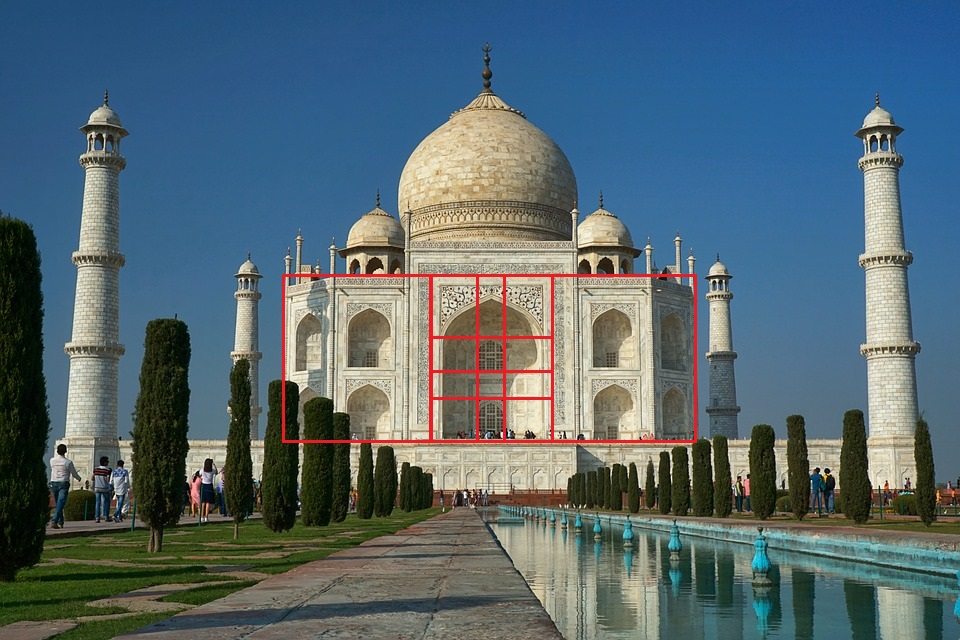

### Konuya Giriş

_"Bu şekil var olan en güzel eğridir."_ **Alfred Russel Wallace (1823-1913)**

Bir doğru parçası düşünelim. Bu doğru parçası belirli bir yol uzunluğu veya kağıtta çizdiğimiz herhangi bir uzunluktan ibaret olabilir. Yeter ki gözümüzle gördüğümüz bir doğru parçası olsun.

Hiç Fibonacci sayılarını duydunuz mu? Evet yukarıdaki söze sahip kişinin bulduğu sayılar. Konuyla çok alakası var. Her sayıyı kendisinden öncekiyle topluyoruz. Doğal sayılar kümesinde 0 dan başlayalım.

**0+0** yine sıfır etti. **1** e geçelim. **0+1=1** etti. **1+1=2** etti. Bundan sonrası gayet kolay. **2+1=3** etti. **3+2=5** etti. **5+3=8** etti. Bu böyle gitmektedir. Öyleyse Fibonacci dizisi **{0, 1, 1, 2, 3, 5, 8, 13, 21, 34, 55, 89, 144, 233...}** şeklinde devam eder. Aslına bakarsanız Fibonacci dizisi herhangi iki sayıdan başlayabilir; **{3, 3, 6, 9, 15, 24, 39, 63, 102...}**.

Öyleyse Fibonacci dizisi doğal sayılar kümesinde herhangi bir sayıdan başlayabilir ve başlangıç noktası sonsuzluğa uzanabilir mi?

Hayır. Fibonacci dizileri doğal sayılar kümesiyle sınırlı değildir. Negatif Fibonacci sayıları da vardır ve tanımlanmıştır. Olayın bu kısmını daha sonraya bırakalım. Konumuza dönelim.

Şimdi bu doğru parçasını ikiye bölmemiz gerekmektedir. El de edeceğimiz iki parçanın birisi diğerinden küçük olmalıdır. Şimdi bu doğru parçasını birde önemli bir noktadan böleceğiz.

Büyük parçanın küçük parçaya oranını düşünelim **(34/21)**. Şimdi ise bütün parçanın büyük doğruya oranına bakalım **(55/34)**. İşte bu iki oran birbirine eşit ise fi sayısını elde ederiz. Yanlış anlaşılmasın pi sayısını değil fi sayısını elde ederiz. Fi sayısı **Φ** sembolü ile gösterilir. **Φ= {1,6180339...}** diye gitmektedir.

Yine bir karenin üstteki bir ucundan pergel vasıtasıyla çizeceğimiz bir yay ile de altın dikdörtgen elde edebiliriz. Yayı bir daireye tamamlarsak, bu dairenin yarıçapının bir ucu elde edeceğimiz dikdörtgenin bir ucu olacaktır. Bu dikdörtgenin içinden sürekli bir kare çıkaralım içindeki uç noktadan bir spiral çizelim.

Kenar uzunluklarını yarıçap alan bu spiral altın spiral (golden spiral) olarak adlandırılmaktadır.

Fi sayısının başka bir şekilde gösterilişi **(1+ √5)/2** olabilir. Yukarıda gördüğümüz bu görselde ki spiral düzenine doğada oldukça sık rastlarız. Sadece doğada değil insanın yaptığı çoğu şeyde görmek mümkündür. Mesela kağıt boyutları (a4 gibi) altın orana göre tasarlanır. Çünkü insan gözüne en güzel gelen oran budur.

### Fibonacci Dizisinin Limiti

Fibonacci dizisinin **{0, 1, 1, 2, 3, 5, 8, 13, 21, 34, 55, 89, 144, 233...}** şeklinde devam ettiğini söylemiştik. Burada 0 hariç her sayıyı kendinden önceki sayıya bölelim.

Örneğin **(2/1 =2), (3/2= 1,5), (5/3=1.66666666667), (8/5=1,6), (13/8=1,625), (21/13=1.61538461538 ), (34/21=1.61904761905), (55/34=1.61764705882), (89/55=1.61818181818)** diye okuması bile hızlıca geçilecek uzun bir örnek verirsek Fibonacci dizisindeki sayı büyüdükçe ve bölme işlemi yaptıkça altın oran sayısınada yaklaşmış oluruz.

  
Evet yukarıda uzunluk cinsinden verdiğimiz örnekte gösterdiğimiz değer tam olarak altın oran değeri değildir. Fibonacci dizisindeki her bir sayıyı kendisinden önceki ardışık iki terimi toplayarak buluyoruz. Dizideki sayıyı **_F_** şeklinde sembolize edelim. **_F_1=_F_2=1** olduğuna göre **_F_3** yukarıda belirttiğimiz üzere **_F_1** ve **_F_2** nin toplamına eşit olacaktır. Buda bize **_F_3=_F_1+_F_2=2** sonucunu verecektir.

Fibonacci Dizisi Elemanları= **{(_F_1=1), (_F_2=1), (_F_3=_F_1+_F_2), (_F_4=_F_3+_F_2), (_F_5=_F_4+_F_3)...}** şeklinde devam etmektedir. Öyleyse **_F_n+1=_F_n-1+_F_n ;(n⩾2)** şeklinde bir ifadeye ulaşabiliriz.

Fibonacci dizisindeki her bir sayıyı kendinden önceki sayıya bölersek altın orana yakın bir değer elde ederiz ve bu iki sayı büyüdükçe yani dizide ilerledikçe elde edilen sayının değeri altın orana yaklaşmaktadır.

**_F_n+1=_F_n-1+_F_n** her iki tarafı da **_F_n** bölersek **(_F_n+1)/_F_n=(_F_n-1+_F_n)/_F_n** şeklinde yeni bir denklem elde ederiz. Bu denklemi şu şeklide yazabiliriz:  
**(_F_n+1)/_F_n=(_F_n-1)/_F_n+1** Eğer **n** sonsuza giderken **(_F_n-1)/_F_n+1** ifadesinin limitini alırsak **limn→∞ _F_n/(_F_n-1)** eşit olur. Bu ifadeyi _**K**_ eşitleyelim. **limn→∞ _F_n/(_F_n-1)=**_**K**_

**limn→∞ (_F_n-1)/_F_n+1 = limn→∞ _F_n/(_F_n-1)** Gösterilen bu denklemi ise  
**1/_K_+1 = _K_** şekline rahatlıkla dönüştürebiliriz. Buradan ise ikinci dereceden bir denklem elde ederiz. **_K_^2-_K_\-1=0** denkleminde negatif ve pozitif kökler olmasına karşın biz altın oranın pozitif bir sayı olarak tanımlandığını bildiğimiz için pozitif kökü alıyoruz.

  
_**K**_**\=(1±√5)/2** den _**K**_**\=(1+√5)/2** elde ederiz. Kısacası biz şuradan şunu elde ettik. **limn→∞ (_F_n+1)/_F_n = (1+√5)/2 = Φ Öyleyse Fibonacci dizisinin limitini alırsak altın oran değerini elde ederiz.**

### Altın Oran Değerinin Geometrik Metot Vasıtası İle Bulunması

Yukarıda 55 birimlik bir doğrumuz vardır hatırlarsanız. Bu doğruyu iki parçaya ayırmıştık. Büyük kısmı A doğrusu küçük kısmı B doğrusu olarak adlandırmıştık. Biz bu doğrunun tamamına C doğrusu diyelim.

C/A = A/B = **Φ** ifadesinden (A+B)/A = A/B = **Φ** ifadesini elde ederiz. Denklemin bir ve ikinci kısmında içler ve dışlar çarpımını yaparsak A^2=AB+B^2 buradanda A^2+AB+B^2 = 0 elde ederiz. Her iki taraftaki ifadeleri biz B^2 böleriz ve (A/B)^2-(A/B)-1=0 ifadesini elde ederiz.

Dikkat ederseniz A/B = **Φ**. Öyleyse (A/B)^2-(A/B)-1=0 ifadesini **Φ^**2-**Φ**\-1=0 şeklinde yazabiliriz. Buradan **Φ^**2-**Φ+1/4-5/4=0** ifadesinde 5/4 ifadesi sağa atılır ve **Φ^**2-**Φ+1/4=5/4** ve buradan da (**Φ-1/2**)^2=5/4 ifadesini elde ederiz.

Her iki tarafın karekökünü alırız ve **Φ-1/2** = **√5/2 elde ederiz.** -1/2 karşı tarafa atarsak **(1±√5)/2** elde ederiz ve altın oran pozitif bir sayı olarak tanımlandığından **(1+√5)/2 sayısını alırız.**

### İnsanda Altın Oran

Üstteki santral kesici iki dişin en uzunluğunun toplamının, tek bir dişin en uzunluğuna oranı bize altın oranı veya altın oranına yakın bir değer verir. Parmağın tam uzunluk değerinin parmağın ilk iki boğum uzunluk değeri oranı , burun genişliği değerinin burun deliği genişliği değerine oranı yine aynı değeri verir. Ayrıca insan akciğerindeki bronş dallanması altın oran ile ilişkilidir.

Yazar, mimar ve mühendis zanaatlarına sahip Vitruvius Pollio'un (M.Ö 1 Y.Y.) dikkatini insan vücudundaki bazı oranlar çekmiştir. İnsan gözüne en güzel görünen oranlar, yukarıda açıklamaya çalıştığımız altın oran değerine sahip olan oranlardır. Oysaki matematik, durumun estetiksel tarafı ile değil, neticesi ile ilgilenmektedir. Matematik neticeleri kalitatif olarak değil kantitatif olarak belirler.

Vitruvius Pollio eserlerinde insan vücudundaki bu oranlara göre yani altın orana göre çalışmıştır. Pollio, DeArchitectura adlı eserinde altın oran ve simetrinin mimarlıkta olan önemini vurgulamıştır. 15 Y.Y. ise Leonardo Da Vinci den önce bir çok kişinin Vitrus adamı üzerinde çalışmasının ve onlara fikir veren kişi Vitruvius Pollio dur. Tabi ki Leonardo Da Vinci kadar başarılı bir çalışma yapan olmamış. Gallerie dell’Academia muhafaza edilen orjinal vitrus adamı çizimi senede birkaç kere halka gösterilir.

- 
    
    Türkçe: Vitruvian Adamı  
    English: Vitruvian Man
    
- 
    
      
    Türkçe: Modern Vitruvian Adamı  
    English: Modern Vitruvian Man
    

### Doğada Altın Orana Bir Örnek:Ayçiçeği

Altın oran papatyagiller **(**_**Asteraceae**_**)** familyasına ait bitkilerde özellikle _**Helianthus**_ cinsine ait bitkilerde görülebilir olan bir durumdur. Ayçiçeği (_**Helianthus annus**_) bitkisinin çiçek tablasının orta kısmına baktığımız zaman sarmallar görürüz. Aşağıda paylaşacağım resimde kolaylık açısından fayda sağlaması açısından kırmızı çizgiler ile resim üzerinde işaretlemeler bulunmaktadır. O yaylar arasında bir altın oran olduğu gibi yaylar orta kısma giderken altın spiral görebilirsiniz. Aynı şekilde papatya bitkilerinde bu durum söz konusudur.

Ayçiçeği (**Helianthus annus**) bitkisinin çiçek tablası (_**receptaculum**_) (Diğer bilinen adı: Gündöndü, English: Sunflower)

Altın oran tütün bitkisinin **(**_**Nicotiana tabaccum**_**)**yaprak dizilimindeki eğriliğin tanjantı şeklinde mevcuttur. Aynı şekilde deniz kabuklarında bulunan eğrilikler, salyangoz **(**_**Orthogastropoda**_**)** kabuğu, eğrelti otunun **(**_**Pteridium spp**_**.)** yaprak diziliminin eğriliğinin tanjantı ve çam kozalağına dik bakıldığında ki simetri bize altın oranın doğada ne kadar çok yer kapladığını göstermektedir.

### Altın Oran ve Sanat

İnsanoğlu altın oranı ürünlerinin bir çok kısımında kullanmıştır. Bunun nedenine gelmeden önce herhangi bir geometrik şekil düşünelim. Mesela bir spiral veya üçgen veya dikdörtgen olsun. İnsan gözüne en güzel gelen şekli ile bu geometrik şekillerin oranları nedense altın oranlarına sahip olmaktadır. Ne ilginçtir ki 16:9 ekran oranı veya A4 kağıt oranı gibi muamele edilmiş ürünler insan gözüne en güzel şekilde gözüktüğü için yapılmıştır. A4 kağıt oranı bünyesinde bulundurduğu **Φ** yakın değerine bayağı bir sapma gerçekleştirirsek bizim için bir göz estetiği bozulması gerçekleşecek midir? A4 kağıt oranı ve satış oranı arasında bir korelasyon var mıdır?

Leonardo Da vinci ünlü eseri Mona Lisa tablosunu yaparken altın orandan yararlanmıştır. Yukarıda resmini paylaştığımız vitruvius adamında altın oranı tam olarak belirtmiştir. Ayrıca "**Aziz Jerome**" tablosunun boyunun enine oranı altın oran değeri verir. Picasso eserlerinde altın oran kullanmıştır.

Keops piramidinin eğim oranı (14/11) altın orana göredir. Keops piramidinin taban uzunluğunun yarısının değerini, yan kenarı ortalayan uzunluğa bölersek yani oranlarsak altın oranı elde ederiz.

Mimar Sinan da altın oran kullanmıştır. İstanbul da bulunan Süleymaniye caminin minarelerinde altın oran kullanılmış. Ayrıca Mimar Sinanın öğrencileri tarafından yapılan Tac Mahal eserinde altın orana rastlamak mümkündür.

Tac Mahal eseri ve altın oran kısımlarının basit bir şekilde tayini. Elbetteki daha fazla altın oran görmek mümkün olsa da gerisini siz değerli okuyucularımıza bulmaca amaçlı bırakıyoruz.

### Kısaca Altın Oran

Altın oran değeri 1,6180339... gibi bir irrasyonel sayıdır. **Φ** sembölü ile gösterilir. Phidias adlı yunan heykeltraş eserlerinde altın oranı ilk kez uygulayan kişidir.  Philiasdan sonra Öklit altın oranı kullanarak bir pentagram oluşturmuştur. Elementler adlı kitabında bir doğruyu 1,618... inci noktasından bölmekten bahsetmiştir.

1200 yıllarda Fibonacci kendi adı ile anılacak olan seriyi ve altın oran ile ilgili bağlantısını bulmuştur. Leonardo Da Vinci, Picasso ve Mimar Sinan gibi meşhur mimar ve gerçek sanatçı kişilikler altın orandan yararlanmıştır.

Ayrıca ayçiçeği, tütün bitkisi, eğrelti otu, çam kozalağı, salyangoz kabuğu, deniz kabuğu, insan anatomisi vb. doğanın muhtelif birçok kısımında altın oran bulunmaktadır. Fizikte ise direnç konusunda altın oran bulunmaktadır. Fizik ve kimya konusunda kuazi kristal yapılarında altın oran bulunur. Kar tanelerinde altın oran bulunmaktadır.

Son olarak altın oranın bir mit olduğunda bahsedilmektedir. Bütün bu bahsedilen yapı veya doğadaki varlıklarda mükemmele ulaşmak mümkün olabilir mi yoksa imkansız mı? Altın orana ulaşan bir çok oran olsa da altın oran irrasyonel bir sayıdır ve bu orana tam sahip bir nesne elde edemeyiz. Hep yakın oranları bulabiliriz.

### Doğadaki Altın Oran Uyumunun Gerçekçiliği

_**"Desenler görmek ve anlamını aramak için genetik olarak programlanmış yaratıklarız ve bunları sınırlı olan matematik algımızla gerçekleştirmeye çalışıyoruz. İnsanlar etraflarında altın oranı gördüklerini düşünüyorlar, dünyada ve sevdiği nesnelerde bunu arıyorlar, ancak doğruluğunu ispat edemiyorlar. İnsanlar çevrelerinde, doğal dünyada ve sevdikleri nesnelerde altın oranlarını gördüklerini düşünüyorlar, ancak bunu doğrulayamıyorlar. Onlar, gördükleri kalıpların aldatıcı olduğunu söyleme matematik becerileri olmadan, evrenin düzeninde anlam bulma arzusunun kurbanıdır"**_ **-** Keith Devlin

Yukarıda bahsedildiği üzere altın oran irrasyonel bir sayıdır. Virgülden sonrası uzar gider. Tıpkı pi sayısı gibidir. İşte biz bu oranı doğada veya insan ürünlerinde incelemeye kalktığında bir sapma görürüz. Örneğin  
_**Orthogastropoda**_ kabuğu şeklini kuşbakışından görür ve altın spirali üzerine yerleştirmeye kalkarsak bir sapma ile karşılaşırız.

Aynı şekilde bu çoğu şeyde geçerli bir durumdur. Doğadaki sapma örneğimizin en bariz kanıtı kabuk şekil ve verimine genetik ve çevresel etkilerin değişkenliğidir. Şöylede anlatabiliriz; örneğin bitkinin spiral genişliğini o vejetasyon dönemindeki ekolojik durum ile birlikteki bakım şartlarına ve genetik yapısı belirler. Bu bir gerçektir. Bunlardan biri değiştiğinde altın oranda tabi ki bir sapma olacaktır.

Altın oran sayısının virgülden sonraki bir milyonuncu basamağı ile diğer nesnede bulunan oranın virgülden sonraki bir milyonuncu basamağı aynı mıdır? Aslında burada mükemmeli elde edemeyeceğimiz için veya elde edebilip edemeyeceğimizin belirsizliği nedeni ile altın oranı tam olarak yerleştiremiyoruz.

### Bu Yazının Son Kısmı

Yazımızı buraya kadar okuyan arkadaşlara teşekkür ederiz. Vakti olmayan ve kısaca göz gezdiren arkadaşlara da teşekkür ederiz. Pisagor Matematik Evi adlı youtube kanalında tanıdığım saygıdeğer Mustafa Yağcı hocam altın oran konusunun matematiğini oldukça güzel anlatmıştır. Videosunda aktardığı bilgiler ve bu bilgiler sayesinde kafamda oluşturduğu fikirler için ve işin geometri kısımında öğrendiğim bilgiler için kendisine buradan teşekkür etmek isterim.

Aslında her yazı, film, roman, problem çözümü, araştırma sonucu vb. bitiminde sorgulanması gereken mutlaka bir veya birden çok şey ortaya çıkar. bu yazının sonunda ben altın oranın estetik yönü uydurmamı yani bize mi öyle geliyor. Yoksa gerçekten var mı? Yoksa sadece işin matematiğine bakıp sonuçların neticesine mi odaklanmalıyız? bu konuda karşılıklı saygı içerisinde bir tartışma yapılabilir. Karar siz değerli okuyucularımızın. Sabahlatan ailesi olarak iyi günler ve iyi okumalar dileriz.
