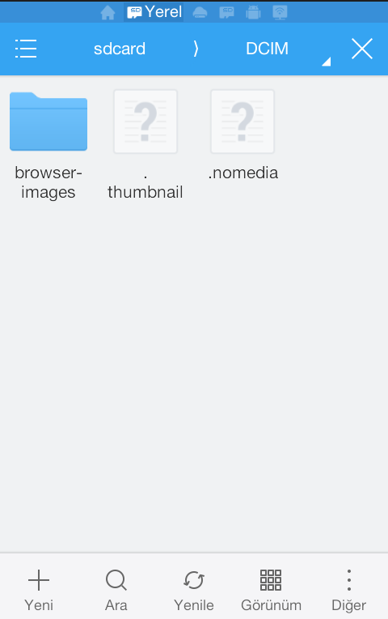

Android işletim sistemli birçok telefonda gittikçe şişerek çok fazla yer kaplayan thumbnail (küçük resim) dosyaları sorunu var. Bu dosyalar çok kısa süre içerisinde biriken dosyalar birkaç yüz megabyte boyutundan birkaç gigabyte boyutuna erişerek telefon hafızasında önemli yer kaplıyor. Telefonun kendi hafızası da küçükse, çalışmak için boş hafıza talep eden Galeri gibi birçok uygulama da kullanılamaz hale geliyor. Thumbnail dosyaları, bunları silseniz dahi tekrar eski boyutuna çok zaman almadan ulaşıyor, uygulamaların birkaç kullanımından sonra aynı boyuta tekrar erişiyor. Bu bir telefon için çok önemli ve atlanamayacak bir sorun, çok fazla vakit kaybına neden oluyor.

#### Thumbnails Nedir

Thumbnail ya da küçük resim denen bu dosyalar telefonda yer alan görsel içerikleri açmaya gerek kalmadan basitçe bir önizleme sağlaması için otomatik olarak oluşturulur. Çoğunlukla büyük kolaylık sağlasa da çoğu platformda sistemi en çok yoran olgulardan biridir. Bunlar Galeri uygulamaları tarafından oluşturulur.

#### Çözüm

Çözüm için birkaç yöntem mevcut. Burada kesin sonuç almak adına bunlardan iki tanesini bir arada kullanalım. Thumbnail dosyaları telefonun kök dizininde yer alan, kamera çekimlerinin yer aldığı **DCIM** (Digital Camera Images) isimli klasörde yer alır. Dizinler arasında dolaşabilmek için telefonun kendi dosya yönetim uygulaması yetersiz kalıyorsa Es File Explorer isimli uygulamayı kurabilirsiniz. Kök dizin içerisindeki DCIM klasörüne girdikten sonra .thumbnails isimli klasör veya dosyayı görüyor olmanız lazım. Bu dosyayı sildikten -Silerken kapladığı boyutu göreceksiniz- sonra telefonu zaten böyle bir dosya olduğuna inandırıp, boş bir .thumbnails dosyası yaratacaksınız. Boş bir dosya oluşturduktan sonra ismini ".thumbnails" değiştirin. Kamera uygulamasının bir sorun yaşamaması için de bu kamera uygulamasının menüsünden dosyaları SD karta kaydetmeyi seçebilirsiniz. Bu şekilde çekilen fotoğraf ve videoların da telefonun kendi hafızasını şişirmemesine yardımcı olacaksınız.

#### Thumbnails Dosyasını Silmenin Etkisi

"Thumbnails dosyasını silersem ne olur, thumbnails dosyasını silmemin bir zararı olur mu?" diye soracak olursanız gerçek şu ki endişelenmenize gerek yok. Thumbnails dosyaları eğer bunu engellemediyseniz uygulamalar tarafından tekrar oluşturulur. **Bunlar resimlerin küçük resimlerini taşımak dışında bir işe yaramazlar.** İstediğiniz gibi silebilirsiniz.
