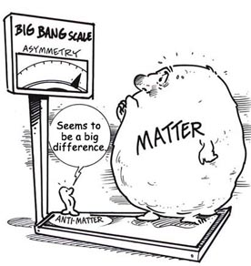

Bilindiği gibi maddeyi oluşturan protonlar artı, elektronlar eksi yüklüdür. Bilimsel kuramların çoğu bu değerleri temel alır. Fakat 1900'lü yılların başlangıcında çeşitli hesaplamalar sonucunda bunun tam aksi yönde özelliklere sahip olan maddeler olabileceği ortaya atıldı. Positron isimli karşıt elektronların, karşıt protonların varlığı mümkündü. İlerleyen yıllarda bu parçacıkların varlığı tespit edildi ve bunların bir araya gelerek madde oluşturabileceği kanıtlandı. Bugün insanoğlu bu konuda emekleme aşamasında olsa da, antimadde tıpta aktif olarak kullanılıyor.

Şimdi olayın ayrıntılarına inelim. Albert Einstein'ın görelilik teorileri bilimde yeni bir çağ açtı denebilir, fakat sonradan fark edildi ki bu teorilerden özel görelilik ışık hızına yakın parçacıklarda sorun çıkarıyordu. Kuantum teorisi ise bu soruna çözüm getirebiliyordu. Bu iki teori kendi içlerinde doğru sonuçlar ortaya çıkarsa da, ortak bir paydada buluşamıyorlardı ve birleştirilmeleri gerekiyordu. Bu konuda teorik fizik alanında çok yol alındıysa da halen bu sorun mevcut. Paul Dirac 1928 yılında bu birleşme için yeni bir denklem ortaya attı. Fakat denklem hem eksi, hem de artı yüklü iki ayrı elektron çeşidinin olabileceğini gösteriyordu. Bu karesi pozitif olan sayının hem negatif, hem pozitif olabileceği örneğine benzetilebilir.

İlerleyen yıllarda uzaydan gelen kozmik ışınları inceleyen bilim insanları bu pozitif yüklü elektron benzeri parçacığı keşfettiler. Dünya'ya uzaydan, özellikle de Güneş'ten sürekli olarak çok yüksek enerjili ışın ve parçacıklar gelir. Bunlar Dünya atmosferine çarparak çok çeşitli yeni parçacıklar oluşmasına neden olur. Keşfedilen bu parçacık artık pozitron olarak anılmaya başladı. Sonrasında proton gibi diğer parçacıkların da anti parçacığı olduğuna dair keşifler yapıldı. Fakat bunlara pozitron gibi özel bir isim yerine antiproton gibi isimler verildi. CERN'de yapılan çeşitli deneylerde anti parçacıklar üretilmeye devam etti, anti parçacıklardan antimadde oluşturulabileceği kanıtlandı.

### Madde ve Antimadde

Madde ile o maddenin karşıtı olan antimadde yan yana geldiğinde birbirlerini yok ederek yüksek enerjiye dönüşürler. Bir kurama göre evrenin oluşumunda madde ve antimadde oluştu ve kendiliğinden simetri kırınımı sonucu birbirlerini yok ettiler. Fakat madde miktarı antimaddeden bir miktar daha fazla olduğundan dolayı varlığına devam ederek bugünkü evreni oluşturdu. Evrenin bir yerlerinde antimaddesel yapılar görmek  imkansız olmayabilir. Fakat bunları gözlemlemek bugünkü gözlem araçları için mümkün değil.

Anti parçacıklar tıpta halihazırda kullanılıyor.  PET/CT (pozitron emisyon tomografisi / bilgisayarlı tomografi) şeklinde adlandırılan tomografi yöntemi pozitronlar kullanılarak birçok hastalığın teşhis edilmesinde kullanışlı bir yöntem olarak yer almakta. Kanser teşhisi buna örnek verilebilir. Kanser hücreleri vücudun diğer bölgelerine kıyasla çok hızlı bir şekilde çoğalır ve aktiflik gösterir. Vücuda verilen pozitronlar vücuttaki bu aktif bölgede yoğunlaşarak orada enerji açığa çıkmasını sağlar. Bilgisayarla yapılan tarama sonucunda da böyle bir yoğunlaşmanın olup olmadığı kontrol edilir.
