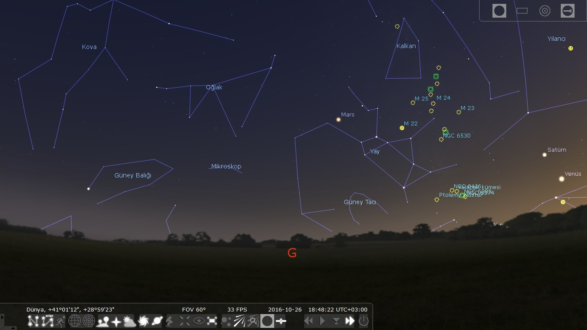
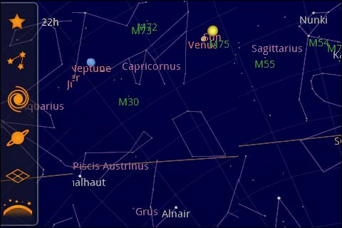
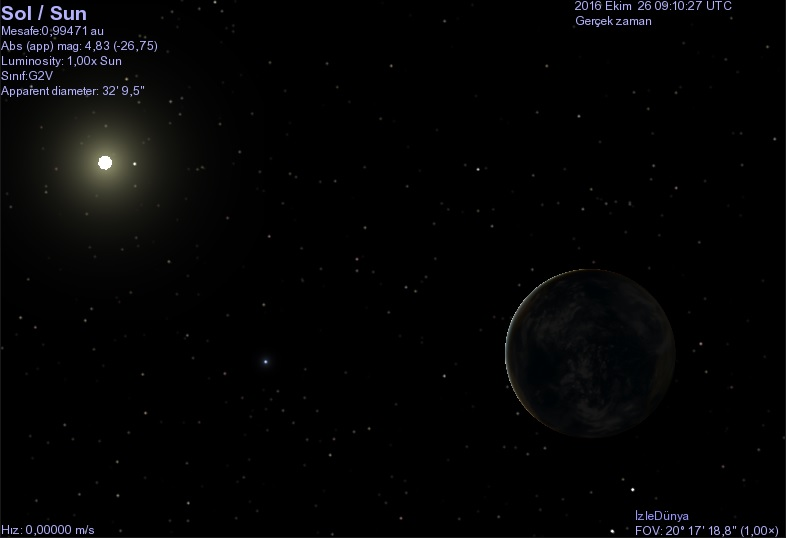
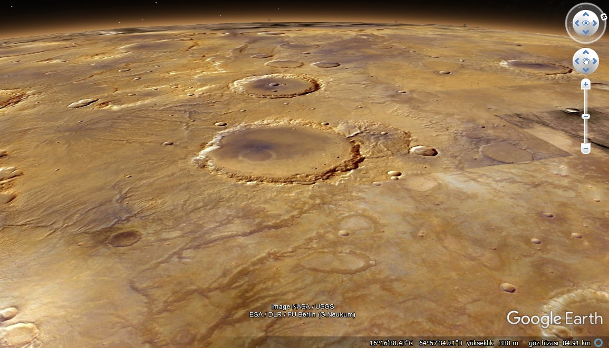
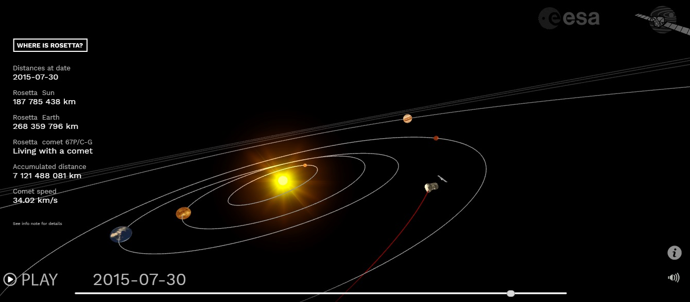

Astronomiye, gökyüzü gözlemlerine ve evrenin derinliklerine meraklıysanız bu alanlarda ilginizi tatmin edecek çeşitli bilgisayar ve mobil uygulamaları mevcut. Bunlar ister bulunduğunuz yerde veya dünyanın herhangi bir noktasında gökyüzünde o an hangi gökcisimlerinin bulunduğunu öğrenmenizi, ister çeşitli gökcisimlerini yakından görmenizi ve tanımanızı sağlayacak uygulamalar. Her biri alternatiften ziyade, bir diğerinde olmayan özellikler taşıyor.

### Stellarium

Amatör olarak astronomiyle ilgileniyorsanız Stellarium'a aşina veya en azından adını duymuş olabilirsiniz. Stellarium açık kaynak kodlu bir bilgisayar uygulaması. Windows, Linux ve Mac OS üzerinde kullanılabiliyor. Dünya üzerinde seçtiğiniz bir konumda o an gökyüzünde hangi gökcisminin ne konumda olduğunu görebilmeniz uygulamanın başlıca özelliği. Gökcisimlerine yaklaşarak daha ayrıntılı bir şekilde görmeniz, üzerlerine tıklayarak haklarında bilgi almanız mümkün. Takımyıldızı çizgilerini ve bunlara özel çizimleri de ayrı ayrı görmenize olanak sağlıyor. Programda zaman kavramı ile de oynayabiliyorsunuz. Zamanı ileri, geri alabilir veya hızlı bir şekilde oynatabilirsiniz.

### Google Sky Map

Google'ın Sky Map uygulaması başlangıçta Stellarium'a çok benziyor gibi görülebilir. Fakat bu uygulamanın en büyük artısı Android işletim sistemli cihazlar için bir mobil uygulama olması. Dolayısıyla telefonda bulunan sensörleri kullanarak bir sanal gerçeklik havasıyla bölgedeki gerçek gökcisimlerini gözlemleyebiliyorsunuz. Telefonu tuttuğunuz konumda hangi gökcisimleri, hangi takımyıldızlar varsa direkt olarak bunların hakkında bilgi alabileceksiniz. Akıllı telefonunuz uygun sensörleri barındırmayacak kadar düşük modelli veya eskiyse bu uygulamayı yine de kullanmanıza engel teşkil etmiyor. Uygulamada tek bir seçeneği değiştirerek aynı gökyüzünü otomatik tespit etmek yerine sürükleyerek gezmeyi sağlamanız mümkün.

### Celestia

Celestia bunların yanında bambaşka bir tarzı olan bir bilgisayar uygulaması. Tıpkı Stellarium gibi açık kaynak kodlu bir yazılım. Bu uygulama içerisinde uzayda seçtiğiniz nesnelere üç boyutlu olarak yolculuk edebiliyorsunuz. Bu şekilde birçok gökcismini arasında seyahat ederek yakından gözlemlemeniz mümkün. Uygulamadaki gökyüzünde bulamadığınız gökcisimleri için menüde hazır seçenekler de bulunuyor.

### Google Earth

Bir zamanlar çok popüler olan, fakat çok daha pratik olan Google Maps alternatifinin daha çok tercih edilmesiyle artık pek adı duyulmayan Google Earth'ün tek işi Dünya ile değil elbet. Program içerisinde Mars ve Ay'a geçiş yapabiliyorsunuz. Tıpkı Dünya üzerinde sokakları, binaları, araçları ve insanları gözlemleyebildiğiniz gibi bu gökcisimleri üzerinde de yakından inceleme yapmanız mümkün hale geliyor. Aynı şekilde gerçek zamanlı olmasa da gökyüzünü de gözlemlemek için bir seçenek var. Tabii Google'ın buna da bir web alternatifi var. Online olarak daha hafif bir versiyonunu kullanmak isterseniz **Google Sky**'ı incelemeniz yeterli.

### Uzay Simulasyonları

İnternet üzerinde birçok spesifik online veya indirilebilir uzay ve evren simulasyonları bulmanız mümkün. Çok fazla örnek bulunduğu için teker teker vermiyorum. Örneğin "where is Rosetta" veya "rosetta real time simulation" şeklinde bir arama yaparsanız 2004 yılında fırlatılan ve 2016 yılında görevi sona eren Rosetta uzay aracını simule eden uygulamalar bulabilirsiniz. Aynı şekilde "milkyway simulation" yazarak Samanyolu Galaksisi'nin simulasyonlarına, "Solar System simulation" yazarak Güneş Sistemi'nin simulasyonlarına ulaşmanız mümkün. Arama yapacağınız kelimeleri iyi seçmeniz gerekiyor.
