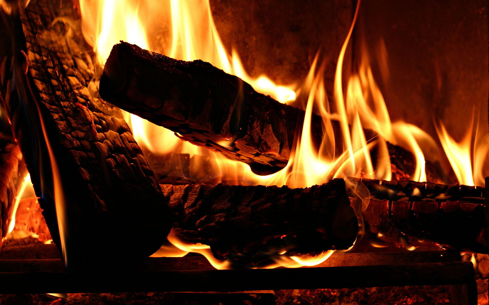

Ateş insanoğlu için çok yaygın bir olgu olsa da, kendisini tanımlayabilmek oldukça güç. Ateş bir kimyasal tepkime veya madde değil, oksijen elementinin diğer maddelerle girdiği tepkime sonucu ortaya çıkan enerji ve madde paketidir. Tepkimenin adı yanma tepkimesidir, ateş bu tepkimenin bir ara ürünü olarak ortaya çıkar. Bu paket içerisinde iyonize olmayan, yani canlıların genetik yapısında değişim ortaya çıkarmayan çeşitli radyasyon türleri ve plazma halinde gazlar bulunur.

Ateş karbondioksit, su buharı, oksijen ve azot gibi gazları bünyesinde bulundurur ve yeterince yüksek sıcaklığa ulaşmışsa bu gazlar plazma haline geçer. Bahsi geçen radyasyon türleri görülebilir ışık, morötesi radyasyon ve kızılötesi radyasyon, yani ısıdır. Madde yanarken kütlesinin bir kısmı bu enerjilere dönüşür ve ateş olarak gözlemlenir, bir kısmı da kül ve duman halini alır. Oksijenle zaten doygun halde tepkimeye girmiş olan bir bileşik bunu tekrar yapamayacağından dolayı kül ve duman tekrar alev alamaz. Duman bir gaz değil, ısısından ve düşük kütlesinden dolayı hava içerisinde hareket edebilen katı ve sıvı parçacıkları, yani bir aerosoldür. Bir yüzeyle karşılaşan duman oraya yapışarak is şeklinde toplanır.

### Evrende Rastlanmayan Ateş

Dünyanın neredeyse her yerinde var olabilen ateş aslında evrenin şu ana kadar bilinen neredeyse hiçbir yerinde kendine yer bulamıyor. Çünkü ateş için gerekli olan yegane etmen oksijenli bir atmosferdir. Oksijenin bolca bulunduğu bir ortamda ısı arttırılırsa madde oksijenle olan tepkimesine başlamış olur. Bu insanlar tarafından genellikle önce kolaylıkla ısıyı arttırarak alev almış bir maddeyi ısısı normal yollarla daha zor arttırılabilecek maddelere yaklaştırarak, yani yakılmış bir ateşi yakılmak istenen maddelere yayarak gerçekleştirilir. Sonuç olarak dünyadaki maddelerin büyük çoğunluğu bir saatli bomba gibidir, bir ısı artışında oksijenle tepkimeye girerek ateş oluşturma eğilimindedirler. Oluşan ateş diğer maddelere de çok kolay sıçrayabilir ve ateş bir engelle karşılaşmadıkça yoluna devam eder.

Evrende en fazla bulunan element hidrojendir, oksijen ise saf halde aşırı nadir bulunur. Çünkü girmesi gereken bütün tepkimelere girmiş haldedir. Dünya gezegeninde ise durum tam tersi şeklinde. Durumun böyle olmasının nedeni canlılıktır. Dünya da başlangıçta gezegenlerin ezici çoğunluğu gibi ağır gazlara sahip bir atmosfere sahipti. İlkel dünya atmosferinde karbonmonoksit, metan gibi gazlar büyük yer tutuyordu. Gelişen ilk fotosentez yapan bakteriler yayılmaya başladıkça atmosferdeki bu gazların oksijene dönüşmesini sağladı. Canlılık dünyanın her yerine yayıldıkça enerji üretim şekilleri oksijeni üretmek ve tüketmek şeklinde gelişim gösterdi ve oksijen Dünya atmosferinin sabit gazı olarak kendine yer buldu. Kolay alev alan gazlar ise atmosferden uzaklaştı. Saf hidrojen bu yüzden Dünya'da çok az bulunur. Havadan hafif olduğu için ya atmosferin üst katmanlarına itilir, ya da kolaylıkla alev alır.

Ateş şu ana kadar Dünya dışında hiçbir yerde gözlemlenemez dedik, bu durumda yıldız, kuasar gibi nesnelerin durumu kafanızı karıştırabilir. Fakat bu gökcisimlerinde gözlemlenen olay ateş değil, nükleer reaksiyondur. Çeşitli kimyasal tepkimeler ve çekirdek tepkimeleri ısı ve ışık yaymaktadır, bunu yapabilmesi için hızlı bir biçimde ve yüksek enerjili olarak gerçekleşmesi yeterli. Ancak ateş yalnızca oksijenin bolca bulunduğu bir ortamda gerçekleşebilen, özel bir tepkimedir. Dünya dışında ateşin gözlemlenebilmesi için oksijeni kullanan bir canlılığın var olduğu bir gezegen bulmak gerekecek.

### Ateş ve Diğer Maddeler

Su aslında ateşin nötrleyicisi bir madde değildir. Suyun ateşi yok edebilmesi, yani söndürebilmesi ve yanma tepkimesini durdurabilmesi yalnızca miktarına bağlı olarak ateşin oksijenle bağını kesmesi ve soğutucu bir etki göstermesi ile gerçekleşir. Su zaten yanmış bir madde olduğu için, içinde oksijen bulunduğundan dolayı alev alamaz, fakat az miktardaki su ateşle karşılaştığında ona yenik düşerek gaz haline geçer. İçerisinde oksijen bulunan, oksijenle daha fazla bağ yapamayan herhangi bir bileşik de uygun hacimde aynı etkiyi gösterecektir, ısısının hızlıca değişmemesi kaydıyla.

Dünya üzerinde yanma tepkimesiyle en çok karşılaşan maddeler organik maddelerdir. Organik bir maddenin 100% verimli bir yanma tepkimesinde ortaya yalnızca karbondioksit ve su çıkması gerekir. Fakat evrende hiçbir şey 100% verimli, 100% saf olamayacağından dolayı bu maddeler de bol miktarda yabancı madde içerir. Kül ve duman bu yüzden ortaya çıkar. Odun gibi bir yapının içinde organik maddelerle birlikte inorganik maddeler de bulunur. Bir ateşten duman çıkmıyorsa ve kül oluşumu gözlenmiyorsa o yeterince verimli ve olması gerektiği gibi olan bir yanma tepkimesidir.
