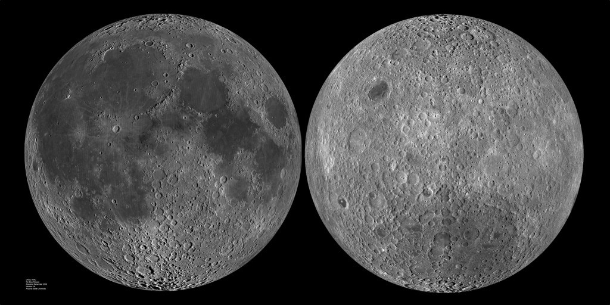

Ay tüm Güneş Sistemi'ne bakıldığında gezegeni ile arasındaki ilişki en enteresan durumda olan uydudur. Her şeyden önce Ay Dünya'nın uydusu olabilmek için çok büyüktür. Bu da doğal olarak uydu şeklinde oluştuğu düşüncesini çürüten bir durum. Ay Dünya'nın yaklaşık dörtte biridir ve Güneş Sistemi üzerinde bu şekilde orana sahip başka bir gezegen - uydu ikilisi bulunmuyor. Ay ve Dünya'dan sonra sistemde en büyük orana sahip bir sonraki ikili, sekizde bir oranıyla Jüpiter ve Ganymede ikilisidir. Ganymede Güneş Sistemi'nde en büyük uydudur ve Merkür gezegeninden daha büyük bir boyuta sahiptir. Ganymede için bu açıdan enteresan bir durum yok. Ay muhtemelen gezegen olarak oluşarak Dünya'nın çekim etkisine kapılmış bir gök cismi.

Diğer açıdan Ay'ın oluşumuyla ilgili en çok ilgi gören teorilerden biri Güneş Sistemi'nin en erken zamanlarında Theia isimli Mars büyüklüğünde bir gezegenin dünyaya çarparak uzaya saçtığı parçalardan Ay'ın oluştuğu yönünde. Bu çarpışma sonucunda Theia yok oluyor ve Dünya da büyük bir yarayla kurtuluyor. Bu teori Dünya'nın eksen eğikliğine de bir yanıt niteliğinde.  Teorinin ismi orjinalinde Giant Impact Theory, Türkçesi ise Dev Darbe Teorisi şeklinde.

Dünya üzerinden Ay'ın çok ufak farklar dışında daima aynı yüzü görünür. Ay'ın Dünya etrafında dönüş süresi ile kendi ekseni etrafındaki dönüş süresi eşittir. Bu yüzden Dünya'ya daima aynı yüzü dönük kalır. Fakat librasyon adı verilen ufak yalpalamaları nedeniyle Dünya'dan Ay yüzeyinin 50%'si değil 59%'u görünür.

Ay'ın Dünya'ya bakan yüzeyi aşırı girinti ve çıkıntıya sahipken diğer yüzeyi bunun tam tersi şekilde düzlüğe yakındır. Ay aşırı bir şekilde asimetrik yapıdadır. Ay'ın yüzeyindeki karanlık çukurlara Ay denizi deniyor. Örneğin ilk insanlı Ay yolculuğu olarak kabul edilen Apollo 11'de Sessizlik Denizi'ne (İngilizcesi Sea Of Tranquillity) inilmiştir. Bu ismin takılma nedeni antik gökbilimcilerin bu bölgeleri su ile dolu, Dünya'daki denizlerden farksız bölgeler sanmasıydı.

Ay ile Dünya Arası 1.255 ışık saniyesine eşittir. Bu demek oluyor ki Dünya üzerinden Ay'a gönderilen herhangi bir ışık veya radyo dalgası Ay'a yaklaşık 1.2 saniyede ulaşır.
