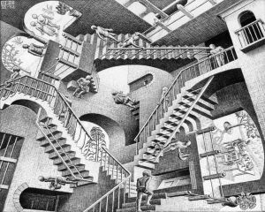
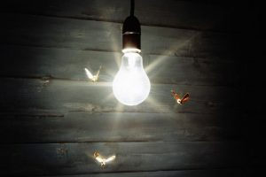

Duyu organları ve bunlardan gelen sinyallere göre hesaplama yapan birimler görevini genellikle olması gerektiği gibi yerine getirse de, çok kolay manipüle edilebilir bir yapıya sahip. Canlı vücutlarını incelemeden önce bilgisayarlardan örnek verelim. Zaman zaman bilgisayarlarınızı, makinelerinizi daha iyi veya ortamda az imkan olması durumunda kandırma gereği duyduğunuz oluyordur. Çalışmak için CD veya DVD okuyucuda bir disk görmeye ihtiyaç duyan yazılımları çalıştırmak için sanal sürücü kullanmak gibi, Pokémon GO oyununu oturduğunuz yerden oynamak için sahte GPS uygulamaları kullanmak gibi örnekler verilebilir. Bilgisayarlar mükemmel cihazlar değildir. Birçok hata, yani "bug" barındırırlar. İnsan dahil tüm canlı vücutları da öyle.

Neredeyse herkese ilköğretim okullarında yaptırılan basit bir fen bilgisi deneyi vardır. Bu deney için gereken malzemeler sıcak, ılık ve soğuk su içeren üç bardaktan ibarettir. Sıcak ve soğuk su içeren bardaklara birer parmağınızı batırarak bir süre bekledikten sonra ikisini birden aynı anda ılık bardağa sokarsınız ve düşündüğünüzden daha farklı bir sıcaklık hissiyle karşılaşırsınız. Bu deney ile dokunma duyusunun ne kadar manipüle edilebildiği anlaşılabilir.

Görsel illüzyon veya göz yanılması denen kavram ise aynı etkiyi görsel duyu için yaratmakta kullanılır. Çeşitli illüzyonlarda uzak ve yakın kavramlarını olması gerektiğinden farklı algılarsınız. Kimilerinde yukarı ve aşağı kısımlara gözlerinizi çevirdiğinizde beklediğinizden farklı bir boyutsal yapıyla karşılaşırsınız, üç boyutlu evren dahilinde fiziksel olarak imkansız olan ve yalnızca bu şekilde ayrı ayrı bakıldığında şaşırtan çeşitli görseller. Görsel illüzyon dendiğinde direkt aklınıza gelen, çeşitli siyah ve beyaz şekillerden oluşan, iç içe geçmiş ve dönen yapıların olduğu videoları sabit bakışlarla izledikten sonra beyaz bir duvara baktığınızda gözlemlenen görsel deformasyonun nedeni de gözdeki reseptörlerin hafızasını yanıltmaktan kaynaklanıyor. Parlak bir nesneye veya ışık kaynağına baktıktan sonra gözlerinizi kırparsanız yine o nesnenin bir silüetini kısa bir süre boyunca algılayabilirsiniz.

İnsan gözü evreni iki boyutlu olarak algılar ve gözden beyne gönderilen sinyaller yardımıyla üç boyutlu olarak yorumlar. Derinlik hissi iki ayrı gözden gönderilen verilerin birleştirilmesiyle oluşur. Üç boyutlu gözlükler ise bu algıyı sahte bir şekilde yaratır. Şu eski teknoloji olan, iki gözü birbirinden farklı renk içeren gözlükler de iki boyutlu bir resme bakarken sahte bir üç boyut algısı yaratmak adına bunu kullanır. Bakılan resimde birbiri içine geçmiş, farklı açılardan çekilmiş iki tane resim bulunur. Bu resimlerin rengi gözlük jelatinlerinin rengiyle aynıdır. Örneğin kırmızı renkte bir jelatinden baktığınız zaman kırmızı renkli bir objeyi görmezsiniz, beyaz renkten farkı kalmaz. Bu şekilde iki göze farklı resimler gönderilir ve bunlar aynı şekilde derinlik algısı yaratır.

Araç tutmasının ve bir araç içinde hareket halindeyken gözlemlenen o enteresan hissin nedeni ise hareket algısındaki manipülasyondur. İnsan vücudu hareket ettiği zaman bunu kendi gerçekleştirdiğini düşünecek şekilde evrimleşti. Hareket iç kulak kısmında bulunan yarım daire kanalları ve kısmen de göz ile algılanır. Yarım daire kanallarındaki sıvının hareketi beyne ne pozisyonda durulduğunu, dengede olup olunmadığını ve hareketi algılatacak olan ham sinyalleri gönderir. Bir araçta giderken kaslar hareket halinde olmamasına rağmen iç kulaktaki bu algı ve gözün algıladığı yer değiştirme hissi beynin zehirlendiğini düşünmesine neden olur. İnsan bedeni zehirlenme belirtileri durumunda sindirim sisteminin üst kısmındaki yemek borusu kaslarını ve mide gibi organları kasarak kusmaya yönelir.

Alkolün, nikotinin, uyuşturucuların, kafeinin yaptığı ise direkt olarak beyindeki algıyı değiştirerek duyuları ve bünyeyi kandırmaktır. Bunlar beynin yorgunluk hissini, hesaplayarak hareket etme yatkınlığını, odaklanma yapısı gibi işlemlerini manipüle ederek vücudu kandıran maddelerdir. Bunun dışında yüksek miktarda alkol aldıktan sonra gözlerinizi kapatıp uzanırsanız yüksek ihtimalle bir denge bozulması hissedecek ve kusma ihtiyacı duyacaksınız. Bu da araç tutmasıyla benzer bir etki.

İnsan dahil çoğu canlıda neden bir çift göz olduğunu anlamışsınızdır. Çift kulak olması da benzer bir nedenden dolayı. Kulaklar çevredeki sesin pozisyonunu, uzaklığını hesaplamak için iki adettir. Beyin iki kulaktan gelen sesi birbirlerine göre işler ve bu verileri ortaya çıkarır. İşitme yoluyla beyin algısını kandırmak için Virtual Barber Shop isminde güzel bir örnek ses kaydı var. Bu kaydı gözleriniz kapalı olarak ve en önemlisi kulaklığınızla dinlediğinizde oldukça gerçekçi gelecektir.

\[embed\]https://www.youtube.com/watch?v=8IXm6SuUigI\[/embed\]

Tat ve koku duyusunun nasıl manipüle edilebildiğini de halihazırda gözlemlemişsinizdir. Bir üst solunum yolu enfeksiyonu geçirdiğiniz ve koku alma duyunuzun çeşitli nedenlerle zayıfladığı durumlarda tat alma duyusundan da yoksun olursunuz. Aynı etkiyi burnunuzu kendiniz kapatarak da gözlemleyebilirsiniz. Çünkü bu iki duyu birbirine entegre olarak çalışır. Dildeki tat alma reseptörleri yalnızca acı, tatlı, tuzlu gibi belli başlı net tatları ayırt eder. Geri kalan daha karmaşık yapıdaki tatlar ise koku duyusu yardımıyla alınır. Koku duyusu aslında oldukça ilkel bir yapıdadadır ve hava aracılığıyla gelen moleküllerin üzerinden çalışır. Tanımlanmayan kokular ise algılanmaz. İnsan için dışkının kötü, yemeğin güzel kokmasının nedeni birinin insan vücudu için uzak durulması gereken, hastalık taşıma ihtimali taşıyan bir etmen, diğerinin ise ihtiyaç duyulan bir materyal olmasıdır. Koku ile ilgili daha çok ayrıntıya başka bir yazıda uzunca değiniriz, benim de o konuda daha çok araştırmam yapmam gerek.

Şimdi biraz da diğer hayvanlar açısından bakalım. Kedilerde hareketsiz bir nesneye vurarak hareket ettirdiklerinde onu hareketli bir nesne sanarak birden geri kaçması gibi enteresan huylar görmüşsünüzdür. Kedileri bug'a sokan bir durum. Aynısını duvara tutulan lazer ışığına karşı da yaparlar.

Fakat şimdi daha güzel örnekler verelim. Sinekler de dahil olmak üzere uçan böceklerin sürekli olarak lambalara uçup çarptıktan sonra tekrar uçmasına sürekli denk geliyorsunuzdur. Bunun nedeni böceklerin doğada Ay'a karşı uçarak yönlerini bulmasıdır. Ay asla ulaşamayacakları bir uzaklıkta olduğundan ve sürekli dünyanın üzerinde hareket edebildiklerinden dolayı evrimsel olarak yönlerini bu şekilde hesaplayacak bir yapıya ulaştılar. Doğada yapay ışık yok, böceklerin de hatalarından ders çıkarabilecekleri gelişmiş bir sinir sistemleri yok.

Karette karette kaplumbağa yavruları da sahillerde yumurtadan çıktıntan sonra da denizin üzerine yansıyan ışıklar aracılığıyla denizin yolunu bulurlar. Bu yüzden şehir ışıkları onları yanıltarak, yanlış bir yöne doğru doğru ilerlemelerine neden olması dolayısıyla onlar için bir tehlike oluşturur. Benzer şekilde yön belirlemek için sonar kullanan hayvanlar da insanların kullandığı sonar kullanan araçlar yüzünden yönlerini yanlış bir şekilde belirlemekte.

Aslında bu konuda söyleyecek daha çok fazla şey var. Telkinler, hipnoz, plasebo etkisi gibi daha oldukça konu var. Şimdilik işin biyolojik kısmını ele aldık. Başka bir yazıda daha fazlasına değinebiliriz.
