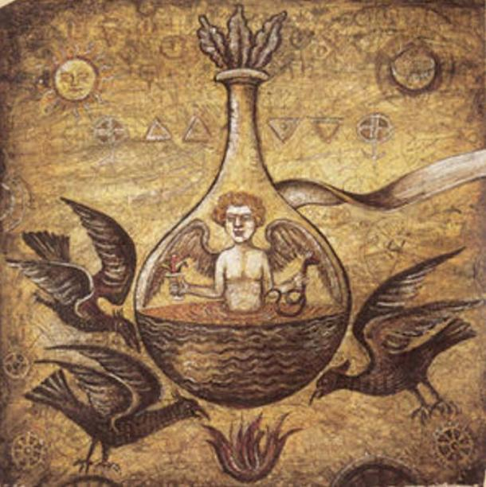
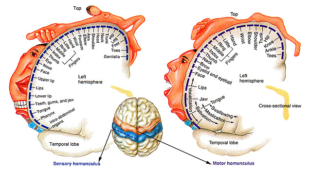
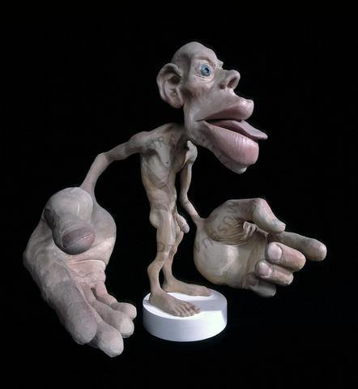
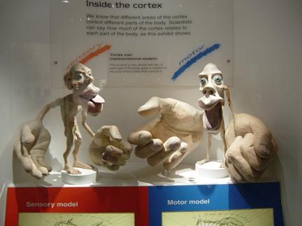
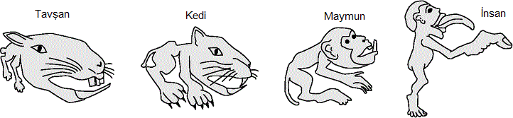

Homunculus kelimesinin taşıdığı birden fazla anlam var. Fakat hepsinin buluştuğu temel nokta, küçük boyutlu bir insan figürü şeklinde. Homunculus kelimesi Latince "küçük adam" veya "adamcık" anlamına geliyor. "Homunculus nedir" dendiğinde karşımıza birden fazla anlam çıkıyor. Önce homunculus teriminin simya dünyasında ortaya çıkışına giriş yapalım, ardından asıl bilimsel yaklaşımı olan sinirbilimdeki yerine bakarız.

### Simyada Homunculus

Henüz doğa bilimlerinin tam anlamıyla emekleme aşamasından kurtulamadığı zamanlarda, bilim ve safsataların iç içe bulunduğu süreçte simya; kimya biliminin öncülü olarak ortaya çıktı. Simyacı veya simyager denebilecek, simya üzerine kafa yoran insanlar maddelerin birbiriyle etkileşimleri ve bunların sonuçlarıyla ilgileniyordu. Fakat yaygın amaç ve simyayı bilim olmaktan ayıran en önemli noktalar; değersiz madenleri altına çevirme, ölümsüzlük iksirini bulma ve bunları yapmalarını sağlayacak felsefe taşı isimli hayali bir objeyi keşfetmeye çalışıyor olmalarıydı. Simya bunlarla birlikte insan oluşumuyla da ilgilendi. O zamanlar spermin içinde minyatür bir insan taşıdığını, cinsel birleşme esnasında bu ilkel insan formunun dişi vücuduna aktarıldığını ve burada yetiştiğine inanılıyordu. Dolayısıyla zamanın yaygın olan ataerkil düşüncesinin ışığında insan doğumu için dişi bireye ihtiyaç yoktu, dişi vücudu yalnızca bu insanı içinde besleyerek büyütmek için gerekiyordu. Simyacılar yalnızca spermden oluşan insan oluşturmayı denediler. Tabii üretilip üretilmediği, hatta simyacıların çıkıp ürettiklerini iddia edip etmediği konusunda kesin bir bilgi yok.

#### Simyadaki Homunculus Tarifi

Bu konuda kafa yoran en ünlü insanlardan biri 16. yüzyılda yaşamış olan, modern tıbbın temellerinin atılmasında önemli bir rolü olan Paracelsus idi. Bu elemanın internette bolca dolaşan bir homunculus tarifi vardır ve burada kısaca bir özetini verelim: Bu tarif spermin kırk gün boyunca çürümüş at gübresiyle birlikte hava geçirmeyen bir şişenin içinde çürümeye bırakılmasıyla başlıyor ve ardından bu karışımda bir hareketlenme görüleceği söyleniyor. Sonucunda ortaya yaşayan fakat minyatür boyutlarda ve şeffaf, insan organlarının minyatür haline sahip bir canlı ortaya çıkıyor. Canlı bu aşamadan sonra her gün insan kanıyla beslendikten sonra kırk gün daha gübre ısısında tutulduğu sürece sonunda tam anlamıyla bir bebek halini alıyor. Gerçek bir bebekten tek farkı ise daha ufak boyutta olması.

Bu formülün farklı biçimde anlatılanları, farklı milletlere atfedilenleri bulunuyor. Eşeyli üremeyle neslini devam ettiren canlıların buna devam edebilmesi için iki cinsin de gerektiği bugün şüphesiz bilinen bir gerçek. Sperm yalnızca kalıtım materyali taşır. Yumurta ile birleştiğinde kendi kalıtım materyalini onunki ile birleştirerek ortaya zigot denen, çoğunluğu kök hücreden oluşmuş olan yüksek potansiyelli bir hücrenin ortaya çıkmasına neden olur. Bu zigot oluşacak canlı embriyosunun, dolayısıyla canlı bireyin en temel halidir ve mitoz bölünme yoluyla git gide o forma dönüşür. Fakat insan tarihi boyunca erkek ve dişi bireylerin üstendiği ve birinin diğerinin üzerine yıktığı roller nedeniyle modern bilim gelişene dek bugünün gelişmiş medeniyetlerinde uzun bir süre ataerkillik hakim olmuştur.

### Homunculus Kavramının Nörolojideki Anlamı

Peki modern bilim açısından homunculus nedir? Bu kavramın bilimsel anlamı ise bambaşka bir tanıma sahip. Beyinde vücuttaki organların istemli olarak kontrol edildiği bölgeler işaretlendiğinde yukarı - aşağı doğrultusunda bir şerit oluştuğu görülür. Buna motor korteks adı veriliyor. Beyin bilindiği üzere iki yarımküreden oluşuyor ve sağ yarımküre vücudun sol kısmını kontrol ederken sol yarımküre ise sağ kısmını yönlendiriyor. Dolayısıyla simetrik iki motor korteks bölümü mevcut. Bu yarımküreler birbirine zayıf noktalarla bağlı ve ortadan bölündüğünde ise bu şeritlerin beynin orta kısımlarında aşağıya doğru indiği görülüyor. Motor korteks üzerinde, organlar temsil edildikleri bölgeler üzerinde işaretlendiği zaman enteresan bir oran göze çarpar. Kabaca dış kısımda en alt bölgelerde gırtlak, bir üzerinde dil, onun üzerinde yüz yani mimikler, ardından el, sonrasında vücudun geri kalanı ve beynin orta kısımlarına doğru da ayak için temsil edilen bölgeler yer alıyor. Eller için motor korteks üzerinde yer alan bölüm diğerlerine oranla fazlasıyla büyük durumda. Bunun nedenine daha sonra gireriz.

Beyindeki bu şerit üzerinde yer alan alanlara göre temsil edilen organlara sahip bir figür çizildiğinde buna homunculus adı veriliyor. Bu figür elleri vücuduna göre abartılı şekilde büyük, ellerle boy ölçüşemese de kafası ve dili de aynı şekilde büyük, vücudunun geri kalanı ise fazlasıyla küçük ve ince şekilde olan bir insan şeklinde ortaya çıkıyor.

#### Motor ve Duyu Homunculusları

Beyindeki bölgelerin temsili şeklinde ortaya çıkan yalnızca bir homunculus yok elbet. Motor korteksin hemen yanında duyusal korteks ismiyle bulunan başka bir şerit mevcut. Bu bölge ise aynı organlardan gelen algıları kontrol ediyor. Bir önceki homunculusun ismi "motor homunculus" olarak geçerken bunun ismi ise "duyusal homunculus" olarak geçiyor. Bu örneğin elleri motor homunculus kadar büyük değil ve tabii insan vücudu ile arasında ne kadar büyük bir uçurum olsa da insan vücudu olmaya motor homunculustan daha yakın bir durumda. Tabii bu şekilde çizilen homunculuslar fiziksel olarak hayatta kalamayacak, yaşaması mümkün olmayan canlılar. Bunlar yalnızca insan beyninde kas kontrollerinin ve algıların bir temsili şeklinde yaratılan figürlerden ibaret.

Şimdi ellerin boyutu meselesine bir bakalım. İnsan evriminde eller çok büyük bir önem taşır. İnsanlığın gelişimi ve doğadan bağımsızlaşması tamamen ellerine bağlanabilir, çünkü insan kapsamlı olarak alet yapan ve kullanabilen tek hayvandır. Bunun dışında insan geliştirdiği bir aleti öğrenerek geliştirebilir. Dolayısıyla bir insan homunculusunda ellerin aşırı büyük olması çok sıradan bir durum.

Yalnızca insan için homunculus oluşturulacak diye bir kural yok. Hayvanlar için de bu metod uygulanabilir. Şimdi birkaç hayvan için çizilmiş homunculus figürlerine bakalım.

Bu resimdeki çizimler tam anlamıyla doğru olmasa da bir fikir vermesi açısından kullanılabilir. Bunlar farklı hayvanların duyusal homunculuslarının bir çizimi. Tavşan örneğinde çenenin vücudun geri kalanına göre aşırı büyük olduğu görünüyor. Kedi tavşan örneğine göre daha orantılı görünse de yine kafa ve bacakların boyutu yüzünden orantısızlık devam ediyor. Örnekteki en tutarlı oranlar ise maymun homunculusuna ait gibi görünüyor.

### Popüler Kültürde Homunculus

Homunculus kavramının popüler kültürdeki en ünlü kullanımı ise Fullmetal Alchemist isimli animede geçer. Simyanın büyü formatında, abartılı bir formunun mevcut olduğu animede homunculuslar simyacıların yarattığı insanlar şeklinde resmediliyor. Bu animenin iki farklı serisi mevcut. Birinci seride homunculuslar insan dönüşümü yapmak, bir insanı geri getirmek isteyen simyacılar tarafından istemsiz bir şekilde oluşturulan varlıklarken; İkinci seride ise "Baba" adı verilen anti-kahraman karakterin kendi vücudundan oluşturduğu varlıklar şeklinde görülüyor.
