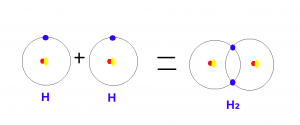
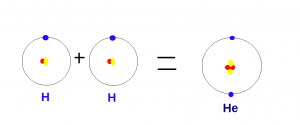

Merhabalar, bu yazımda sizlere bir yıldız nasıl doğar sorusunun cevabını vereceğim.

Cevap: Yerçekimi.

Bu sorunun cevabını net bir şekilde anlayabilmek için bazı konu başlıklarına değinmemiz gerekir. Bunlardan ilki tabii ki yer çekimi.

Kütlesi olan her şeyin bir kütle çekim kuvveti vardır. Biz bu kuvvete yer çekimi adını vermekteyiz. Big Bang gerçekleştiğinde etrafa muazzam ölçüde hidrojen atomu saçılmıştır. Başıboş halde Big Bang'in merkezinden etrafa saçılan hidrojen atomları bir süre sonra kütle çekim kuvvetinden dolayı bir araya gelmeye başlamıştır. Bu topaklanma sürecinde birbirine sürten hidrojen atomları ısı üretmeye başlar.

Şimdi buraya bir virgül koyuyoruz ve ikinci konu başlığımıza geçiyoruz. İkinci konu başlığımız ısı transferi.

Uzayın soğuğu denilen bir kavram vardır. Bu kavram aslında hatalıdır. Çünkü bir şeyin sıcak yada soğuk olmasından bahsedebilmek için maddenin varlığından söz etmemiz gerekir. Sıcaklık dediğimiz şey maddeyi oluşturan taneciklerin titreşiminden başka bir şey değildir. Bu durumda ısınan bir şeyi soğutmanın tek yolu, ısısı daha düşük bir maddeye mevcut ısının aktarımıdır. Örneğin ellerimizi birbirine sürtersek ellerimiz ısınacaktır. Ellerimizi ayırdığımızda ise soğur. Çünkü ellerimiz ile hava arasında bir ısı alışverişi gerçekleşir ve elimizdeki ısı havaya geçer. Fakat uzayda hava gibi bir ortam olmadığından ötürü birbirine sürten hidrojen atomlarının ürettiği ısı korunur ve sürtünme devam ettiği sürece ısı artmaya devam eder.

Buraya kadarki kısımdan sonra değineceğimiz konu başlığı nükleer reaksiyon.

Nükleer reaksiyondan önce nükleer olmayan reaksiyonlara kısaca değinmemiz gerekir. Kısaca reaksiyon dediğimiz şey iki maddenin bağ oluşturarak yeni bir madde oluşturmasıdır. Örneğin hidrojen ile oksijenin tepkimeye girmesi ile suyu oluşturduğunu hepimiz biliyoruz. Bu olayda gerçekleşen şey, iki hidrojen ile bir oksijenin birbirine tutunmasıdır diyebiliriz. Ama bu bileşiği oluşturan elementlerin yapılarında hiç bir değişiklik olmaz. İçerdiği hidrojen bildiğimiz hidrojen, içerdiği oksijen bildiğimiz oksijen. Fakat nükleer reaksiyon dediğimiz şey çok yüksek sıcaklıklarda atom çekirdeğini bir arada tutan bağların zayıflaması sonucu atomların birleşmesi ve yeni atomlar oluşturması durumudur. Yani normal reaksiyon sonucunda 2 hidrojen atomu bir araya gelerek H₂ bileşiğini oluştururken, Nükleer reaksiyon sonucunda 2 hidrojen atomu bir araya gelerek helyumu oluşturur. Yani bir proton ve bir elektronu olan iki adet hidrojen, nükleer reaksiyon sonucunda iki proton ve iki elektronu olan helyuma dönüşür.

Bir yıldız ilk doğumu sırasında nükleer reaksiyon başladığında o kadar büyük bir enerji açığa çıkar ki bir şok dalgası ile etrafındaki tüm maddeyi dağıtarak uzayın farklı noktalarına gönderir. Bu olayın sonucunda bir yıldız doğmuş olur. Enerjinin ne kadar büyük olduğunu anlamak için Einstein'ın meşhur denklemi olan E = mc² düşünülebilir. Bu denklemde E = Enerji, m = Kütle ve c = Işık hızının kısaltmalarıdır. Yani nükleer reaksiyon sonucunda ortaya çıkan enerji kütle x ışık hızının karesine eşit olur. Işık hızının 299.792.458 m/s ve bizim yıldızımın olan güneşin kütlesinin 1989000000000000000000000000000 kg olduğunu düşünürsek ortaya çıkan enerji çok büyüktür.

Bu bilgileri toparlayacak olursak, bir yıldız kütle çekim kuvveti sonucunda bir araya gelerek birbirine sürten taneciklerin ürettiği ısı sonucunda nükleer reaksiyon başlar ve bir yıldız doğmuş olur.
