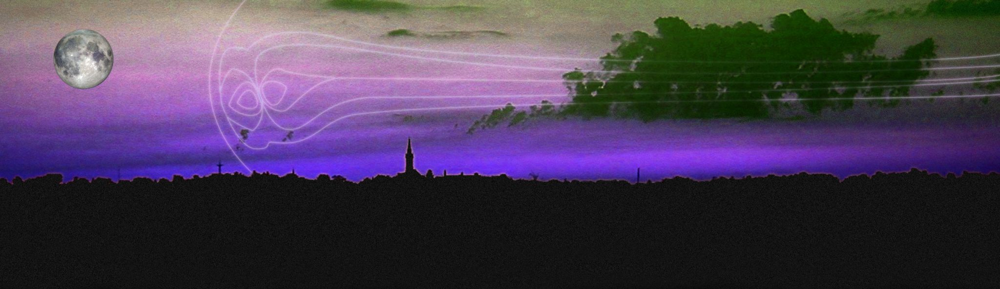
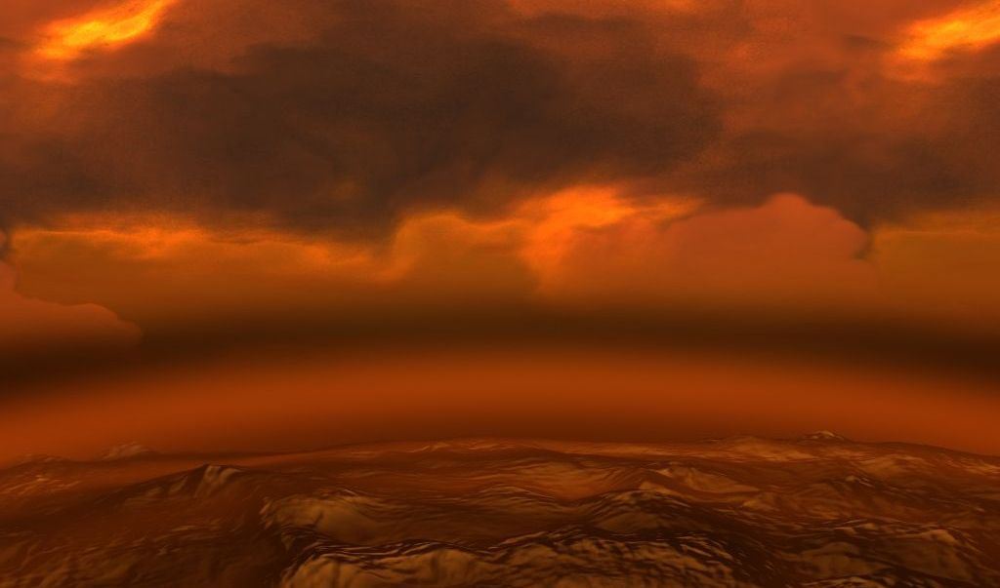
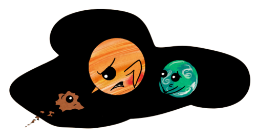

Bilinen yaşamın yalnızca Dünya'da oluşarak, başka gezegen ve yıldız sistemlerinde oluşmamış olmasının birçok nedeni var. Bu yalnızca Dünya'yı sarıp koruyan bir ozon tabakası olmasından çok daha karmaşık bir mevzu. Dünya'daki yaşamın korunmasında Jüpiter dahi büyük role sahip.

Her şeyden önce dünya bir kayaç gezegen. Bunun anlamı sert bir zemin barındırıyor ve en üst katmanında yoğun olarak bulunan maddeler bugün bilinen organik maddelerin oluşabilmesi için yapı taşı konumunda. Dünya'daki hayat temel olarak Karbon atomunun üzerine kurulmuştur. Güneş sisteminde bulunan gaz devleri bir canlının yaşamasının mümkün olmadığı bölgelerdir. Bu gezegenler büyük ölçüde gazdan oluştuğundan dolayı kendisine yaklaşan herhangi bir cismi doğruca merkezine çeker ve orada yüksek basınçtan dolayı ezerek kendi çekirdeğine ekler. Gaz devleri doğrudan canlıların veya herhangi başka bir maddenin barınmasına elverişli olmasa da, yüksek kütlelerinden dolayı çevrelerinde tuttukları, kayaç gezegen büyüklüğündeki katı haldeki uydularının yaşam barındırma olasılığı vardır. Fakat örneğin Jüpiter bu tarz uydulara sahip olsa da, aynı şekilde çevresinde yüksek radyasyon barındıran kuşaklara da sahiptir. Bunun nedeni Jüpiter'in sahip olduğu devasa manyetosferidir. Jüpiter'in manyetosferi Güneş Sistemindeki en büyük boyuta sahip oluşumlardan biridir ve çıplak gözle görülmesi mümkün olsa gökyüzünde Ay büyüklüğünde bir alan kaplardı. 

Dünya büyük oranda stabil bir atmosfere sahip. Bu atmosfer ne tüm maddeleri ezecek kadar yoğun ve geniş; ne de gezegeni her an terk edecek veya kullanılamayacak kadar seyrek. Atmosfer canlıların oluşumundan bu yana besin sindirimi veya üretimi için kullandıkları çeşitli gazları içeriyor. Besinini fotosentez yoluyla sağlayan canlılar atmosferdeki karbondioksiti besinin hammaddesi olarak kullanırken, besinini diğer canlılardan karşılayan canlılar ise bu besini sindirmek için aynı atmosferdeki oksijen gazını kullanır. Bunun dışında atmosfer gezegenin hasar almasını, aldığı hasarları da kendi kendine onarabilmesini sağlıyor. Ay'ın yüzeyince bolca krater bulunurken Dünya'nın bu açıdan çok daha rahat olmasının nedeni de budur. Dünya'ya her gün düşen sayısız göktaşı hızından dolayı atmosferde sürtünmeden erirken, yeryüzüne ulaşıp krater açan göktaşlarınınsa kraterleri atmosfer aracılığıyla zamanla yok olur. Dünyanın bir bölgesinde herhangi bir şekil bozukluğu olduğunda gaz ve su kütleleri başta olmak üzere doğal kuvvetler bu bölgeyi onararak büyük oranda eski haline çevirir. Venüs de bir atmosfere sahip olmasına rağmen onun atmosferi aşırı yoğun ve yüksek sıcaklık barındıran bir atmosferdir. Venüs yüzeyinde bu yüzden basınç ve sıcaklık değil canlıların, mekanik cihazların dahi kolayca harap olmasına neden olacak kadar yüksektir. Bunun nedeni sera etkisidir. Venüs'ün bir zamanlar Dünya gibi bir gezegen olmasının, dolayısıyla Dünya'nın geleceğinin de Venüs gibi olmasının ihtimali yüksek.

 

Dünya işlevsel bir manyetosfere sahi ve pusulaların Dünya üzerindeyken çalışabilmesini sağlayan kuvvet de bu. Dünyanın merkezinde eriyik halde bulunan demir - nikel alaşımı hareket halindedir ve dünyayı büyük bir mıknatısa çevirir. Dünya bu sayede güneşten gelen solar rüzgarları kendinden uzaklaştırır. Manyetosfer bu açıdan bir kalkan görevi görür. Bu olay gerçekleşirken güneş rüzgarlarından kaynaklı yüklü parçacıklar Dünya'nın kutuplarına itilerek aurora (kutup ışıkları) denen doğa olayı gerçekleşir. Mars da bir zamanlar etkin bir manyetosfere sahip olmuşsa da artık düzensiz ufak manyetik bölgeleri olan bir gezegen konumundadır. Sonuç olarak Mars bu yönde korunabilme yeteneğini kaybetmiştir.

Dünya atmosferinin bir katmanını oluşturan iyonosfer ise iyonize olmuş gazdan oluşmuştur. Bu katman aurora olayının yoğun olarak gerçekleştiği katmandır. İyonosfer 30 mHz altı frekansa sahip dalgaları yansıtır ve Dünya'daki karasal yayınların daha verimli iletilmesini sağlar. Dünya'yı elektromanyetik dalgalardan koruyan bir başka etmendir.

Ozonosferin önemi ise elbette göz ardı edilemez. Güneşin yaydığı enerjinin bir kısmını oluşturan morötesi (UV) ışınların büyük kısmı bu katman tarafından emilir ve Dünya'ya ulaşması engellenir. Bu ışınlar canlı hücrelerin, kalıtsal maddelerin yapısını bozarak kanser olarak bilinen bilinçsiz zombi yapılara dönüşmesine neden olur. Ultraviyole ışınlar elektromanyetik spektrumda görünür ışıktan sonra gelen, ondan daha yüksek frekansa sahip ışınlardır. Ultraviyole ışınlarla başlayan, yüksek frekanslı tüm ışınlar canlı hücrelerde tahribata neden olan iyonlaştırıcı etkiye sahiptir.

Dünya'daki yaşamın korunmasını sağlayan en önemli olgulardan biri de Dünya'nın konumu sayılabilir. Dünya yıldızı Güneş'in yaşam kuşağı denen bölgesinde bulunur. Yıldızların çevresinde dolaşan gökcisimlerinin canlıların yaşamasına engel oluşturacak şekilde aşırı soğuk veya aşırı sıcak olmayan, optimum yörünge bölgelerine yaşam kuşağı denir. Yeni gezegen araştırmalarında ilk kontrol edilen verilerin başında gelir. Bir gezegen yıldızının yaşam kuşağında yer alıyorsa o gezegenin yaşam barındırma ihtimali bulunur.

Elbette su gibi, organik maddelere doğrudan bir zararı olmayan ve organik tepkimelerin çok hızlı gerçekleşmesini sağlayan temel bir sıvı da yaşam içeren bir gezegende olmazsa olmazdır. Bu yüzden yeni bulunan gezegenlerde ilk kontrol edilen durumlardan biri de sıvı su içermesidir.

Tüm bunların dışında, Dünya'nın korunmasını sağlayan en tahmin edilemez faydayı ise Jüpiter sağlar. Dünya'dan çok uzakta bulunan bu Güneş Sistemi'nin Hulusi Kentmen'i Güneş Sistemi'ne dışarıdan sızan, özellikle Oort Bulutu'ndan itilen asteroidleri kendine çeker ve Dünya'ya ulaşmasını engeller. Dünya'ya yaklaşamadan çoğu asteroid Jüpiter tarafından yutulur. Canlılığın oluşacağı farklı yıldız sistemlerinde dış gezegen katmanında Jüpiter gibi bir gaz devi bulunması bu açıdan önemlidir. Yine Jüpiter bu kendine çektiği gök cisimlerini parçalara ayırır ve yörüngesinde yüksek hızda dönmelerine neden olur. Bu yüzden Jüpiter'in çevresinde bir de yüksek hızda dönen ufak parçalardan oluşan kemerler vardır. Jüpiter uydularında yaşam oluşumunu tehdit eden bir diğer unsur ise budur.

