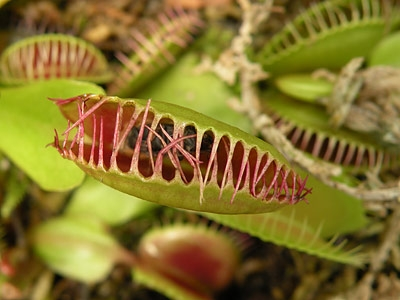
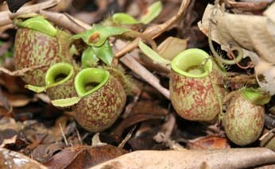
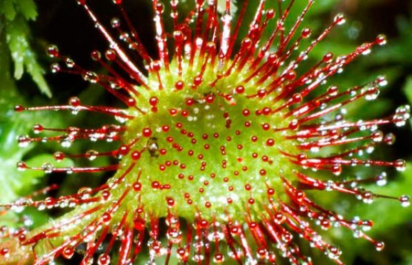

Evrimleşme süreci bazı bitkiler üzerinde farklı gelişmelere neden olmuştur. Genel olarak bitkiler fotosentez yapan, üreten ve gerekli besinini topraktan alan canlılar olarak bilinirler. Ancak bazı nedenlerden dolayı kimi bitkilerde etoburluk görülmektedir. Bu bitkilere Etobur (Karnivor) bitkiler denmektedir.

Etobur bitkileri diğer bitkilerden ayıran özellikleri böcek, sinek, örümcek gibi küçük hayvanları sindirmesidir. Diğer bitkiler gibi iletim demetleri, çiçek, yaprağa sahiptir. Bu bitkiler canlıların ilgisini daha çekecek kadar renkli ve güzel kokulara sahiptirler. Bu sayede hareketsiz haldeyken yemeklerini kendilerine çekerler.

Kurak yada bataklık gibi topraklarda yaşayan bitkiler topraktan yeterince bitki besin maddelerini alamaz. Topraktaki azot eksiliğini başka yollarla elde etmeye çalışırlar. Bu bitkiler çeşitli sinek, böcek gibi canlıları sindirerek yaşamlarını sürdürürler. Etobur bitkiler bunu yapmadan da yaşarlar ancak gelişimleri daha yavaş olur.  Doğada yaklaşık 600 kadar etobur bitki türü bulunmaktadır. Bunlardan en çok ilgi çekenlerinden birkaçı  Venüs sinek kapanı, Suibriğigiller, Güneş gülü bitkisidir.

#### Venüs Sinek Kapanı (Sinekkapan Bitkisi)****

Sinekkapan bitkisi canlıları cezbedecek kokuya sahiptir. Sulak alanlarda yetişen bu bitkinin 2 yaprağında üçgen şeklinde  üçer tüy bulunur. Üzerine konan sinek ya da benzeri bir canlının tüylerden birine dokunuşundan sonra 20 saniye içinde ikinci kez dokunursa yapraklar hızlı bir şekilde kapanır.Kapana sıkışan canlı çok küçük ya da çok büyükse kapandan kurtulmayı başarabilir. Kapana kısılan canlı 5 ile 20 gün arasından sindirilir. Daha sonra kapan açılır ve yeni canlı beklenir.

#### Suibriğigiller Bitkisi ****

Tüp şeklinde olan yapısıyla adeta bir sürahiyi andıran bir bitkidir. Tüpün içinde sindirim enzimleri olan bir sıvı bulundurur.  Bitkinin yüzeyi kaygan bir yapıdadır. Bu kaygan yüzey, üzerine konan canlıların tutunamayarak tüpün içine düşmesine neden olur. Sıvının içine düşen canlı hareket edemez . Kısa bir süre sonra sıvı içine düşen canlı boğulur. Bu sıvı içindeki enzimler sayesinde sindirilir. Bu bitkinin içindeki sıvının yapısı hala tam olarak bilinememektedir.

#### Güneş Gülü Bitkisi

Güneş gülü bitkisi rengarenk ve hoş kokulu bir yapıya sahiptir. Sulak alanlarda yetişmektedir. Bu bitki yapraklarında tüyler barındırır. Tüylere bir canlı dokunduğu zaman hemen yapışkan bir sıvı salgılar. Bu salgı canlının  kaçmasını engeller. Sıvı sayesinde yaprağa yapışan canlı kaçmaya çalışsa bile kaçamaz ve yaprak kıvrılmaya başlar. Güneş gülünün dokunaçları her yöne kıvrılabilir. Bu sayede canlıyı rahatlıklar sarabilir. Yaprak canlıyı sardıkça yapışkan sıvı canlının her tarafına bulaşır ve canlı boğulur. Sindirim enzimleri sayesinde Güneş gülü bitkisi canlıyı sindirir. Bu bitki de bu sayede azot ihtiyacını karşılamış olur.
