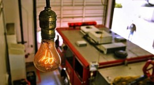
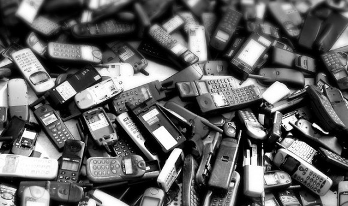

Bir ürün aldınız, birkaç sene kullandınız ve durup dururken bu ürün işe yaramaz hale geldi. Kolayca hasar görmüş olabilir. Diğer yandan hasar görmemiş ve dış görünüşünün sorunsuz halde olmasına rağmen iş görmüyor da olabilir. Fark edilebileceği üzere tüm ürünler kullanılmaya başlandıktan belli bir süre sonra ıskartaya çıkmakta. Komplo teorilerine göre bunlar tesadüf değil, üretimde uygulanan bir stratejinin sonucu. Planlı eskitme veya kasıtlı eskitme denen bu olgu yüzünden seri üretime sahip tüm ürünler, tüm cihazlar belli bir kullanım ömründen sonra bozulacak veya iş görmeyecek hale gelecek şekilde üretiliyor. Elektronik, giyim, yapı gibi her çeşit sektörde bu durumu görmek mümkün. Her ne kadar komplo teorisi desek de bu durum hakkında su götürmeyen gerçekler mevcut.

Planlı eskitmenin amacı bir ürünün ömrünü normalden daha kısa hale getirerek insanların bu ürünü daha sık şekilde ve en güncel halini almasını sağlamak. Bu olgu her zaman yoktu elbet. 1920'lerde ortaya çıkan ve tüm piyasayı kaplayan planlı eskitme tüketim toplumunun oluşmasında ve ekonominin bu yönde şekillenmesinde büyük rol oynadı. Şirketler bu durumdan büyük kar elde ediyor. Tüketim toplumunun doğmasıyla oluşan moda kavramı ile bu durum gittikçe güçlenmiş durumda. iPhone 5 almış olan bir velet telefonu bozulduğunda elbette "iPhone 6 çıktı, en iyisi onu alayım" diyecektir. Bunun dışında elinizdeki herhangi bir ürün bozulduğunda, bunu teknik servise götürürseniz büyük oranda "Tamir ettirmek yenisini almaktan daha pahalıya patlar" zırvasını duymanız olası.

Planlı eskitme kavramını daha iyi anlamak için bu kavramın olmadığı zamanlardan kalma bir örneğe bakmak iyi bir yol olacaktır. ABD'nin Kaliforniya eyaletinin Livermore kasabasında, 1901 yılından beri yanan bir ampul bulunuyor. Bu ampul yalnızca takıldığı zamandan bu yana bölgede gerçekleşen 3 kesinti esnasında sönmüş. Livermore İtfaiye Müdürlüğünde takılı halde olan ampulün bu özelliği 1970'lerde keşfediliyor. O zamandan beri bu ampul 2 webcam eskitmiş. 2001 yılında bir işsiz aşireti toplanıp bu ampulün 100'üncü yaş gününü kutladı. Ampulü geliştiren Adolphe Chaillet ampulün bu dayanıklılığını nasıl sağladığına dair sırrını mezara götürdü. Nasıl bu kadar süre dayanabildiğine dair bir bilgi yok. Bu eleman ampulünü Edison ile girdiği yarış için tasarlamıştı. Bu ampul üretildiği sırada planlı eskitme kavramı ortada yoktu ve ürünler dayanabileceği en uzun süre boyunca dayanması için üretiliyordu.

1920'li yıllarda ampul üretimine dayalı şirketlerden oluşan bir kartel kurulması için toplanan grup ile birlikte planlı eskitme kavramı insan hayatına girmiş oldu. Başlarda Phoebus adlı bu kartel reklam kampanyalarında 2500 saate kadar dayanan ampullerden bahsederken sonrasında ömrü özellikle 1000 saate düşürülmüş ampuller üretilmesine dair bir fikir ortaya atıldı. Dayanıklı ampul üretmek kısa vadede elbette iyi bir seçenekti. Dayanıklı ürüne sahip şirketlerin ürünleri daha çok tercih edilirdi. Fakat uzun vadede düşünüldüğünde uzun ömürlü ürün üretilmeye devam edilmesi tüketicilerin yeni ürün almasının önünü kesiyordu. Kartel bünyesindeki şirketlere baskı uygulayarak, 1000 saatten fazla tüketim ömrüne sahip ampul üreten şirketlere para cezası uyguluyordu.

Planlı eskitme bugünün dünyasında seri üretimin olduğu her yerdedir. Ürünler özellikle kendi ömürlerini kısaltacak şekilde davranmak için de üretilebilirler. Bunun dışında ürünü kaliteli görünecek şekilde kalitesiz şekilde üretmek de planlı eskitmeye dahildir. Maliyet düşer, çok daha fazla ürün üretilir ve tüketiciler ürünlere çok daha fazla rağbet eder, ihtiyaç değil, zevk ön planda olur. Bütün bunlar ekonominin güçlenmesine neden olur. Bu kavram birden bırakılacak olursa bugünün ekonomisi büyük kan kaybedecektir.
