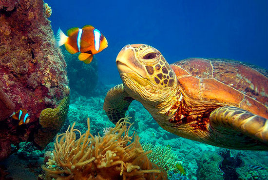

Avustralya yakınlarında Mercan Denizi'nde bulunan Büyük Set Resifi (Great Barrier Reef) dünya üzerinde canlı organizmalardan oluşan devasa tek yapıdır. Çoğu yerde yanlış bir şekilde "dünyanın en büyük canlısı" şeklinde anılsa da, bu yapı milyarlarca canlıdan oluşmuş büyük bir ekosistemdir. Milyarlarca mercan polipi bu yapı içinde bir arada bulunur. Bu resif yaklaşık 2300 kilometre uzunluğundadır ve uydu görüntülerinde kolayca seçilebilir.

Su canlıları içinde bulundukları yoğun, katalize oranı yüksek ortam ve rahat üç boyutlu hareket imkanı ile kara canlılarına nazaran çok daha rahat birbirleriyle ilişki halinde bulunabilir. Dolayısıyla bu gibi ekosistemlerde muazzam sayılarda ve çeşitlerde canlılık bulunur. Bir canlının ölümü çok daha fazla canlının var olabilmesini mümkün kılar. İnorganik ortam git gide organikleşir.

Mercan resifleri bu nedenle canlılığın en zengin olduğu ortamların başını çeker. Sayısız hayvan ve bitki türünü bünyesinde barındırır. Dünya okyanuslarının yüzde bir kadar alanı mercan resifleri tarafından örtülür. Büyük set resifi bunun gibi 2900'e yakın ayrı mercan resifinden ve 900'e yakın adadan meydana gelir.

Bu yapı devasa bir canlı olmasa da, tek hücreliden çok hücreli yaşama geçiş konusunda olduğu gibi canlıların evrimin ilerleyen süreçlerinde organize iş paylaşımını ilerleterek tek bir organizma haline gelmesi mümkündür. Çok hücreli yaşamın hemen önceki aşamalarında ufak koloniler yer alır. Bunlar tek hücreli ayrı birer canlı olsa da, bir araya gelerek çok hücreli yeni bir organizma benzeri bir yapı oluşturmuştur. Organizma içerisinde her birinin farklı bir görevi vardır. Sonraki aşamalarda tekilliğin hiçbir önemi kalmaz; kalsa dahi tek başına kalan, organizasyona adapte olmuş hücre yaşamını devam ettiremeyeceğinden çok hücreli canlılık başlamış olur.
