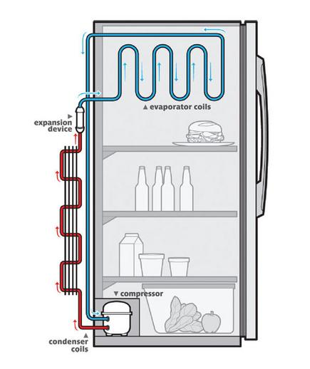

Evlerde kullanılan beyaz eşyalar içerisinde, çalışma prensibi gündelik hayattaki bilgilerle kolayca anlaşılamayacak olan iki cihaz vardır. Birincisi mikrodalga fırın iken diğeri buzdolabıdır. Diğer beyaz eşyalar içerisinde bulunan ve direkt olarak kullanılan ısıtıcı devreler, motorlar gibi temel devre elemanları dolayısıyla kolaylıkla anlaşılabilir. Tabii burada eşyaların en temel görevini yaptığı, en basit formundan bahsediyoruz. Birçok ürüne sonradan eklenen dijital kontrol panelleri, zamanlama üniteleri bu konuya dahil değil.

Bir nesneyi ısıtmak bu evrendeki en kolay eylemlerden biridir. Entropi'nin, yani evrenin giderek daha karmaşık bir noktaya sürüklenmesinin bir getirisi olarak tüm maddeler zaten ısınmaya meyillidir. Hareket eden, bir enerji tüketen, üzerinde iş yapılan her madde ısınır. İnsanoğlu bu özelliği fark ettiğinden bu yana, elektriğin keşfinden bu yana aynı ilkel düzeneği eşyalarda doğrudan kullanmaya devam ediyor. Bir ısıtıcı devre çok basit bir forma sahiptir, hatta elektronik alanına dahil sayılamayacak kadar basit bir form. Basit bir direnç devresi olan bu düzenek, iki kablonun arasına daha ince ve uzun bir kablo koyarak, elektrik geçtiğinde bu ince kısımda geçmekte zorlanan elektronların kabloyu ısıtması prensibinden yola çıkar. Halen sıradan fırınlarda, çamaşır makinelerinde, elektrikli şofbenlerde, saç kurutma makinelerinde ve elektrikli ısıtıcılarda bu basit düzenek kullanılmakta.

Soğutmak ise çok daha zor ve kolaylıkla yapılamayacak bir iştir. Isınma atomların daha hareketli duruma geçmesiyken, soğuma ise bunun tam tersi olarak atomların yavaş hareket etmeye başlamasından ibaret. Bir iletkenin içinden geçen elektronlar o iletkeni ısıtır. Hareket enerjisi, ekzotermik kimyasal tepkimeler de ısı üretmenin çeşitli yollarıdır. Soğutma için de kimyasal tepkimeler kullanılabilir, fakat bu maliyetli ve zor bir iş olacaktır. Fan, vantilatör gibi cihazlar ise soğutma işlemi gerçekleştirmez. Havanın devinimini, sirkülasyonunu sağlar ve soğuma işlemini maddenin kendisinin yapmasına yardımcı olur. Sıcak bir günde durgun bir havada daha çok bunalırsınız, çünkü vücuttan salgılanan ter kolay buharlaşamaz. Ter salgısının görevi salgılandıktan sonra buharlaşarak vücuttan ısı almak ve vücudun ısısını düşürmektir, aynı zamanda ufak çaplı atıkların deri üzerinden atılmasına da yardımcı olur. Hareket ederek cilde çarpan hava, terin daha hızlı kuruyup ısıyı düşürmesine yardımcı olurken; aynı zamanda temas eden hava molekülleri de kendilerinden daha sıcak olan yüzeyin bir miktar ısısını alır. Doğal olarak bir fan, terleme gibi bir özelliği olmayan nesnenin odadaki sıcaklıktan daha fazla soğumasını sağlayamaz.

Buzdolabının soğutma yönteminde işin içine günlük hayatta çok göze çarpmayan bir fizik yasası giriyor. Göze çarpmıyor, fakat çoğunuz bunu farkında olmadan da olsa biliyorsunuz. Genişleyen gazlar soğurken, sıkışan gazlar ısınır. Teneke kutusunda basınçlı olarak bulunan bir parfümü, böcek ilacını veya sprey boyayı sıktığınızda kutunun ağız çevresinde bir soğuma olduğunu; içindeki gazın da görece soğuk çıktığını fark etmiş olabilirsiniz. Hacmi artan gaz enerji kaybeder, rahatlar ve atom titreşimleri azalır. Bu yüzden daha soğuk bir forma geçer.

Buzdolabı düzeneğinde bir motor ve dışarıya çıkışı olmayan bir gaz bulunur. Motor bu gazı içerideki ve dışarıda borulardan dolandırarak ısı transferini sağlar. Gaz içeriye girdiğinde daha geniş bir bölmeden geçtiğinden dolayı soğur, dolabın dışarısında ise kılcal borulardan geçtiğinden dolayı ısınır. Bu yüzden buzdolabının arkasındaki bölüm odadan kısmen daha sıcaktır. Fizik kuralları gereği sıcak gaz soğuk kısma daha kolay akarken, soğuk gaz sıcak kısma akamaz. Bu yüzden bir motor gereklidir. Bu motor güçlüdür ve eski buzdolaplarınızın motorlarını harici bir kompresör olarak değerlendirmeniz mümkündür.

Yalnızca buzdolabı değil, klima ve benzeri soğutucu cihazlarda da aynı süreç işlemektedir.

Bu fizik kuralını evrenin Bigbang'den bu yana geçen sürecinde de görmek mümkün. Patlamanın en başında evren çok yüksek bir sıcaklığa sahipti ve oluşan parçacıklar birleşip madde oluşturamıyordu. Fakat evren genişledikçe sıcaklığı git gide azaldı ve bugün boş uzayın ortalama sıcaklığı 2.725 Kelvin, yani -270 Santigrat derece olarak ölçülüyor.
