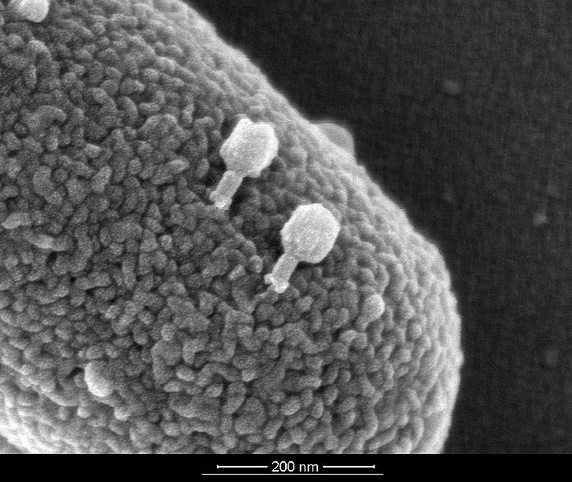

Her insanın kafasında canlılıkla ilgili bir tanım, canlı ile cansız arasında net bir sınır vardır. Fakat bu konu mikrobiyolojik olarak ele alındığında bu kadar basit sonuçlar çıkmıyor. Ne kadar canlılık belli bir tanımın içerisine konularak, birtakım özelliklere göre sınıflandırılmak istense dahi en ilkel canlı ile en karmaşık cansız nesne arasında net bir sınır bulunamıyor. Tabii burada karmaşıklıktan kastedilen canlılığa özgü olan yapılar. Sonuç olarak belli varlıkların canlı mı veya cansız mı olduğuna henüz karar verilebilmiş değil. İşin felsefi boyutu ise içinden çıkılmaz bir hal alabiliyor. Materyalist ve deterministik bir bakış açısıyla ele alındığında aslında canlı ile cansız arasında bir fark yok. Canlı diye tabir edilen varlıklar cansız varlıklardan çok daha karmaşık olmaktan öteye gitmeyen moleküler bir çorbadan ibaret. Bu düşünce baz alındığında aslında canlıların herhangi bir fizik kuralını ihmal etmesi söz konusu değil. Her şey entropinin artışına göre hareket ediyor. Fakat gündelik açıdan bakıldığında canlı varlıkların fizik kurallarına aykırı davrandığı iddia edebilir. Doğa her zaman bildiğini okur, tüm parçacıkların maksimum düzensizlik ve maksimum enerjiye itildiği bu evrende kaos her zaman artmakta. Ancak doğa ve fizik kuralları bir parçacığı sola götürmek isterken bir canlı bu parçacığı sağa götürebilir. Tabii artan kaos kendi içerisinde her zaman kısa zamanlı küçük düzenler oluşturacaktır. Bu tür felsefik görüşler başka bir yazının konusu olabilir, bu yazıda ele alınacak olan konu canlılığın biyolojik anlamı olacak.

Virüsler en çok bilinen, canlılığı tartışılan varlıklar. Canlılardan sonraki en karmaşık varlıklar olarak geçiyorlar. Bu varlıkların bünyesinde temel olarak yalnızca kalıtsal materyal ve protein yapılı dış kılıfları bulunuyor. Temel bir virüs bu şekilde tanımlanır, buna ek olarak çeşitli ek özellikler de taşıyabilirler. Ayrıca hücre zarlarını eritebilmek için bir enzim de barındırabilirler. Virüsler RNA veya DNA olmak üzere bir kalıtım materyalini bünyelerinin merkezinde bulundurur. Bu sayede kendi kalıtsal özelliklerine sahip olabilirler. Taşıdıkları zarf ve kapsit gibi dış kılıf yapıları virüsü dış etkilerden korumayı sağlar. Cansız bir ortamda, hücre dışında cansız bir varlıktan hiçbir farkları yoktur. Kristalize olmuş bir formda sağa sola sürüklenirler. Bir hücre ile karşılaştıklarında ise kalıtım materyallerini bu hücrenin içine göndererek hücreyi kendi gibi bolca virüs üreten bilinçsiz bir fabrikaya dönüştürürler. En sonunda üretilen virüsler hücreyi yırtarak dışarı çıkar ve yayılmaya devam ederler. Başka hiçbir esprileri yoktur.

Viroidler virüslerden çok daha ilkel, ancak çok daha enteresan varlıklar. Virüslerin canlılığının tartışıldığı bir durumda viroidlere canlı diyebilmek çok zor. Bunlar başıboş RNA parçalarından ibaret varlıklardır. Canlılığın her yanını sardığı, dolayısıyla kendilerini sindirebilecek çok fazla enzimin bulunduğu dünyada var olmamaları gerekirken vardırlar. Virüsler gibi kalıtım materyalini koruyacak zarf ve kapsit gibi bir yapıya sahip değildirler, kalıtım materyalinin kendisidirler. Bitkilerde meydana getirdikleri hastalıklardan dolayı tanınırlar.

Prionlar kesinlikle bir canlı değildir. Fakat canlı olabilmek için gereken en tipik özelliği sergileyebilen ve canlılarla direkt olarak etkileşimi olan varlıklardır. Bunlar yanlış katlanmış proteinlerden ibaret nesnelerdir. Bulaştıkları canlılarda bulunan diğer proteinleri de kendileri gibi bozulmuş bir hale getirerek bir nevi ürerler. Ortaya çıkardıkları deli dana gibi hastalıklarla bilinirler. Bulunduğu ortamdaki diğer maddeleri kendine benzetebilmek aslında yalnızca canlılara özgü bir yetenek değil. En basitinden katılardaki kristalize olma eğilimi buna bir örnek gösterebilir. Fakat prionların bundan daha fazlası olmasının nedeni direkt olarak canlıların yapıtaşları olan aminoasitlerden meydana gelmeleri ve işlerinin direkt olarak canlılarla olması gösterilebilir.
