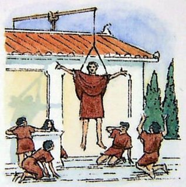

Antik Yunan ve Roma tiyatrosunda, gitgide karmaşıklaşan oyun senaryolarını, iç içe giren olay örgülerini tek seferde çözüme ulaştırmak için kullanılan yöntemin adı olan Latince bir terim deus ex machina. Bugünkü eserlerde de kendine yer buluyor. Esasında çok basit bir kavram. İfadenin kökenine bakıldığında ismini karşılayan, net bir uygulama görülüyor. Deus ex machina ifadesi "makineden tanrı" anlamını taşır. Oyun boyunca işler karmakarışık bir hale geliyor ve oyunun sonunda mekanik bir düzenek yardımıyla yukarı kaldırılan, tanrıyı oynayan bir karakter her şeyi olması gereken hale getiriyor. Tabii Roma ve Yunan tiyatro kültüründe "biz bundan 3 sezon daha çıkartırız" anlayışı yok, her şey oyunun sonunda bağlanmak zorunda. Sonuç olarak mitolojiden seçilen tanrılar oyunun sonunda ölmesi gerekeni öldürüyor, kurtarılması gerekeni kurtarıyor ve eser içerisindeki tüm düğümler çözülmüş oluyor. O dönemlerde çözüm üretemeyen, yaratıcı olamayan bir yazar için oldukça kullanışlı bir yöntem.

Bugünkü sinema filmlerinde, tiyatro oyunlarında, kitaplarda, dizilerde de bu kavram varlığına devam ediyor. Tabii antik tiyatrodaki vinçle kaldırılan tanrı gibi bir örnek yerine, soyut bir şekilde varlığını gösteriyor. Deus ex machina günümüz eserlerinde, eserin sonunda tek seferde tüm olayları yoluna sokan bir karakter, bir obje veya bir olay şeklinde bulunuyor. Örneğin bir doğa olayının çok alakasız bir şekilde eserdeki kötü karakteri öldürmesi, gizemli bir karakterin eserin sonunda olaylara müdahale edip çözüme ulaştırması sayılabilir. Matrix üçlemesini izleyenler buna örnek gösterilecek bir sahneyle karşılaşmıştır. Kimi filmlerde ana karakterin saçma sapan nedenlerle birden ölmekten kurtulması, durduk yere kurtarıcı bir neden ortaya çıkması veya bir kurtarıcının gelmesi de deus ex machina kavramının eserlerdeki yansıması olarak gösterilebilecek örneklerden.
