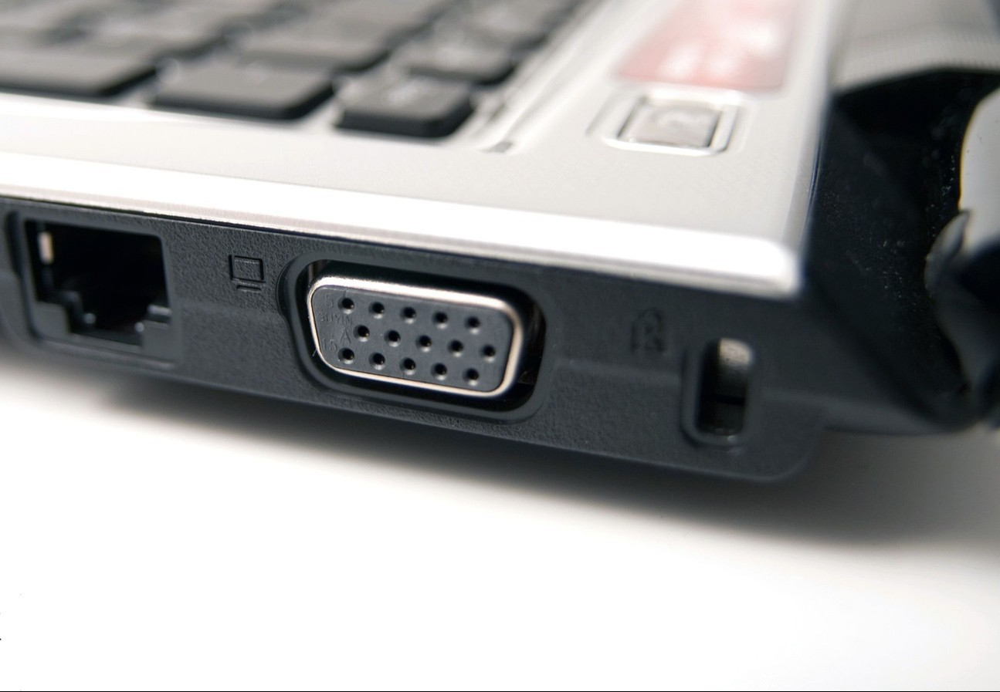

Dizüstü bilgisayarların sağında, solunda ya da arkasında küçük yuvalar bulunur. Bu yuvaların ne işe yaradığı pek çok kişi tarafından bilinmez. Bu yuvalar hırsızlığa karşı geliştirilmiş bir kilittir. Yani Kensington kilididir. Amerika’da geliştirilmiş olan bu sistemle az da olsa bilgisayarınızı koruyabiliyorsunuz. Özellikle cihazınızı kafe, kütüphane gibi halka açık yerlere götürüyorsanız kullanmanız gereken bir kilittir.

#### Kensington Kilidi Nasıl Kullanılır?

Metal olan güvenlik kablosunun bir ucunda Kensington yuvasına bağlanan şifreli ya da anahtarlı bir kilit vardır. Diğer ucu ise cihazı güvenen almak için belirli bir yerlere bağlanır. Metal kablonun Kensington  girişi bilgisayarın kilit yuvasına takılır. Bu kilit yuvası cihazın metalini kavradığı için sökülmesi zordur. Sökülürse dahi cihazda hasar bırakır. Bu yüzden çalınsa bile satılması pek mümkün olmaz. 2 tür Kensington kilit vardır: şifreli ve anahtarlı Kensington kilit.

Kensington kilidinin güvenli olup olmadığı tartışılır. Çünkü bu kilidin nasıl açıldığını gösteren videolar mevcut. Yine de açıkta bırakılan dizüstü bilgisayarlar için şimdilik en iyi güvenlik yöntemi bu gibi görünüyor.
