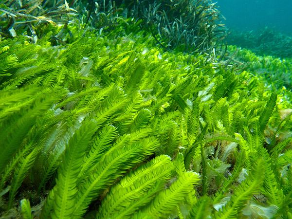
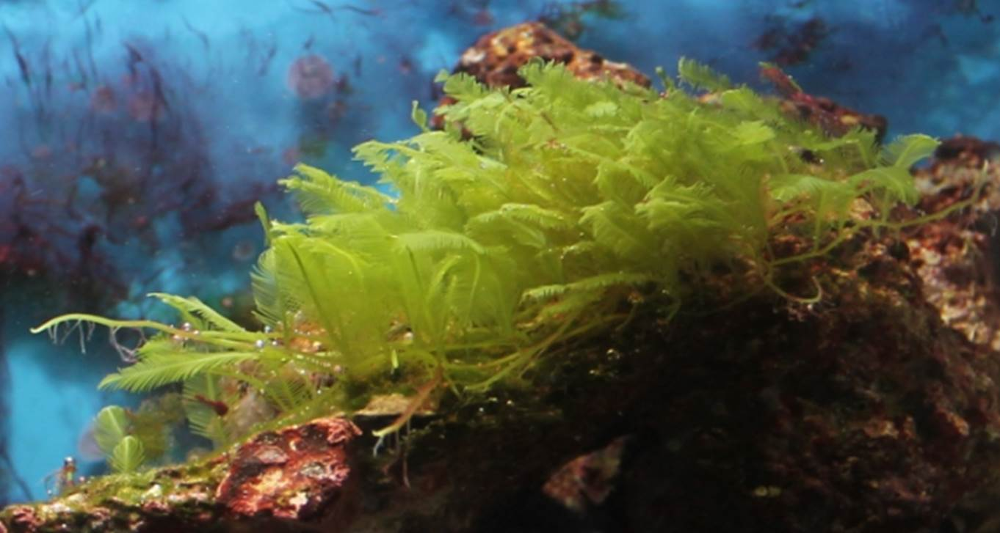

Geçmişten günümüze kadar bize öğretilen bilgi, bitkilerin asıl oksijen kaynağı olduğudur. Aslında bu doğru değildir. Dünya'daki oksijenin çoğu aslında başka canlılar tarafından üretilir. Bize öğretilen bu bilgiler belki de insanların doğayı koruması ve ağaçları kesmemeleri için öğretilmiş olabilir. Sonuçta Dünya'da ekolojik denge mevcuttur. Ormanların yok olması da bu ekolojik dengeyi bozabilen faktörlerden biridir. Dünya'daki tüm ormanlar oksijenin yaklaşık %20'si kadarını fotosentez yoluyla üretmektedir. Geriye kalan kısmını ise Su yosunları yani "Algler" üretmektedir. Sadece oksijen üreterek değil, birçok özelliğiyle sularda görev yapmaktadır.

Alg kelimesi latince de deniz otu anlamına gelen "alga" kelimesinden türetilmiştir. Algler bitkilere benzemelerine rağmen bitkilerle yakın akrabalığı olmayan sucul canlılardır. Sularda yaşayan birincil üretici canlıdırlar. Bu canlılar bitkilerin aksine fotosentez ürünlerini nişasta olarak depolamazlar. Klorofil-c taşırlar ve bitkilerde bulunmayan başka pigment maddeleri bulundururlar. Denizlerde önemli olduğu kadar tüm dünya içinde önemli canlılardır. Dünya'nın %70'ini kaplayan denizler ve okyanuslarda yaşayan algler ekosistemler için oldukça yararlı canlılardır. Dünyadaki fotosentetik karbonun üçte ikisi su yosunları tarafından üretilmektedir. Denizlerde birincil üretici aynı zamanda denizde yaşayan diğer canlılar için besin kaynağıdırlar. Ürettikleri oksijen sadece deniz canlıları için değil bütün dünya için önemli miktardadır.

Su yosunları dünyadaki oksijenin yaklaşık %70-80'ini üretirler. Geriye kalan kısmını ise bitkiler üretir. Bu oran oldukça fazladır. Bu nedenle su yosunları dünyadaki canlılık için bir vazgeçilmezdir. Denizlerin kirletilmesi bu canlıları etkiler ise dünyanın asıl oksijen kaynağı zarar görebilir. Bu durum bütün canlılariçin zararlı olacaktır. Bu nedenle insanoğlu denizleri yani algleri ve bitkileri korumak zorundadır.
