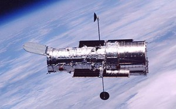
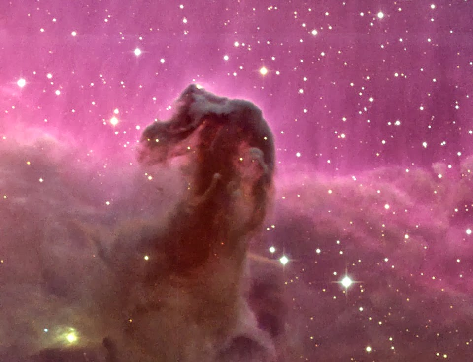
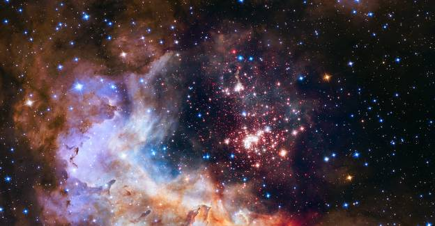
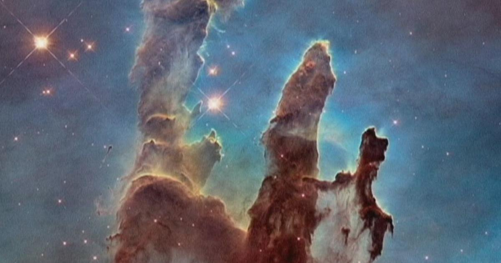
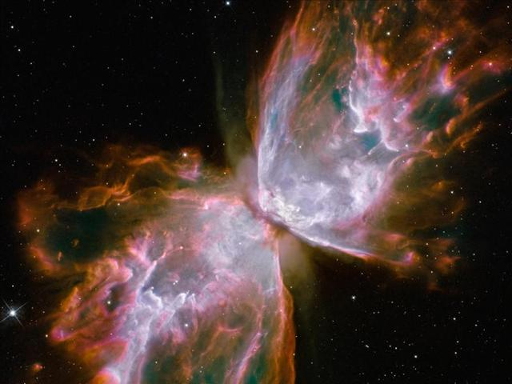
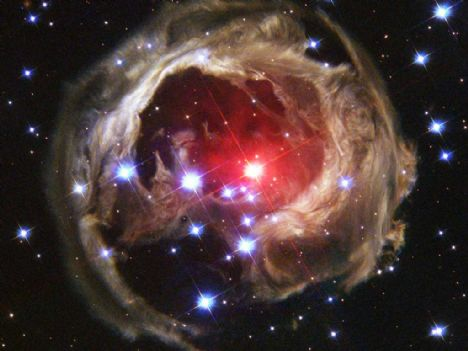

Nisan 1990 yılında uzaya gönderilen Hubble Uzay Teleskobu 25. yılına girdi. İlk uzay teleskobu olan Hubble eski olmasına rağmen bir çok özelliğe sahiptir. Amerikalı astronom Edwin Hubble anısına ismi bu teleskoba verilmişti. Hubble Uzay Teleskopu(HUT), STS-31 görevi sırasında Uzay Mekiği Discovery tarafından Dünya yörüngesine tam olarak 24 Nisan 1990 yılında yerleştirildi.

Başarılı performansıyla Hubble Uzay Teleskobu uzayın incelenmesinde en başarılı fotoğrafları çekti. Yeryüzünden 569 kilometre yukarıda olan Hubble 800.000 gök cisminde 1 milyondan fazla gözlemde bulunmuştur.

Hubble uzayda astronotlar tarafından bakımı yapılabilen tek teleskoptur. Hubble teleskobuna ilk servis uçuşu 1993 yılında görüntüleme hatasının düzeltilmesi için yapılmıştır. 2024 yılında uzaya gönderilmesi beklenen James Webb teleskobunun Hubble'ın yerini alması bekleniyor.

**Hubble Uzay Teleskobundan Eşsiz Kareler**

