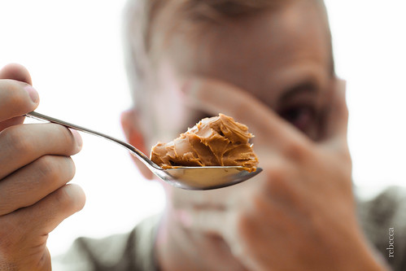
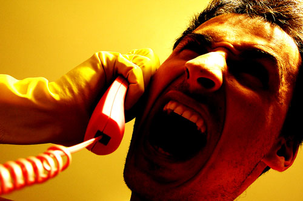
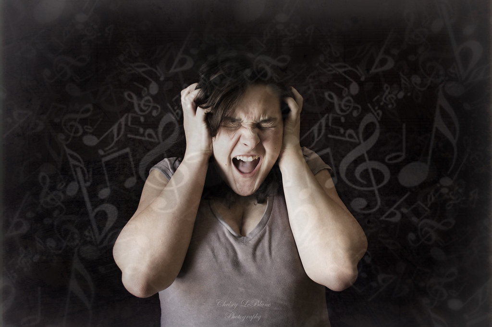
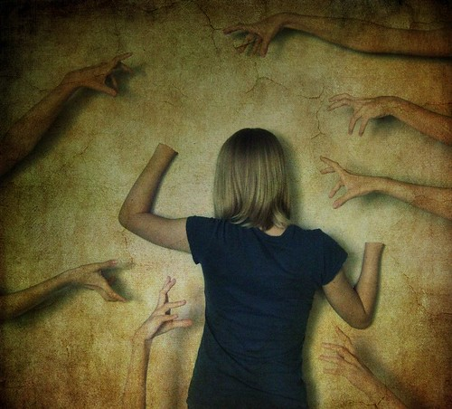
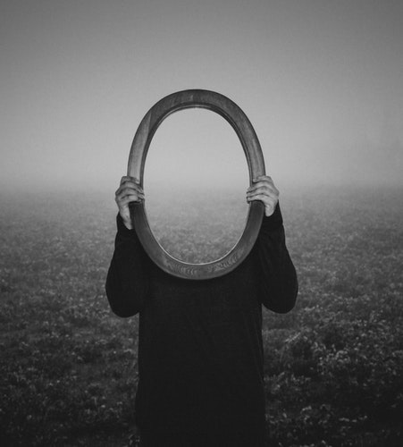

Her canlı kendini meydana getiren evrimsel sürecin bir sonucu olarak kendini tehdit eden faktörlerden kaçınır. Korku bu tehditlere karşı savunmada kalma halidir. Bu kavramın daima yaşamı tehdit eden somut bir durum olması gerekmiyor, bilinçaltında yer alan tamamlanmamış veriler de korkuya neden olabilir. Korkular artık insanın hayatını etkileyecek seviyede olduğunda ise bunlara fobi adı veriliyor. Fobisi olan insana da "fobik" deniyor - Kullanırım lan ben bunu -. Kişi fobilerinin mantıksız olduğunu bilse dahi bunlardan kolaylıkla kurtulamıyor. Fobi ismi Yunan Mitolojisi'ndeki korku tanrısı Phobos (φόβος)'un adından geliyor. Fobi literatürü oldukça kabarık. Artık neredeyse fobisi olmayan kavram yok durumda. Siz de kendi fobinizi yaratabilirsiniz. Bunun için herhangi bir olgunun Yunanca ismini alarak sonuna -phobia sonekini eklemeniz yeterli.

Bu yazıda araknofobi (Örümceğe karşı saygısızlık), klostrofobi (Kapalı alana karşı sempatisizlik) gibi genel olarak bilinen fobiler değil, bilinme oranı düşük olan ve mantık sınırlarının gözden kaybolduğu fobiler listelenecek.

**Arakibutirofobi (Arachibutyrophobia)**

Fıstık ezmesi yerken damağa yapışma korkusu şeklinde bir tanıma sahip olan bu fobi her halta fobi adı vermenin en güzel örneğidir. Doğal olarak görülme sıklığı çok azdır ve bu fobiye sahip olduğunu söyleyenlerin dantel olma potansiyeli yüksektir.

**Eufobi (Euphobia)**

İyi haber alma korkusu diye açıklanan bu fobi muhtemelen tamamen emo ve gothic akımının etkisiyle ortaya çıktı. Şöyle güzelinden bir deprem olsa da ölsek. Bunun olayı ise bir öncekinden ziyade aykırı bir fobi ismi bulma çabasından kaynaklanıyor. Fakat isminin kısalığına bakılacak olursa kimilerinin sempatisini kazanacağı aşikar.

**Melofobi (Melophobia)**

Melofobi müzik korkusu anlamına geliyor. Olabilir, doğaldır; fakat aslında doğru müziği henüz dinlememiş olmak demek daha mantıklı olacaktır. İnsanoğlu dediğin her halta müzik diyor be yavrum.

**Kirofobi (Chirophobia)**

Elden korkma durumuna kirofobi deniyor. Haklı sayılabilir, nihayetinde el bu. Hele Türkiye gibi el organının lüzumsuz yere bol kullanıldığı bir ülkede bolca temsilcisi olma ihtimali yüksek.

**Katoptrofobi(Catoptrophobia) veya Spektrofobi (Spectrophobia)**

İkisi birden genel olarak ayna korkusu olarak yorumlanabilir. Kimi yerlerde aynı anlamlarda kullanılsa da, kimi yerlerde de ufak farklılıklarla ayrı kavramlar olarak geçer. Eisoptrofobi (Eisoptrophobia) ise bunlardan farklı olarak kişinin kendi yansımasından korkması durumudur. Temel olarak duyulan korku kişinin kendi yansımasına karşı değil, bu yansımaya bakarken cindir, gulyabanidir, Yıldız Tilbe'dir, bunlar gibi farklı varlıkların belirmesine olan korkudur.

