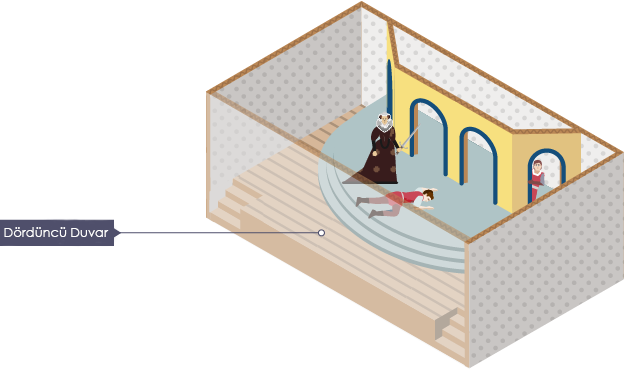
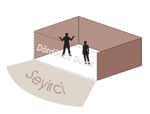
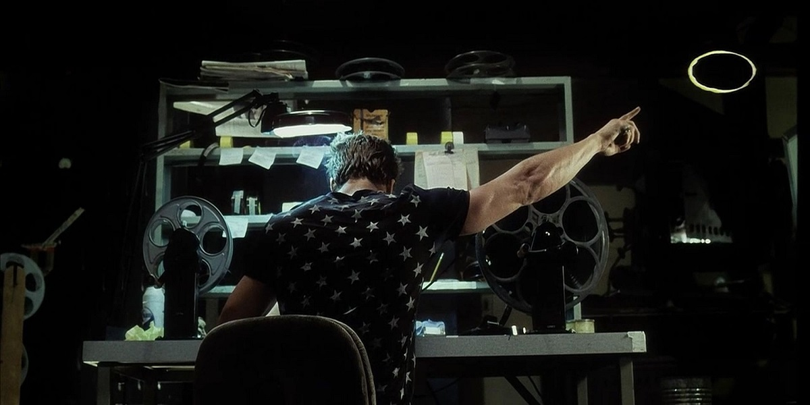

Kurguya sahip bir tiyatro oyununda, sinema filminde, bilgisayar oyununda, romanda veya çizgi romanda kendinizi karakterlerin içinde yaşadığı alternatif bir gerçekliğin içinde bulursunuz. Zamanlar ve mekanlar gerçek dünyaya paralel şekilde olabilir, fakat takip edilen olaylar o andan bağımsız, bambaşka bir şekilde kurgulanmıştır. Bir eserin ortaya çıkmasındaki amaç da zaten budur; gerçek dünyayı yeniden kurgulamak veya olayları baştan ele almak.

Bir tiyatro oyunu izlediğinizde karakterlerin çevresini kaplayan 3 duvar görürsünüz. Seyirci oyunu kalan duvarın olması gerektiği yerden izliyor olur. Dördüncü duvar terimi buradan ortaya çıkmıştır. Oyunun 3 tarafı kendi alternatif dünyasıyla çevrilidir, dördüncü duvar da seyircinin dünyaya bakış açısı, oyun ve seyirciyi birbirine bağlayan kapıdır. Kısaca oyuncuların seyircilere bakarak seyirci yokmuş gibi davranmasına dördüncü duvar denebilir.

İlk kez Fransız yazar ve filozof Denis Diderot tarafından dile getirilen bu kavram elbette yalnızca tiyatro oyunlarında kullanılmaz, başta saydığım bütün kurgusal gerçeklik içeren eserlerin temel yapıtaşlarından biridir.

Dördüncü duvarı yıkmak denen olay ise herhangi bir karakterin seyirci ile direkt olarak iletişime geçmesi anlamına gelir. Karakter bir eserin içinde yer aldığının farkındadır ve bunu seyirci, izleyici, okuyucu veya dinleyici ile paylaşır. Olan bitenle dalga geçer, açıklar veya rahatsızlığını dile getirir. Genellikle esere ekstra mizah katma amacıyla kullanılır. Elbette çoğu zaman yersiz kullanıldığında eserin olay örgüsünü bozarak eserin etkisini kaybetmesine, berbat olmasına neden olabilir. Bir eseri takip eden insan çoğunlukla kendini o eserin içinde hissetmek isteyecektir. Takip ettiği kurgusal olayları eğer eser genel olarak mizahi yöne ağırlık vermemişse gerçek kabul ederek kafasında tamamlayacak ve bu şekilde bundan zevk alacaktır. Fakat işin içerisine bir karakterin eserin kurgusal yapısını yırtması girdiği zaman bu etki yok olur. Eserin o zamana dek sağlamlaştırdığı atmosfer dağılır.

Dördüncü duvarı yıkmak aslında çok da yabancı bir kavram değildir. Özellikle sinema filmlerinde kendini çok fazla belli etmeden bulunabilir. En basitinden; kameraya doğru, orada insan varmışçasına anlamlı bir bakış atmak, mimik göstermek dahi dördüncü duvarı yıkmak sayılabilir. Eserde bir dış ses bulunuyorsa bu dördüncü duvarı yıkmak anlamına gelmiyor. Bu şekilde olsaydı dördüncü duvar bu kadar spesifik bir kavram olmayacaktı. Bu kavramın pratik kullanıma birkaç örnek vermek gerekirse: Fight Club (Dövüş Kulübü) filminde Narrator (Anlatıcı)'ın filmin dış sesi olarak filmin akışına yardım etmesi dördüncü duvarı yıkmak sayılmasa da bir sahnede Tyler Durden karakterinin Narrator'ın muhabbetine katılarak ekrandaki sarı noktayı işaret etmesi sayılıyor.

Marvel kahramanı Deadpool'un özelliklerinden biri dördüncü duvarı yıkmak. Zaman zaman konuşma balonlarının görünüşü hakkında monologları dahi oluyor. Diğer karakterlerin dışında dördüncü duvarı yıkabilmesinin açıklaması ise eserlerde deli olmasından kaynaklandığı şeklinde yapılıyor.
