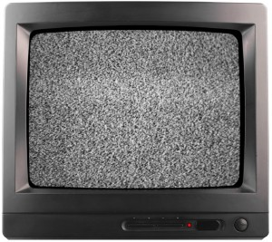
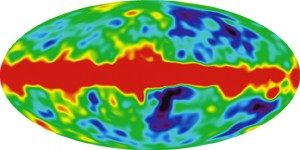

Evrenin yaklaşık 13.7 milyar yıl önce Big Bang denen olay ile birlikte oluştuğu yapılan hesaplamalar sonucu biliniyor.  Big Bang teorisinden bu kadar emin olunabilmesinin nedeni kolayca gözlemlenebilir sonuçlarında yatıyor. Her şeyden önce evrendeki gök cisimlerinin bir arada bulunduğu en büyük yapılar olan galaksiler birbirlerinden hızla uzaklaşıyor. Ayrıca evrenin her noktasına yayılmış olan bir radyasyon da Big Bang'in kuvvetli bir kanıtı. Televizyonda frekansı ayarlanmamış boş bir kanal açtığınızda görülen karıncalanmanın, radyoda aynı şekilde görülen cızırtıların nedeni bu arkaplan ışımasıdır. Bu yazının konusu da bu ışımaya yönelik.

Bugün evrenin dört bir yanına dağılmış ve dağılmakta olan tüm madde ve enerji çok küçük tek bir noktada, aşırı yüksek bir sıcaklıkta sıkışmış halde bulunuyordu. Elbette burada bahsettiğim "bulunmak" ifadesi bir sürece işaret etmiyor. Çünkü zaman evreni oluşturan 4 boyuttan biridir, ve o da Big Bang ile ortaya çıkmıştır. Tüm madde ve enerjinin bulunduğu bu noktanın orada Big Bang'in başlaması ile çok ufak bir zaman için var olması muhtemel. Zaman algısı ile bilincini kullanan, var oluşu ve yok oluşu zaman denen bu faktöre bağlı varlıklar için zamanın olmaması durumunu algılayabilmek doğal yollardan mümkün olmayacaktır. Fakat kuantum da insanın algısına bir boy büyük gelse de, bugünlerde bir nebze pratik olarak kullanılabiliyor. Sonuç olarak Big Bang'den önce ne vardı sorusu mantıklı bir soru değildir. Big Bang'den öncesi bu evren için yoktur. Bu evrenin birkaç boyut üzerinde M-kuramına göre iki zarın çarpışmasıyla Big Bang olayı tetiklenmiş olabilir. Bir şekilde bir simetri kırınımı oluştu ve bu olay gerçekleşti. Bu fenomenin adı Big Bang (Büyük Patlama) olsa da, patlamayla bir alakası yoktur. Patlama kimyasal veya nükleer bir reaksiyonun sonucudur ve maddenin enerji veya bir başka madde ile ilişkiye girmesi sonucu bir anlığına hacminin artıp ısısının yükselmesidir. Big Bang'de etkileşime girebilecek madde yoktur. Bu olay tekillikteki kütlelerin dışarı doğru hızla yayılmasından ibarettir.

Evren ilk oluştuğunda çok sıcaktı. Bu hali madde oluşmasına izin vermiyordu. İlk 300.000 yıl boyunca da madde oluşamayacaktı. Yalnızca ortada rastgele saçılan temel yapıtaşlarından oluşan bir evren vardı. Evren gittikçe soğudu ve artık protonların elektronları yakalamasıyla ilk atomlar oluşabildi. Yüksek enerjisini dağıtan madde yapıtaşları bir araya gelip daha büyük yapılar oluşturabilir hale geldi. Evrenin sıcaklığı 13.7 milyar yıl içerisinde gittikçe düştü ve bugünkü haline erişti. Bugün tıpkı birbirinden gittikçe uzaklaşan yapıların Big Bang teorisine bir kanıt olması gibi, evrenin gittikçe enerji kaybeden bir ışımaya sahip olması da aynı şekilde bir kanıttır. Buna Kozmik Mikrodalga Arkaplan Işıması deniyor.

Kozmik Mikrodalga Arkaplan Işıması evrenin her noktasında görülür ve Big Bang'den arta kalan bu radyasyon radyo dalgaları ile çalışan cihazlarda boş frekansları bozar. Bu yüzden kendini bastıracak herhangi bir sinyal yokken radyo ve analog TV üzerinde boş frekanslarda parazit, karıncalanma veya bazı kekoların karlanma diye tabir ettiği olay görülür. Elbette bu frekans bozulmalarının bir kısmı bu fon ışımasından gelir, evrendeki diğer radyo dalgaları yayan gök cisimlerinin de bunda etkisi vardır. Yakınlardaki süpernova patlamaları, kuasarlar ve pulsar gibi yıldızlar da bu etkide rol oynar. Bu sinyallerin insan için herhangi bir anlam ve düzeni olmadığı için bu şekilde bir frekans gürültüsü halindedirler. Eğer Arkaplan Işıması olmasaydı, radyo kaynağı gök cisimlerinin oluşturduğu daha zayıf etkiler bu şekilde gözlemlenecekti. Onlar da olmasaydı boş bir frekansta düz, beyaz bir ekrana bakıyor olurdunuz. Tabii burada dünyada ufak tefek elektromanyetik gürültü yapan diğer elektronik cihazları saymıyorum.

Bu ışımanın sıcaklığı yaklaşık 2.7 kelvin, frekansı 160.2 GHz ve dalga boyu 1.9 milimetre'dir. Bu değerleri bu iş için gönderilmiş olan COBE (Cosmic Background Explorer) uydusu ölçmüştür. Öncesinde bu ışıma yeryüzünden gözlemlenerek değerleri de yeryüzünden ölçülüyordu. 18 Kasım 1989'da ise bu görevi COBE yörüngeye oturarak devraldı.

Arkaplan Işıması evrenin en uzak köşelerinden, en genç halinden geldiği düşünülen ışımadır. Bu yüzden bu ışımayı gözlemleyerek oluşturulan haritalara bakıldığında evrenin en erken zaman hallerine bakılıyor olur.
