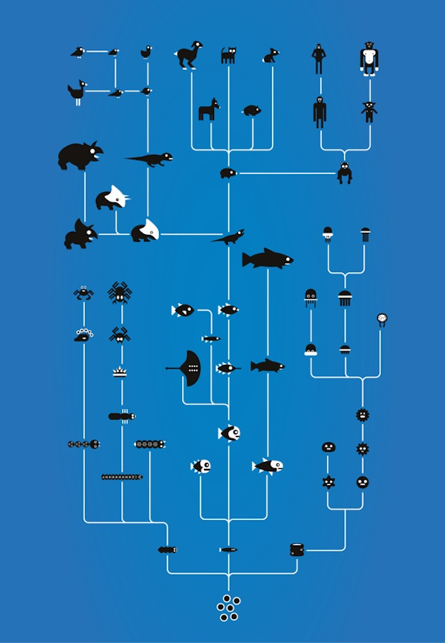
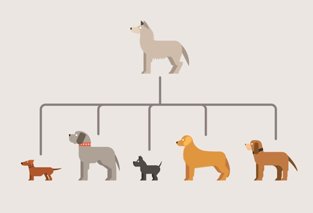

Evrim çoğunluk tarafından yanlış bilinir, fakat bu durum herkesin evrim hakkında bir fikri olmasını engellemez. Yeterince araştırmadan, yalnızca bir tanım duyarak yapılan yorumları sıklıkla çevrenizde görüyorsunuzdur. Bu yazıda temel amaç evrimin temel mekanizmalarına kısa bir giriş yaparak konunun daha iyi anlaşılması olacak.

Her şeyden önce evrim ilk canlının nasıl ortaya çıktığını açıklamaz. Bunun için farklı hipotezler vardır ve ikisi farklı alanlardır. Evrimin tesadüfle de alakası yoktur. Evrim kısaca canlıları doğanın istediği şekilde biçimlendiren mekanizmadır. Çok basit ve biraz eksik bir şekilde "Canlıların nesilleri ilerledikçe basitten karmaşığa doğru yol alması" şekilde açıklanabilir. Buradaki eksik nokta şudur: Her zaman bir sonraki canlının bir öncekinden daha karmaşık olması gerekmez. Bu tanım daha iyi anlaşılması için bir adım görevi görebilir, fakat daha doğru bir tanım "Canlıların nesilleri ilerledikçe bulunduğu ortama en uyum sağlayacak şekle gelmesi" olacaktır.

Tabii bu evrim Pokemon isimli Anime'deki gibi gerçekleşmez. Yaşayan bir varlık evrim geçirmez. Form değiştirse bile bu şekli kendinden bir sonraki nesle geçmez. Evrim Jean-Baptiste Lamarck'ın iddia ettiği gibi de gerçekleşmez. Elemana göre zürafaların boynu yerde besin kalmadığında üst yapraklara uzanabilmek için, kendi istekleri doğrusunda uzamıştır. Evrimde sihirli bir olay yoktur, her şey gayet sıradandır.

Doğada evrimin temel mekanizması doğal seçilimdir. Charles Darwin'in basitle oluşturduğu ve üstüne yapılan bir çok eklemeyle bugünkü haline ulaşan Evrim Teorisi'ne göre bu böyledir. Bir organizma birden çok döl verecek şekilde ürer ve bu örneklerden ortama en uyum sağlayanı hayatta kalır. Üreme esnasında aktarılan, ayrılan ve birleşen DNA mükemmel bir şekilde kopyalanmaz. Her dölde barındırdığı ufak değişiklikler o canlıya duruma göre farklı özellikler verir. Bu değişiklikler aracılığıyla da özellikle ortam değiştiren canlı nesillerinden yalnızca yeni ortama en iyi uyum sağlayan hayatta kalır. Su dolu bir ortamdaysa solungaç, kara üzerindeyse akciğer solunumu yapmak gibi. Mutasyonların doğurduğu büyük sorunları doğa affetmez ve bu canlılar hayatına ve üremeye devam edemeyeceğinden elenir. DNA'nın mükemmel kopyalanamaması dolasıyla örneğin insan gibi kuyruğu iptal olmuş canlılarda kimi zaman kuyruklu doğumlar meydana gelebiliyor. Benzer bir çok anomali doğada, canlılar arasında mevcuttur.

Doğa canlılara her zaman acımasız davranır. Doğa bu şekilde olmasaydı bugün yeryüzünde şu ankiyle kıyaslanamayacak kadar çok sayıda canlı türü olacaktı. Fakat bu canlılar büyük bir zorlukla karşılaşmadığından hepsi ilkel yapıda olurdu. Doğanın canlının her istediğini verdiği bir durumda canlı hiç evrimleşemez, muhtemelen ilk canlı oluşamazdı dahi.

Evrimin bugün gözlemlenen birçok kanıtı mevcut. Karmaşık ve büyük boyutlu canlılarda evrim insanların tarih boyunca gözlemleyemeyeceği kadar yavaş ilerler. Fakat bugün insanların çok yakın bir şekilde bildiği yapay seçilim ve mikroskobik boyutta gerçekleşen doğal seçilim söz konusu.  Daha önceki [Yapay Seçilim](http://sabahlatan.com/blog/insanligin-dogayi-binlerce-yillik-sekillendirisi-yapay-secilim/) yazısında değinildiği gibi yapay seçilim, insanın kendi eliyle diğer canlılara geçirttiği evrim biçimidir. Kurttan türeyen köpek, yabani meyvelerden türeyen daha dolgun ve etli meyveler bunlara verilebilecek örnekler. İnsanoğlu her nesilde istediğine en uygun dölleri seçmiş ve bunları yetiştirmiş, bu yolla da bu canlılar bugünkü hallerine gelebilmiştir. Tarım devrimi, hayvancılık gibi insanların medeniyet geliştirmesini sağlayan önemli konular bu sayede var olmuştur. Mikroskobik düzeyde gerçekleşen evrim ise her yıl virüs ve bakterilerin evrim geçirmesi şeklinde gözlemlenir. Bu yüzden tıp bilimi her yıl yeni aşı geliştirmeye uğraşır. Evrim geçiren mikroorganizmalar bir önceki nesli yok eden aşı ve ilaçlara karşı bağışıklık ve dayanıklılık geliştirebilir.

İnsan maymun'dan gelmemiştir. İnsan ve maymun türleri aynı ilkel atadan türemişlerdir. İnsan hayatta kalmak için beynini geliştirmiş, alet yapmış, hayal kurmaya başlamış, problem çözme ve karmaşık diller üretebilme yeteneklerine sahip olmuştur. Evrimsel süreçte yok olan çok fazla canlı türü vardır. Bu yüzden insan bu özelliklere sahip tek tek canlıdır.

Evrim bugünkü biyolojinin ve tıbbın temelini oluşturur. Tüketilen gıdalar dahi evrim aracılığıyla bugünkü formundadır. Dolayısıyla hem bu gerçekleri reddedip, hem de bugünün dünyasında yaşamak mümkün değildir. İnancı gereğiyle evrimi reddedenler dahi söz konusu bunlar olunca anlık olarak bu durumu kabul etmek zorunda kalırlar.
