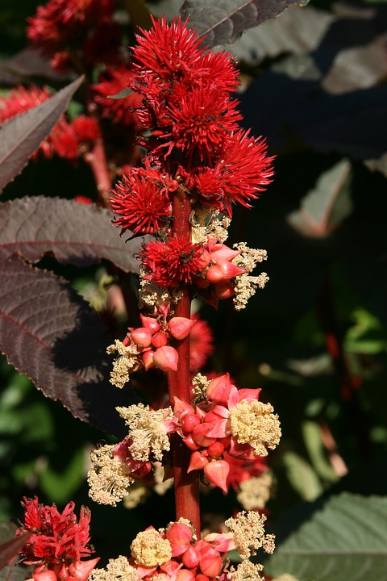
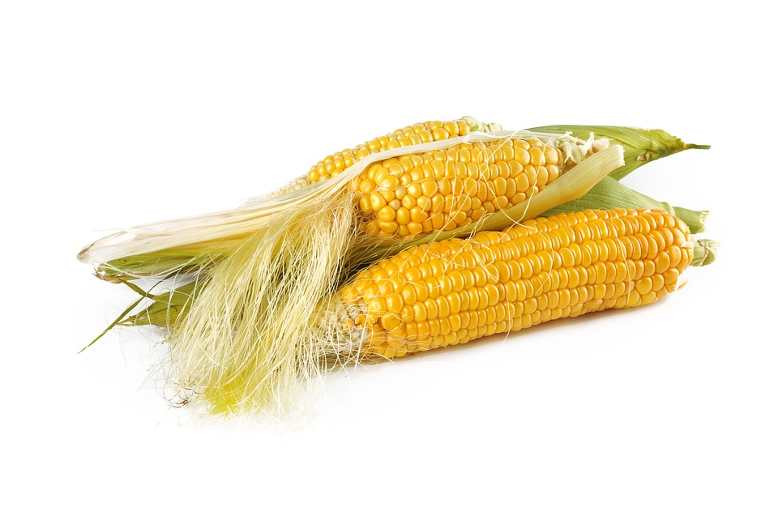
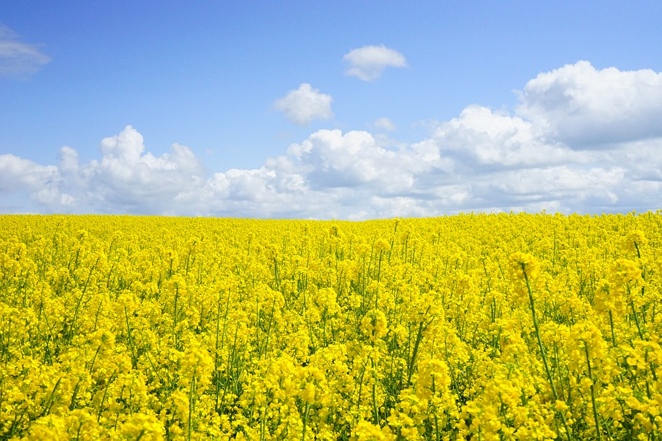
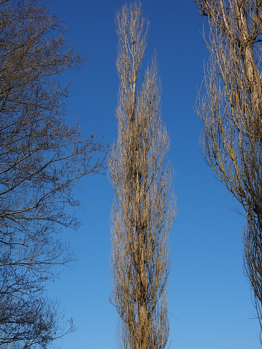
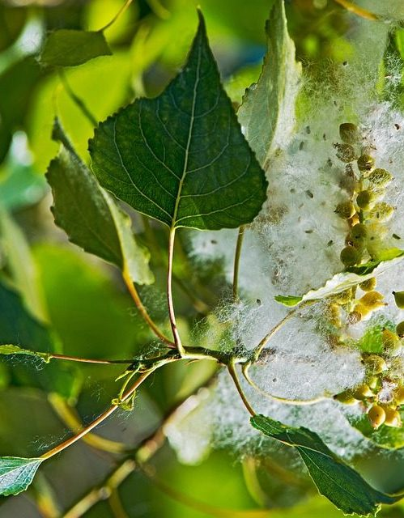
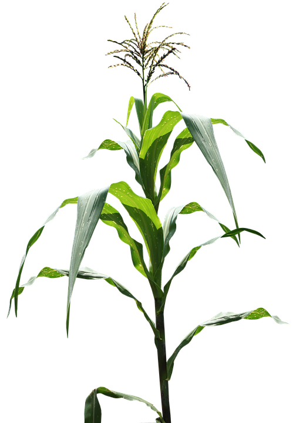
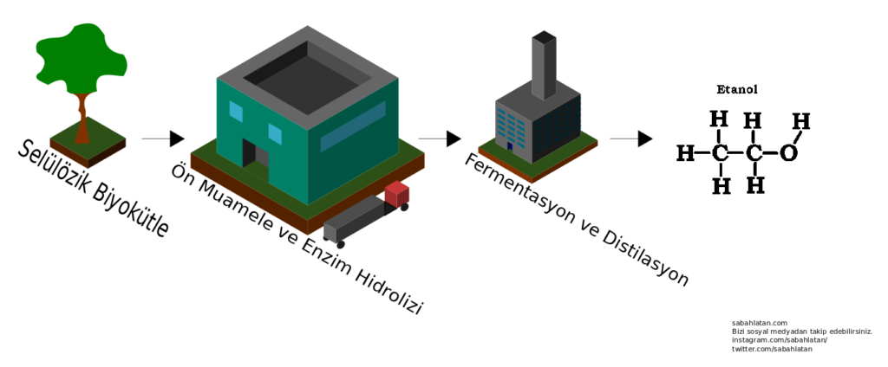
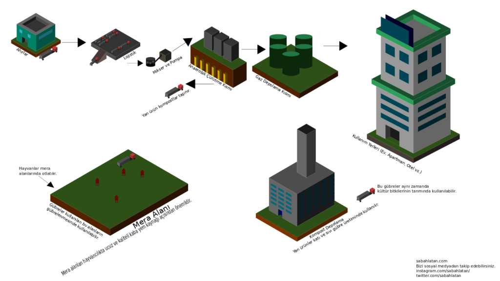

Öncelikle merhaba arkadaşlar. Bu yazımızda dünyada tükenen fosil yakıtlar nedeniyle bir alternatif yakıt olarak düşünülen biyoyakıt konusunu inceleyeceğiz. Keyifli okumalar arkadaşlar.

### Öncelikle Birkaç Tanım

Tanımlardan sıkıldığınızı biliyorum arkadaşlar. Ancak bir kaç şeyin ne olduğunu bilmekte fayda var. Çünkü yazımızın ilerleyen kısımlarında bu kelime gruplarıyla sonradan karşılaşmak ve tam olarak ne olduğunu bilmemek sıkıntı çıkartabilir. Bu tanımları bilenleri tenzih ederim.

#### Enerji Bitkisi Nedir?

Enerji bitkisini T.C. Enerji ve Tabi Kaynaklar Bakanlığına bağlı Yenilenebilir Enerji Müdürlüğü “Enerji ormanları, ve ağaç endüstrisi atıklarından elde edilen bio-dizel, atenol gibi çeşitli yakıtlar, tarım kesimindeki bitkisel ve hayvansal atıklar, kentsel atıklar, tarıma dayalı endüstri atıkları modern biyokütle enerjisinin kaynağıdır.” olarak tanımlamıştır.

#### Enerji Bitkilerinin Özellikleri Nelerdir?

Enerji bitkileri bir çok cins ve türe ayrılmakta ve botanik anlamda farklılıklar göstermektedir. Kimi enerji bitkileri odunsu bir gövde yapısına sahip iken kimi enerji bitkileri otsu bir yapıdadır. _**Populus**_ spp. odunsu bir gövde yapısına sahip iken mısır (_**Zea mays**_ L.) şeker kamışı (_**Saccharum officinarum**_) otsu bir yapıdadır. Bu bitkilerin botanik uzuvları da boyut bakımından farklılık gösterir. Hint yağı bitkisinin (_**Ricinus communis**_ L.) boyu yarım metreyi geçmektedir.

Enerji bitkilerinin genel özelliklerinden biriside yüksek oranda yağ, lignoselülozik maddeler, şeker veya nişasta içermeleridir. Ayçiçeği, soya, susam vb. yağ bitkileri yüksek oranda yağ içerir. Yağlar biyodizel üretiminde kullanılabilmektedir. Şeker pancarı ve şeker kamışı adından da anlaşılacağı gibi şekerce zengin bitkilerdir. Bu şekerlerin fermentasyonu sonucu biyoetanol elde edilebilmektedir. _**Salix**_ spp. **(söğüt)** _**Populus**_ spp. **(kavak)** türleri ise lignoselülozik maddelerce zengindir ve etanol üretimi yapılır.

Enerji bitkilerinin genel özelliklerinden biriside yüksek oranda yağ, lignoselülozik maddeler, şeker veya nişasta içermeleridir. Ayçiçeği, soya, susam vb. yağ bitkileri yüksek oranda yağ içerir. Yağlar biyodizel üretiminde kullanılabilmektedir. Şeker pancarı ve şeker kamışı adından da anlaşılacağı gibi şekerce zengin bitkilerdir. Bu şekerlerin fermentasyonu sonucu biyoetanol elde edilebilmektedir. _**Salix**_ **spp. (söğüt)** _**Populus**_ **spp.** **(kavak)** türleri ise lignoselülozik maddelerce zengindir ve etanol üretimi yapılır.

- 
    
    Söğüt Ağacı
    
- 
    
      
    Hint yağı bitkisi
    

#### Biyoyakıt Nedir?

Biyoyakıt; karbon yoğunluğu düşük olan ve bu nedenle küresel ısınmayı doğrudan etkilemeyen, kısa süre önce yaşamış organizmalar veya onların metabolik çıktılarından elde edilen yakıttır.

### Peki Biyoyakıtların Yararları ve Zararları Nelerdir?

Biyoyakıtlar küspe ve gübre olarak ikiye ayrılan yan ürünleri ile tarım ve sanayiye katkı sağlamaktadır. Getirdiği iş gücü ile kırsal alana katkı sağlamakta ayrıca yağ bitkileri tarımını yaygınlaştırmaktadır. Ekolojik sağlığın korunmasına yardımcı olurlar. Sera gazlarının salınmasını azaltır. Taşınması kolaydır, diğer petrol dizel yakıtı ile karışabilir. Motor ömrünü uzatır. C16-C18 metil esterleri daha kolay çözülür.

Bütün bunların yanında biyoyakıtların birtakım dezavantajlarıda bulunmaktadır. Güç düşüşü yanında hava şartlarından daha kolay etkilenmesi, NOX emisyonunun daha yüksek olması, enerji çıkışının düşük olması ve yüksek maliyeti biyoyakıtın dezavantajlarındandır. Ayrıca yüksek su kullanımı, üretimi boyunca oluşturulan endüstriyel kirlilik, oluşturduğu gıda açığı, biyoyakıt üretimi için kullanılan ormanların yok olma tehlikesi, egzoz borularında tıkanma sorunu ve vizkozitesinin dizel yakıtlara göre yüksek oluşu diğer dezavantajlardır.

### Peki Bu Biyoyakıtlar Nelerdir?

Biyoyakıtın ne olduğunu, avantajlarından tutunda dezavantajlarını yüzeysel bir şekilde okuduk. Peki bu biyoyakıtlar nelerden oluşur? Kaç çeşit biyoyakıt var? Hadi gelin biraz bu konulardan bahsedelim.

**Biyodizel;** organik yağların, baz ve alkolle belirli oranlarda karıştırılarak dizel yakıta çevrilmesi sonucu elde edilen yakıttır.

**Biyoetanol**; şekerpancarı, mısır, buğday, odunsu bitkiler gibi şeker, nişasta veya selüloz özlü tarımsal ürünlerin fermantasyonuyla elde edilir ve petrol kökenli benzinle belirli oranlarda karıştırılarak kullanılan bir yakıttır.

**Biyogaz;** evsel, hayvansal, bitkisel ve endüstriyel atık ve ürünlerin havasız bir ortamda mikrobiyolojik aktivite sonucu fermantasyonu sonucu metan ve karbondioksit gazı eldesidir.

**Biyokütle;** canlı olan herhangi bir şey, organik şeyler veya çok kısa süre önce canlı olan fakat şuan canlılığını yitirmiş maddeler olarak tanımlanmaktadır.

### Peki Hangi Bitkiler Biyoyakıt İçin Kullanılır?

Bu kısımda biyoyakıt üretiminde kullanılan ve tarımsal öneme sahip birkaç bitkiden söz edeceğiz.

**Mısır (**_**Zea mays**_**);** _Poaceae_ (Buğdaygiller) familyasına ait _Tripsaceae_ oymağında yer alır. Tanesinin %3/4 kısmı nişastadan ve 1/50 gibi küçük bir kısmı şekerden oluşmaktadır.

**Kanola (**_**Brassica napus**_**)**; _Brassicaceae_ (Turpgiller) familyasında _Brassiceae_ oymağındadır. Yabancı ot olarak bilinen _Brassica arvensis_ ile karıştırılma ihtimali oldukça yüksektir.

**Kavak (**_**Populus**_ **spp.);** 2/5 lik kısmı selülözden oluşan kavak türleri çok yıllık odunsu bitkileri kapsamaktadır. Kısaca biyoyakıt için ağaç kaynağıdır.

**Tatlı sorgum (**_**Sorghum bicolor**_**);** Poaceae (Buğdaygiller) familyasına ait etanol üretiminde kullanılan bir bitkidir.

- 
    
    Mısır koçanları
    
- 
    
    Kanola bitkileri
    
- 
    
    Sorgum bitkileri
    
- 
    
    Kavak ağacı
    
- 
    
    Kavak ağacının yaprakları ve tohumları
    
- 
    
    Mısır bitkisi
    

### Üretim Aşamaları

Biyoetanol şekerden, nişastadan ve selülozdan üretimi yapılabilmektedir. Şeker kaynağı için şeker pancarı ve şeker kamışı kullanılmakta olup _**Saccharomyces cerevisiae**_ adlı ekmek mayası şekeri etanole çevirmek için kullanılır. 100 g glikoz fermentasyonu sonucunda 51,4 g etanol elde edilir.

Mantarlar başta olmak üzere birçok organizmanın su ile hidrolize ettiği nişasta bakteriler tarafından fermente edilerek şekere dönüştürülmüş olur. Sanayi üretiminde kimyasal bağları kıran bir takım enzimler katılır.

Selülozik materyaller selüloz, hemiselüloz ve ligninden oluşur. Lignosesülozik materyallerin kaynağı bol ve ucuzdur ancak plansız biyoyakıt üretiminin artması sonucu ormanların yok olma tehlikesi artma ihtimali vardır.

Ağaçtan biyogaz üretim şeması

Biyogaz üretimi ise farklı bir şekilde işlemektedir. İlgili bakteriler uzun zincirli protein, yağ ve lipidleri kısa zincirli yapılara dönüştürürler. Dönüşüm sonunda ise bir miktar CO2 ve asetik asit de çıkar. Selülöz ve ligninin hidrolize uğraması çok zordur. Uçucu yağ asitleri hidrojen ve karbondioksit gibi daha küçük maddelere dönüşürler.

**H3 (CH2)n COOH + H2O => 2CH3 COOH + 2H2  
2CO2 + 4H2 => CH3 COOH + 2H2O**

Biyogaz üretim ve yan ürünlerinin kullanım şeması

Metan gazı bakterileri asetik asiti kullanırlar ve CH4 ve CO2 oluştururlar. Metal gazının yaklaşık %70 kadarlık bir kısmı asetik asit metil grubundan sağlanmaktadır. Bu bakteri grupları üç kısımda toplanabilir. Bunlar sakrofilik, mezofilik ve termofilik bakterilerdir.

### Peki Gelecek İçin Ne Düşünülebilir?

Eğer biyoyakıt üretimi için kullanılan bitkilerin ekimi artarsa gıda için bitki tarımı azalır. Buda gıda açığına sebebiyet verir ki bundan en çok üçüncü dünya ülkeleri etkilenir. Birleşmiş Milletlere bağlı tüm kurumların hazırladığı raporda insanların yaşam koşullarını ve çevre kalitesini düşürebileceği uyarısında bulunulmuştur. İlgili habere şu [linkten](http://www.bbc.co.uk/turkish/news/story/2007/05/070509_biofuels.shtml) ulaşabilirsiniz.

Raporlar doğru politikalarla üretilmediği taktir de biyoyakıtlara yönelmenin ormanların hızlıca yokolacağını ve toprak erezyonuna sebebiyet verebileceğini belirtmektedir.

Verim ve kalite genellikle birbiriyle ters ilişki içerisinde olan iki terimdir. Verim arttıkça kalite düşer, kalite arttıkça verim düşer. Dünya nüfusu hızla artmaktadır. Artan nüfus ile beraber kuraklık ve nüfusun sebep olduğu gıda ihtiyacı gözardı edilemez. Fosil yakıtların bir yüzyıldan fazla verimliliğinin kalmadığı ilgili konunun trend haberlerinde zaten mevcuttur. Sanayi tipi gıda üretimi için tabi ki yakıta ihtiyaç vardır. Bunun belli başlı sebebi hem üretim tesisi faaliyeti için hemde lojistik içindir.

İleri ki dönemlerde ki buna bizim yaşımızın yeteceği belli değildir, fosil yakıtlar tükendiğinde bu tür alternatif yakıtların üretimi, gıda üretimi ve insan popülasyonu bir denge içerisinde olmalıdır. Belki ileri ki yüzyıllarda farklı bir yakıt türü keşfedilecek. Belki keşfedilemeyecek ve bu tür yakıtların kullanımı oldukça artacak. Bunun içinde belki bazı filmlerde gördüğümüz gibi nüfus kontrol programları uygulanacak. Bu programı yedinci hayat (What happened to Monday) adlı filmde görmekteyiz.

Her ne kadar bu gezegeni hor kullansak da farklı bir gezegen aramaktan önce bu gezegeni hor kullanmaktan vazgeçmeliyiz. Yazıyı bu noktaya kadar okuyan arkadaşlara teşekkür eder iyi günler dilerim.

### Kaynakça

http://biofuel.org.uk/  
http://biyokure.org/biyodizelin-avantajlari-ve-dezavantajlari/5480/  
https://www.ultraenerji.com/biyoyakit/biyodizelin-faydalari-nelerdir.html  
http://www.otoguncel.com/teknik-bilgiler/hidrojenin-yanmasiyla-egzozda-nedennox- emisyonu-olusur-nox-emisyonu-nasil-azaltilir/  
http://www.eie.gov.tr/yenilenebilir/biyodizel.aspx  
https://prezi.com/iveia1nlsu\_w/biyoyakit/
