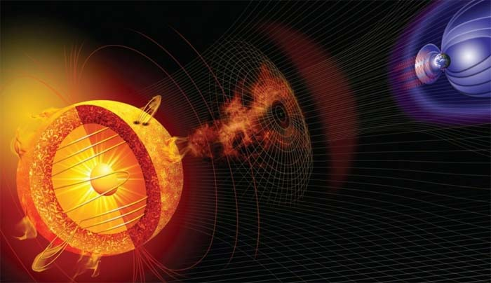

Başta Dünya ve diğer gezegenler olmak üzere, gökcisimlerinin kütleleri ve iç yapısı insanlık tarafından biliniyor. Günlük yaşamda bir nesnenin kütlesini tartarak ölçen, iç yapısını onu kırarak, veya kimi zaman bir aşama ileri gidip X-ışınlarıyla öğrenen insanoğlu için bu konu biraz kafa karışıklığı yaratabilir. Tabii bunun için radyasyonu kullanmak da yalnızca yumuşak ve görece ince yapılar söz konusu olduğunda yer. Bir de bunu her istenen yerde uygulayabilmek için Tüm bu veriler tamamen dolaylı yöntemlerle elde ediliyor. Bugünkü konu yalnızca gezegenlerin, yıldızların ve diğer bir bütün haldeki gökcisimlerinin çekirdekleriyle ilgili olacak. Daha sonra gökcisimlerine dair diğer özellikler nasıl hesaplanıyor, ondan da bahsedeceğimiz bir yazı yazarız.

Öncelikle gökcisimlerinin çekirdekleri nasıl ortaya çıkarılıyor, onu görelim. Sonrasında teker teker inceleriz. Bunun için kullanılan esas yöntem sismoloji. Deprem dalgalarını ölçerek bir gezegenin iç yapısı hakkında bilgi sahibi olunabilir. Gökcisminin bir ucunda oluşan geniş çaplı bir hareketliliğin yarattığı sismik dalgaların diğer uca ne şekilde, nereye doğru saparak ulaştığı hesaplanır ve gökcisminin modeli üzerinden buna neden olabilecek bir yapı çıkartılır. Deprem dalgalarının kendi içinde farklı türleri vardır, kimisi sıvılar içinde ilerleyebilirken kimisi ilerleyemez. Bu şekilde katı iç çekirdek ve sıvı dış çekirdek hakkında bilgi sahibi olunabiliyor. Güneş için uygulanan bu yöndeki sismolojik gözlemlere ise Helyosismoloji deniyor.

Gezegenin çekirdek yapısı o gezegene bir manyetosfer kazandırabilir. Örneğin Dünya'da aktif, tek parça bir manyetosfer varken Mars'ta neredeyse hiç yoktur. Yalnızca yer yer ufak, manyetosfer görevi gören kısımlar bulunur. Manyetosferi oluşturan yapı sıvı dış çekirdektir. Büyük oranda demir - nikel alaşımından oluşur ve hareket halindedir. Manyetosfer gökcisimlerinin manyetik alanıdır. Dünya'nın manyetosferi Dünyayı ve Dünya'daki canlılığı büyük oranda Güneş rüzgarlarının tahrip edici etkisinden korur.

Gökcisimlerinin çoğunda sıvı dış çekirdek ve katı iç çekirdek vardır. Merkezdeki çok yüksek sıcaklıktan dolayı aslında insanoğlunun alışkın olduğu basınç altında iyonize gaz halde olması gereken maddeler merkeze yakın noktada sıvı, merkezde ise çok yüksek basınçtan dolayı kristalize olmuş katı haldedir. Maddenin halini etkileyen tek faktör sıcaklık değildir, basınç da maddenin hangi hale geçeceğini etkiler. Sıcaklığın sabit olduğu bir ortamda sıvı bir madde düşük basınç altında dağılır ve gaz hale geçer, yüksek basınç uygulandığında ise sıkışır, kristalize olur ve katılaşır. Bunu anlamak aslında ısıdan dolayı hal değişimini anlamaktan daha kolay olmalı. Çünkü ısı atomların hareketini değiştirdiğinden dolayı bağ yapma imkanlarını değiştirirken basınç ise atomları birbirine yakın durmaya zorladığından dolayı bağ yapma imkanlarını değiştirir. Tüm gökcisimlerinde çekirdekte en yoğun maddeler birikir.

Yıldız çekirdekleri ise yıldızın yaşam döngüsünü direkt olarak etkiler. Yıldızların çekirdeklerindeki o an füzyonu yapılan maddenin bitme noktasına gelmesi füzyonlardan üretilen ürünün füzyonunun başlamasına neden olur ve bu, yıldızın yapısını direkt olarak etkiler. Yıldızı sabit boyutta, küre şeklinde tutan faktör kütleçekim ve çekirdekten yayılan yüksek enerjinin birbirini dengelemesidir. Daha yüksek kütleli atomların füzyonu demek, yıldızı dengede tutan bu yapının bozulması anlamına gelir. Bu dönüşüm hidrojen, helyum, karbon, azot, oksijen, demir gibi bir sıralamayla ilerler. Helyum yakmaya başlayan yıldız kırmızı dev aşamasına geçer. Sonrasında dış katmanlarını fırlatıp beyaz cüceye dönüştükten sonra ise çekirdeği artık büyük oranda karbondan oluşmuştur. Bunlar küçük yıldızların başına gelecek olanlardı.

Daha büyük yıldızlar için ise durum karışık. Nötron yıldızlarına değinmekte de fayda var. Bu gökcisimlerinin yüzeyleri dahi alışkın olunmayan bir yapıda. Çok yüksek yoğunluklarından dolayı tüm proton ve nötronları birleşerek nötron halinde bulunduğu için bütün yıldız dev bir atom çekirdeği gibi davranır. Ultra yoğunluktaki çekirdeklerinde ise ne olduğu tam olarak bilinmiyor. Nötron yıldızına ve karadeliğe dönüşen yıldızlar için artık bilinen maddeden bahsetmek mümkün değil.
