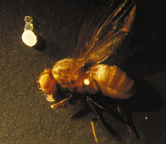

İnsanlık genel olarak tek hücreli canlıları çıplak gözle görebilmeyi beklemez. Günlük yaşantıda pek karşılaşılmamasının yanı sıra, hücre yapısı için de sağlıklı bir durum değil tek bir hücrenin çok büyük boyutlara ulaşması. Hücre dahil her üç boyutlu cisim için hacim ve yüzey belli bir dengede kalmalıdır. Hücre zarının kalınlığı kolay kolay artmadığından hücrenin belli bir limiti vardır. Hacim / Kütle oranı yeterince arttığı zaman hücre tekrar denge durumuna ulaşmak için bölünür ve büyüklüğünü çok arttırmadan bu şekilde türünü devam ettirir. Bunun istisnası olan çok büyük hücreler vardır tabii, örneğin yumurta hücreleri karşılaşılabilecek en büyük hücrelerden biridir. Bir de öyle bir bakteri var ki, insan gözüyle seçilebilecek kadar büyük bir hücre yapısına sahip.

Thiomargarita namibiensis Dünya üzerinde bu zamana dek keşfedilmiş en büyük bakteri. Ortalama 0.1 - 0.3 mm arası büyüklüğe sahip. Kimi üyeleri 0.75 mm büyüklüğüne kadar erişebiliyor. İlk olarak Afrika kıtasının güneylerinde, Namibya'nın kıta sahanlığındaki okyanus kıyılarında keşfedildi. Şekil olarak kok, yani yuvarlak bakteri sınıfına giriyor. Kendisi gram negatif bir bakteri türü, gram boyasıyla boyanmıyor ve bu grubun en büyük sınıflarından biri olan proteobakteri sınıfına giriyor.

İsmini oluşturan ilk kelime, yani tür adı olan Thiomargarita "sülfür incisi" anlamına geliyor. Bu, hücrelerinin görünüşüne yapılan bir atıf. Hücreleri üzerine gelen ışığı dağıtan mikroskopik sülfür granüllerine sahip. Namibiensis ise "Namibya'nın", "Namibya'dan" anlamına geliyor.

Bu bakteri alışkın olunan bakterilerin aksine çok büyük ve örneğin yandaki fotoğrafta bir meyve sineğinin yanında bu şekilde rahatça çıplak gözle görülebiliyor.

Thiomargarita namibiensis keşfedilmeden önce bilinen en büyük bakteri ise 0.5 mm uzunluğundaki Epulopiscium fishelsoni'ydi.
