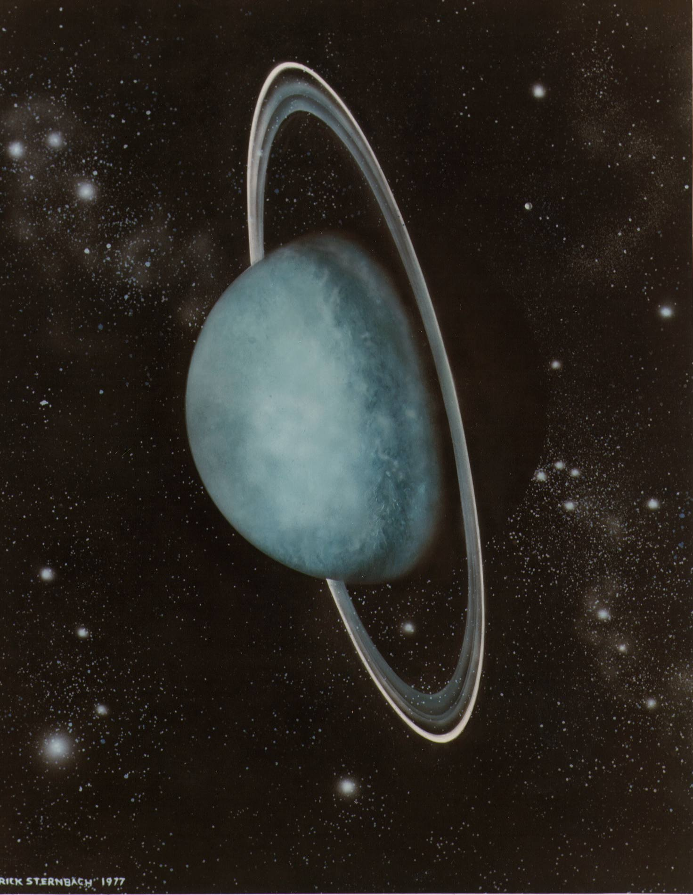
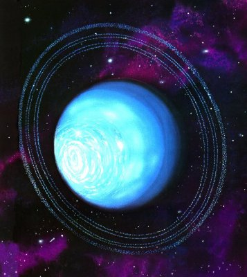

Uranüs özelliksiz bir gezegen değil. Aslında Güneş Sistemi içindeki konumunda, kendine özgü birçok özelliği var. Fakat bu gezegen hiçbir zaman umursanamakta. Belgesellerde dahi üzerinde saatlerce isminin İngilizce telaffuzunun "Your anus" ifadesini andırması üzerine saatlerce geyik yapılır, özelliklerinden kısaca bahsedilir ve geçilir. Kendisine çok benzeyen Neptün dahi çok fazla şımartılan bir gezegen. Gerek rengi, gerek Plüton'un atılmasından sonra sistemdeki son gezegen sayılması, gerek üzerindeki büyük lekesi dolayısıyla Neptün'den her zaman uzun uzun bahsedilirken Uranüs'e karşı tık yoktur.

İnsanların kendi verdikleri isme, üstelik alakasız bir şekilde verdikleri isme kendileri gülmesi yine insanoğlunun "Yeter ulan" dedirten enteresan bir özelliği. Tıpkı Turkey kelimesinin hem Türkiye, hem de hindi anlamı taşımasına gülmek gibi. Halbuki ülkenin ismi önce, kümes hayvanının ismi daha sonra konmuştur. Aynı şekilde Uranüs'ün ismi de Yunan Mitolojisi'ndeki gökyüzü tanrısı olan Uranos'tan gelir. Tüm bunlar, gökbilimci de olsan bir kahvehaneye gidip içini döküp sonra işine devam etmen gerektiğinin bir kanıtı.

Şimdi bu elemanın çevresinde 3 tane halkası vardır. Ekseni 98 derece gibi aşırı bir eğikliğe sahiptir. Bu yüzden diğer gezegenlerden çok farklı bir şekilde sistemde yatık olacak bir şekilde dönmesiyle en dengesiz gezegen olma ünvanına sahip olabilir. Tabii Venüs'ün de kendi ekseni etrafında diğer gezegenlerin aksi yönünde dönmesi nedeniyle bu ikisi bu alanda yarışabilir. İkisinin de bu derdinin nedeni olarak büyükçe bir cisim çarpması düşünülüyor.

Uranüs çıplak gözle görülmeyen, modern yöntemlerle keşfedilen ilk gezegendir. İlk 5 gezegen insanlar tarafından tarihin başından bu yana biliniyordu. Yıldızlardan farklı olarak sabit gözlemlenmek yerine hareketli olarak gözlemlendiklerinden dolayı gezegen ismi verildi. İngilizcedeki planet kelimesi de etimolojik olarak Yunanca "başı boş gezen" anlamına gelen planetai (πλανήται) ifadesinden gelir. İlk 3 gezegen olan Merkür, Venüs, Mars Dünya'ya yakın olduğundan, diğer 2 gezegen olan Jüpiter, Satürn ise hem görece yakın hem de oldukça büyük olduğundan çıplak gözle çok rahat gözlemlenebilen gezegenler. Bunların ilk 5 gezegen sayılmasının nedeni tabii ki Dünya'nın da bir gezegen olduğunun, evrenin merkezi olmadığının sürekli tanrı yaratmaktan başka derdi olmayan insanoğlu tarafından geç anlaşılmış olması. Neptün'ün keşfi ise Uranüs aracılığıyla gerçekleşti. Uranüs'ün yörüngesindeki enteresan etkileri inceleyen bilim insanları Uranüs'ün ardında başka bir gezegen daha olması gerektiğine karar verdi. Dolayısıyla başlangıçta Neptün fiziksel hesaplamalarla keşfedilmiş, bu hesaplamaların sonucu olarak gözlemlenmiştir. Dolayısıyla "Uranüs'e dil uzatma nedensiz, baban kim bilemezdin şerefsiz" falan filan işte.

Şimdi bu gezegenin diğer sıkıcı özelliklerine girelim. Bir Uranüs yılı, 84 dünya yılına denk. Bu gezegenin 27 adet uydusu var. Neptün ile birlikte buz devi sınıfına giriyor. Bunun nedeni de iç yapısında donmuş metan, amonyak ve su barındırması. Bu iki elemanın Jüpiter ve Satürn'ün aksine kütlesinin çoğunu değil, %20'sini hidrojen oluşturuyor.

Her gezegen kendine özgü bir çok özellik taşımakta. Tüm bu gezegenlerin önemli bir özelliği kendilerini diğer gezegenlerden ayrı kılıyor. Güneş sistemde özelliksiz olarak anılabilecek bir gezegen arandığında insanın karşısına direkt Uranüs çıkıyor. Merkür'ün bir yanının aşırı sıcakken diğer yanının aşırı soğuk olması ve küçük hacmi, yüksek yoğunluğu, Venüs'ün yüksek sera etkisinden dolayı Güneş Sistemi'nin en sıcak ve yüzeyi en yaşanmaz halde olan gezegeni olması, Mars'ın kızıl olması ve yaşam için ilk göz atılan yerlerin başında gelmesi, Jüpiter'in büyüklüğü, Satürn'ün halkaları, Neptün'ün son gezegen statüsüne geçirilmesi ve rengi derken, Uranüs en göz önünde olmayan, oraya figüran olarak konmuş bir gezegen şeklinde görülüyor. Uranüs normal, insanlar onu tırt hale getirdi.
