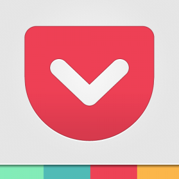
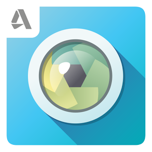

Artık insanlar için hayatın akıllı telefonları ve internet olmadan akmadığı su götürmez bir gerçek. Yanlarından ayırmadıkları akıllı telefonlarıyla canları sıkıldığı zaman oyun oynamak olsun, istediklerinde bir şeyler izlemek veya okumak gibi eylemler olsun kolaylıkla ve hızlı bir şekilde gerçekleştirebiliyorlar. Hayatı bu kadar hızlandıran bir icattan kimse mahrum kalmak istemez. Elbette içerisinde çeşitli uygulamalar olmadıkça bir akıllı telefon büyük oranda boş bir kutu. Bu uygulamalar olmadıktan sonra akıllı telefonlar yalnızca rahatça internete girmek, müzik dinlemek, takvim ve ses kaydı gibi temel işlevler için kullanılabilir. Bu yazıda Android işletim sistemine sahip akıllı telefonlar için hayatı kolaylaştıran kimi uygulamalara değinilecek. Bu uygulamaların büyük oranda diğer platformlar için de versiyonları bulunuyor. Aynı üreticinin ürünü olmasa da, aynı işlevi görecek muadilleri de mevcut. Şimdi uygulamaları tanıtmaya geçelim.

**Pocket** Bir şeyler okumayı seviyorsanız ve daima okumak için bir şeyler arıyorsanız elbette tüm bu metinleri okumak için yeterli zaman olmadığı bir gerçek. Pocket uygulaması bu durumda büyük kolaylık sağlıyor. Okumak istediğiniz fakat o an bu eylemi gerçekleştiremeyeceğiniz herhangi bir makaleyi Pocket'a aktarıyorsunuz ve uygulama bunu daha sonra daha rahat okunabilecek bir şekilde biçimlendirip, çevrimdışı da okunabilir halde kaydediyor. Pocket'ı kullanmaya başlamak için bir üyelik oluşturmanız gerekiyor ve üye olup uygulamayı kullanmaya başladıktan sonra istediğiniz başka bir cihaz veya internet üzerinden hesabınıza girip kaydettiğiniz makalelere erişebiliyorsunuz.

**Cleanmaster** Tüm Android kullanıcılarının bildiği üzere telefon kullanmaya devam edildikçe yavaşlar, gereksiz dosyalarla şişer. Özellikle yeni eklenen uygulamaların sayısı arttıkça görülen bu durum için çeşitli arındırıcı uygulamalar mevcut. Cleanmaster bunların arasında iyi bir seçenek. Birçok özelliği bir arada bünyesinde barındırıyor. Temel özelliği ile bir taramada GB'larca veri temizleyebiliyorsunuz. Bunun dışında önbelleği de temizleyerek telefonu hızlandırabiliyor. Uygulamaları telefondan kaldırdıktan sonra geride bıraktıkları çöp dosyaları da isteğinize bağlı olarak arındırma özelliğine sahip. Bunun dışında uygulamalar için yedekleme özelliği de bulunuyor.

**Pixlr Express** Tarayıcı üzerinden çalışan, bir fotoğraf düzenleme servisi olan Pixlr'ın mobil versiyonu olan Pixlr Express ile fotoğraflara dair birçok işlemi kolayca halledebiliyorsunuz. İçerisinde birçok efekt barındırıyor. Bu efektler özellikle Instagram'ın sunduğu efektlere nazaran çok daha kaliteli. Bunun gibi fotoğraf tabanlı sosyal ağ uygulamalarında fotoğraflar için uygulamanın sunduğu kendi efekt sistemini değil, Pixlr gibi uygulamaları kullanmak daha mantıklı olacaktır. Pixlr bunun yanı sıra fotoğraf için temel olan parlaklık, kontrast gibi özellikleri de barındırıyor. Adobe Photoshop gibi programlarda bulunan bulanıklık filtreleri, yüzey temizleme ve desen işlemleri gibi daha birçok özellik de içerisinde barınıyor. Tüm bunların dışında resimlerinize yazı ekleyerek zeminle uyumlu bir hale getirebiliyorsunuz.

**Skype** Skype'ın Android uygulaması da en az PC versiyonu kadar başarılı. Kameralı ve sesli görüşmede kalite bakımından rakipsiz olan Skype uygulamasında telefonunuzun ön kamerası ve mikrofonuyla çok rahat bir şekilde görüşme yapabiliyorsunuz. Telefonunuzda ön kamera bulunmasa dahi arka kamerayı da görüşme için kullanabilmeniz mümkün. Her ne kadar işlevsel olmasa da, kameranın gerektiği durumlar için birebir bir seçenek. Uygulamayı diğer bütün mesajlaşma uygulamaları gibi kullanabiliyorsunuz. Skype uygulaması push bildirimlerini de destekliyor.

**Google Sky Map** Astronomi ile ilgileniyorsanız bilgisayar üzerinden açık kaynaklı bir yazılım olan Stellarium'u kullanmışsınızdır. Google Sky Map de bu ayarda bir yazılım. Fakat akıllı telefonların getirdiği sensör özellikleri de kullanılarak daha kullanışlı bir hale getirilmiş. Bu uygulamayla o an bulunduğunuz veya özel olarak seçtiğiniz bir bölgede gökyüzünde bulunan gök cisimlerini ekranda görerek isim ve özelliklerine erişebiliyorsunuz. Uygulama size sanal bir gökyüzü oluşturuyor. İsterseniz ekranı elinizle kaydırarak, isterseniz de telefonu sağa sola oynarak gök cisimlerini kameraya alıyormuşsunuz gibi tarayabilirsiniz. Uygulama telefonun hareketlerini algılayarak gerçekçi bir simulasyon yaratıyor.
