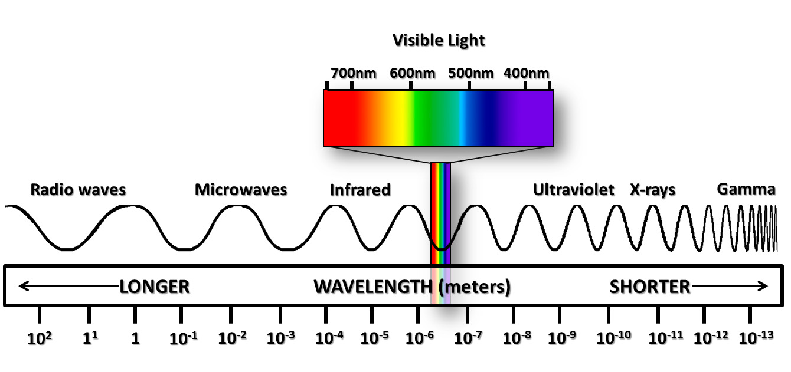
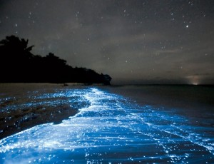
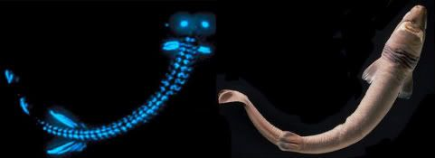
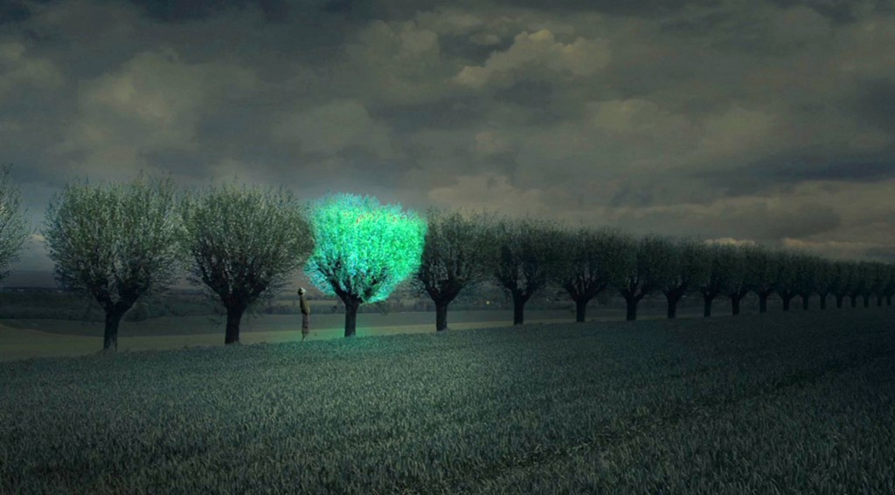

Işık üretmek insanlar tarafından ateş böceği gibi genel olarak bilinen örnekler dışında canlılarla pek fazla bağdaştırılamasa da, dünya üzerinde bu yeteneğe sahip çok sayıda canlı mevcut. Hatta çoğunluğu yaşadığı yerler dolayısıyla henüz keşfedilememiş durumda. Canlının vücudundan biyolojik ışık üretme olayına biyolüminesans adı veriliyor. Biyolüminesans kelimesi Latince yaşam anlamına gelen "Bios" ve ışık anlamındaki "Lumen" kelimelerinden gelir. Soğuk ışık olarak da bilinen lüminesans bir nesnenin ısısı değişmeden ışık yaymasına deniyor. Bunu gerçekleştiren canlı olduğu zaman da buna biyolüminesans ismi veriliyor. Bu biyolojik ışık üretilirken enerjinin yalnızca 20%'den azı ısıya dönüşür.

Elbette mutlak sıfıra ulaşmamış her varlık bir ışınım yayar. 0 kelvin veya -273 santigrat derece ile ifade edilen bu noktaya ulaşmak ise imkansız sayıldığından ışınım yaymayan madde yok gibidir. İnsanlar yalnızca gözleriyle algılayabildikleri, elektromanyetik spektrumdaki çok ufak bir bölgeyi oluşturan görülebilir ışığa ışık demiştir. Oysa radyo dalgalarından mikrodalgalara, kızılötesi ışınlardan gama ışınlarına hepsinin yapısı görülebilir ışıkla aynıdır. Farklı olmalarını sağlayan tek faktör dalgaboylarıdır. En basitinden her madde, dolayısıyla her canlı ısı yayar. Isı, kızılötesi ışınımdır ve bir elektromanyetik dalga çeşididir. Bunun dışında kimi canlılar insan gözünün algılayamayacağı kadar küçük veya büyük dalgaboylarında ışınım yayar ve algılarlar. Fakat burada biyolüminesans derken yalnızca görülebilir ışık ve bunun çok yakınındaki ışınımlardan bahsediyor olunacak.

Bir canlı biyolüminesans özelliğini kullanabilmek için lusiferin pigmentini ve lusiferaz enzimini kullanır. Lusiferin'i oksitleyerek ışık üretirken, lusiferaz enzimini de bu tepkime için hızlandırıcı olarak kullanır. Bu tepkimenin hücre içinde olması şart değildir, hücre dışında da gerçekleşebilir.

Genel bir örnek olan ateş böcekleri biyolojik ışıklarını türleri içindeki iletişim için kullanır. Çiftleşme dönemlerinde bu özelliklerini yoğun olarak kullanırlar. Ateş böceği dışında, genellikle hakkında yanlış bilginin yaygın olduğu yakamozlar da biyolojik olarak ışık üreten canlılardır. Yakamoz (_Noctiluca scintillans_) tek hücreli bir deniz canlısıdır. Bu canlı suyun ve balıkların hareketi ile etkileşime geçtikçe ışık ile tepki verir. Gece yakamozun bolca olduğu bir yerde bulunan insanlar, kayıklarının kürekleriyle suyu ittiklerinde veya yüzdüklerinde bu hareketlerine bağlı olarak yakamozların ışık saçtığını görecektir. Fotosentez ile besinini sentezleyebildiği için su yüzeyine yakın vaziyette, toplu halde yaşarlar. Türkçede yakamoz çoğu zaman yanlış bir şekilde ay ışığının suya vuran yansıması olarak kullanılsa da; hem bu canlıya, hem de bu canlının yaydığı mavi ışığa verilen isimdir.

Biyolüminesans yeteneğini vücutlarında daha aktif kullanabilen çoğu canlı ise yakamozların aksine deniz ve okyanusların derin bölgelerinde yaşar. Güneş ışınlarının ulaşamadığı bu bölgelerde bu özellikleri bu deniz canlılarına birçok fayda sağlar. Bu derin sularda yaşayan canlıların 90% kadarı biyolüminesan özelliğe sahip. Genellikle suyun içerisinde güçlü etki gösteren yeşil ve mavi renklerde ışık yayıyorlar. Fakat bu canlılar ışığı burada aydınlanma veya yolunu görmek amacıyla kullanmaz. Işığı ilgi çekici bir etmen olarak kullanarak av olmaktan kurtulur veya av yakalarlar. Yüzünün önüne sarkan ışık yayan uzvu ile, bu ışığa gelen ufak balıkları avlayarak beslenen fener balığı (_Lophius piscatorius_) buna güzel bir örnektir.

Cookiecutter köpekbalığı bu özelliği vücudunun ufak bir kısmını aydınlatarak kamuflaj olarak kullanır. Vücudunun alt kısımlarını aydınlatmaz ve yetersiz ışıkta bu durum küçük bir balık gibi görünmesine neden olur. Bir av bulduğunu düşünen tuna ve uskumru gibi yırtıcı balıklar cookiecutter'a yaklaştıklarında kendileri av durumuna geçerler.

Kimi mürekkep balığı türleri ise vücutlarından püskürttükleri biyolüminesan moleküller ile avcılarının kendilerini takip etmesini sağlayarak kendi bölgesine çeker. Bu şekilde avcı av konumuna düşer.

Bazı bakteri türleri de biyolüminesan özelliğe sahiptir. Bu bakteriler koloniler halinde bir arada bulunarak parlak ışık yayar hale gelebilir ve kimi balıkları enfekte edebilir. Enfekte olan balık da yüksek bakteri yoğunluğundan dolayı ışık yayar hale gelir. Örneğin Anomalops isimli balık türü gözünün altını saran bölgeden ışık yayar. Buna orada yoğun halde bulunan biyolüminesan bakteriler neden olur.

 Kimi canlılar kendilerine verilen ışığı emerek geri yansıtır. Bunun biyolüminesan etki ile hiçbir alakası yoktur.

İnsan vücudunda da yayılan biyolojik ışık tespit edilmiştir. Fakat bu ışık insan gözünün algılayacağından 1000 kat daha zayıf durumdadır. Evrimsel süreçte ışığa çeşitli yönlerden hayati ihtiyaç duyan kimi canlılar bu özelliklerini geliştirebilmiştir. Bunun dışında her canlı metabolizmasını oluşturan kimyasal tepkimeler sonucu görülebilir ışığa yakın dalgaboylarında ışınım yayabilir.

Biyolüminesansın suni amaçlara uygun kullanılmasına dair çeşitli çalışmalar yapılıyor. Işık yayan bitkiler, ağaçlar ile çevre aydınlatması elektrikten tasarruf etmeye yardımcı olabilecek. Aynı şekilde hayvanlar üzerinde yürütülen çalışma ve deneyler de mevcut.

