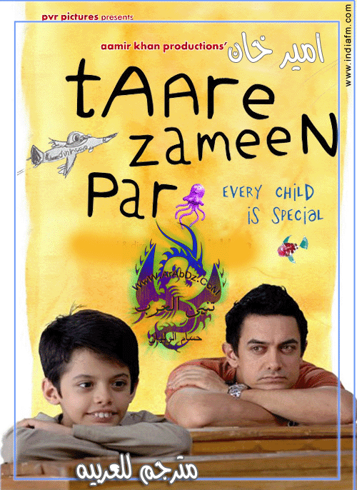

### **Peekay ( PK )**

#### Yönetmen: Rajkumar Hirani

#### IMDB: 8,7

P.K. ayrı bir dünyadan gelen ve evine gitmenin yolunu arayan biridir. Dünya serüveninde insanlara sorduğu sorularla bir anda bütün dikkatleri üzerine çeker. Bu sorular çocukça ve masum sorulardır ancak cevabı oldukça zordur. Felsefenin sınırlarını zorlayan kişiler dahi cevap verememektedir. Muzipliği ve sorduğu sorularla kendine iyi dostlar edinir. Kahkaha, dram ve bir aşk masalını bir arada yaşatan oldukça güzel bir filmdir.

****

### **Dhoom 3**

#### Yönetmen: Vijay Krishna Acharya

#### IMDB: 5,9

IMDB puanına bakıp aldanmamak gerek. Sahir sirk şovmeni olan babasının yanında yaşar. Ancak bankalara borçlanan ve borcunu ödeyemeyen babası intihar eder. Sahir babasının intikamını almak için azılı bir hırsıza dönüşür ve bankalara savaş açar. Filmin sonunda izleyicileri bir sürpriz beklemektedir.

### **Fanaa**

#### Yönetmen: Kunal Kohli

#### IMDB: 7,0

Güzel ama kör bir kız olan Zooni sahne almak için gittiği Delhi'de rehber olan Rehan ile karşılaşır. Zooni hiç görmeden Rehan'a aşık olmuştur. Bir ameliyat ile gözleri açılır. Ancak Rehan bombalı saldırıda ölmüştür. Şehirden uzakta yaşayan Zooni'nin bir gün kapısı çalar. Karmaşık ve dramatik olaylar başlar. Yoksa Rehan yaşıyor mu?

### 

### **3 Idiots**

#### Yönetmen: Rajkumar Hirani

#### IMDB: 8,3

İyi bir mühendislik okuluna başlayan ve içine düştükleri sürekli yarış sistemini değiştirmeye çalışan bir öğrenci ve 2 arkadaşını anlatan bir film. Dram ve komedinin bir arada işlendiği filmde gençlerin başlarından geçenler en iyi şekilde anlatılmıştır.

### **Talaash**

#### Yönetmen: Reema Kagti

#### IMDB: 7,2

Polis olan Surjan oğlunu bir trafik kazasında kaybetmiştir ve eşi ile boşanmak üzeredir. Bollywood yıldızının şüpheli bir trafik kazasında ölmesi üzerine Surjan bu olayı araştırmaya başlar. Hayat kadını olan Simran sayesinde derin olaylar gün ışığına çıkar. Bu olayla kimileri için mutlu günler kimileri için de korkunç günler başlar.

 

**Taare Zameen Par**

#### Yönetmen: Aamir Khan

#### IMDB: 8,0

Ishaan oldukça kötü, tembel ve sorumsuz bir öğrencidir. Kardeşi Yohaan ise tam tersine sınıf birincisidir. Aile elinden geleni yapar ancak Ishaan'da hiç bir değişiklik olmaz ve sonunda ailesi Ishaan'ı yatılı okula göndermeye karar verir. Acaba Ishaan'ı bu okulda neler beklemektedir?

 

**Dil Chahta Hai**

#### Yönetmen: Farhan Akhtar

#### IMDB: 8,2

Aşk konusunda birbirinden oldukça farklı 3 arkadaş... 3 arkadaş birbirine oldukça bağlıdır. Ancak biri çapkınlık peşinde, biri her gördüğüne aşık olan diğeri ise aşktan hiç bahsetmeyen biridir. Bir gün kaderin oyunu üçünün de aşka olan bakış açısını değiştirir. Aşk, yalnızlık, ayrılık ve dahası...

****

 

**Ghajini**

#### Yönetmen: A.R Murugadoss

#### IMDB: 7,1

Sanjay Hindistan'da güçlü bir şirket olan Air Voice şirketinin sahibidir. Kalpana ise reklam firmasında oyunculuk yapmaktadır. Reklam afişi için Kalpana'nın kaldığı ev seçilmiştir ve Sanjay'ın adamları kendisiyle görüşmeye gelirler. Ancak Kalpana'nın arkadaşları Sanjay'ın kendisine aşık olduğunu sanar. Sanjay bir gün Kalpana ile tanışır ancak kimliğini gizler. Birbirlerine aşık olurlar. Bir iş için ikisi de farklı şehirlere giderler. Ancak bu mutluluk uzun sürmez. Bunun sebebi Ghajini'dir. Geride sadece hafızasını kaybeden ve 15 dakikada bir bazı şeyleri hatırlayan Sanjay kalmıştır. Sanjay intikam için elinden geleni yapmaktadır. Kesinlikle izlenmesi gereken bir başyapıt.

 

### **Lagaan**

#### Yönetmen: Ashutosh Gowariker

#### IMDB: 8,3

İngiliz sömürgesi altındaki Hindistan'ı ve Hintlilerin çektikleri sıkıntıları anlatan iyi bir film. İngilizlerin uyguladığı tarım vergisi ve kuraklık insanların sıkıntı çekmesine neden olmaktadır. Köylüler tarım vergisi olan 'lagaan' dan bu yıl muaf tutulmayı isteyecekken bunun 2 katına çıktığını öğrenirler. Köylüler Bhuvan adındaki genç çiftçi önderliğinde eyaletin racası ile görüşmeye giderler. Raca kararın İngilizler tarafından verildiğini söyler. Kibirli yüzbaşı Russell köylülere kriket maçı teklif eder ve kazanırlarsa 3 yıl lagaandan muaf tutulacaklarını, kaybederlerse 3 katı lagaan ödeyeceklerini söyler. Bhuvan bilmedikleri bir oyun için köylüyü ikna etmeye çalışır. Bakalım ikna edebilecek mi?

