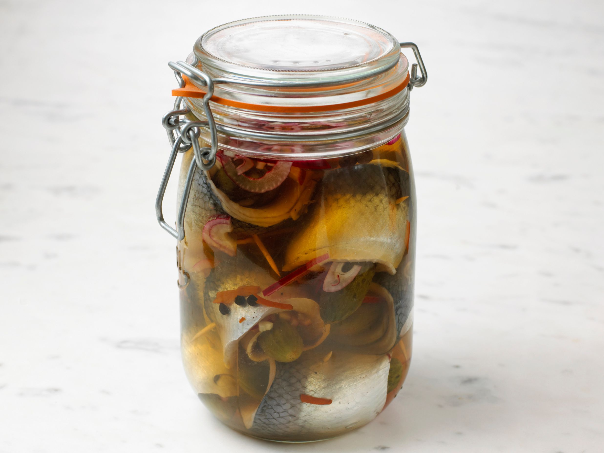
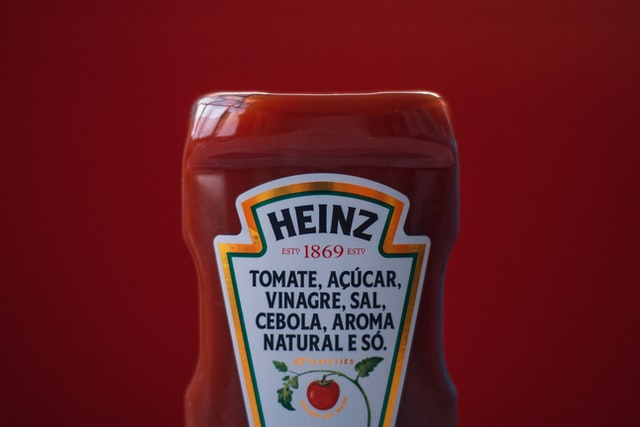

Birçok insanın vazgeçilmezi olan, her markette rafları dolduran ketçabın tarihi aslında bildiğimizden daha eskidir. Günümüzde ketçap denilince akla ilk olarak domates gelmektedir. Modern ketçaplar domates sosudur. Peki ya ketçabın ilk olarak balıktan yapıldığını biliyor muydunuz?

17.yüzyılda Çin'de kullanılan bir yöntem ketçabın temellerini oluşturur. O dönemlerde nemli havadan dolayı balıkları kurutarak muhafaza etmek pek mümkün değildi. Bu nedenle balıklar tuzlu suda salamura yapılarak muhafaza ediliyordu. Salamura balık ve baharatlarla bir sos hazırlanıyor ve bu sos yemeklerde kullanılıyordu. Lezzetinden dolayı Çin mutfağının bir parçası olan ve Ke-chiap olarak adlandırılan bu sosun ünü kısa sürede Malezya, Singapur, Endonezya'ya kadar ulaşmıştı.

## Ketçap ve Yayılması

18.yüzyılda Asya'daki İngiliz tüccar ve denizciler tarafından keşfedilen bu sos çok beğenildi. Bu sosu kendi ülkeleri olan İngiltere'ye götürdüler ancak bu sosun içeriğini tam olarak bilemeyen İngiliz aşçılar mantar, ceviz, salatalık ve çeşitli baharatlar kullanarak sos hazırlayıp yemeklerde kullandılar. Ketch-up olarak telaffuz ettikleri bu sos çok beğenildi ve tüm İngiltere'ye yayıldı. Günümüzde hala mantardan hazırladıkları sosları kullanmaktadırlar. Domates henüz kullanılmamaktadır.

## Peki ya ketçapta domates ne zaman kullanılmaya başlanmıştı?

Domatesin anavatanı Güney ve Orta Amerika'dır. Amerika'nın keşfinden sonra keşfedilen domatesin yerliler tarafından tüketilmediği fark edildi. Domatesin zehirli bir bitki olduğuna inanılıyordu. Domates bitkisi zehir etkisi yapabilecek maddeler içermesine rağmen meyvesi yenen bir bitkidir. Buradan domates gemilerle Avrupa'ya gönderildi. Zehirli olduğuna inanılan domates süs bitkisi olarak kullanılıyordu. Daha sonra zehirsiz olduğu anlaşılınca mutfaklarda kullanılmaya ve tarımı yapılmaya başlandı.

İlk olarak Sandy Addison tarafından 1801 yılında bir yemek kitabında verdiği ketçap tarifinde domatesi kullandı. Daha sonra Mary Randolph adındaki bir yemek kitabı yazarı kitabında domates kullanarak ketçap yapımı tarifini vermiştir ve ketçap hızla yayılan bir sos halini aldı. Domates ile hazırlanan ketçabın bir fabrikasyon ürünü olmasını ve seri üretime geçilmesini sağlayan Henry Heinz'dır. 1876 yılında fabrikasında ilk şişe ketçap üretimini gerçekleştirmiştir. Sulu ve akıcı olarak hazırlanan ketçabın şişeleri dar ağızlıydı ve sekiz köşeliydi. Daha sonra daha koyu bir kıvamda üretilmeye başlandı. Ancak dar ağızlı şişelerden ketçabı dökmek oldukça zor bir durum oluşturmuştu. Ketçap adı Heinz markası ve şişesiyle özdeşleştiğinden diğer üreticilerde aynı şekilde şişelerde üretip satmaya başladı. 1983 yılında Heinz firması günümüzde de kullandığımız plastik, ortasından sıkılan şişeler geliştirdi. Asya'dan Amerika'ya kadar uzanan ketçabın serüveninden sonra ketçap günümüzde en çok tercih edilen soslardan biri olmuştur.

