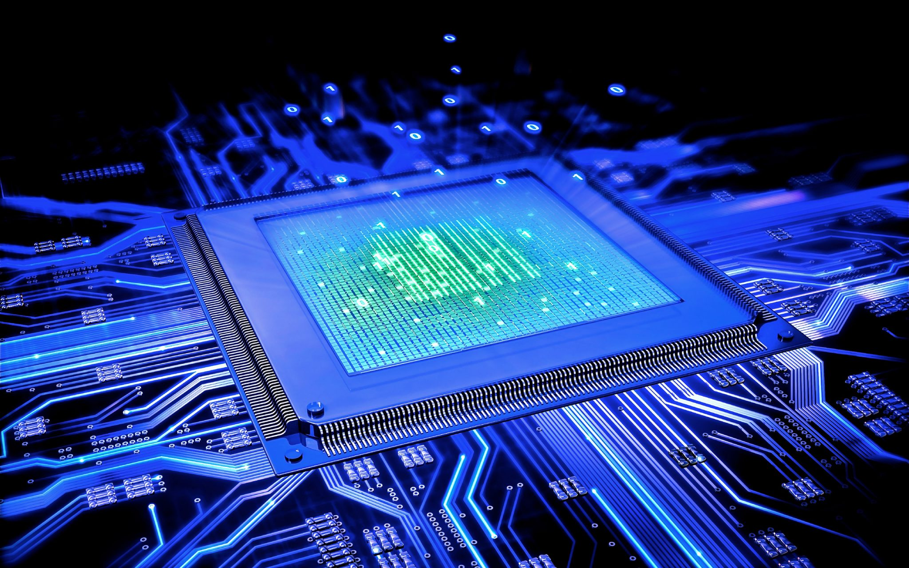
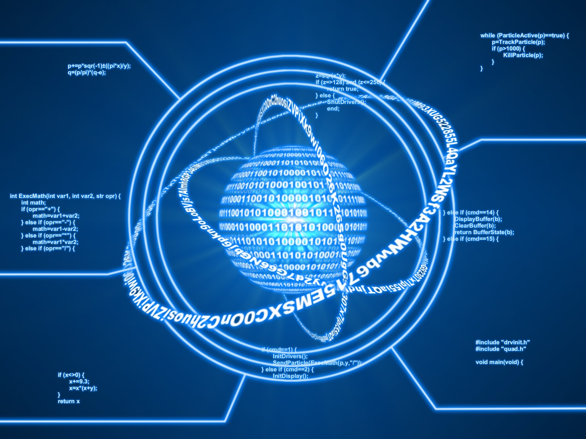

Teknoloji hızla ilerliyor, fakat ne kadar ilerlerse ilerlesin bu gelişmeler genellikle tekdüze bir doğrultuda devam ediyor. Bilgisayar bilimlerinde Moore Yasası denen basit bir öngörü vardır. Buna göre her iki yılda bir bilgisayar işlemci kapasiteleri iki katına çıkarak artmaya devam eder. 20. yüzyılın ortalarından bu yana hemen hemen her zaman doğru çıkan bu öngörü son yıllarda işlememeye başlamıştır. İnsanoğlu şu an teknolojik bir duraklama evresindedir.

Bunun nedeni bilgisayarın tarihinde gizli. En başta analog sistemler şekilde doğan bilgisayarlar, vakum tüplerinin icadıyla dijital hale geldi ve bugüne kadar başta bilgisayarlar olmak üzere tüm elektronik aletler yavaş yavaş dijitalleşmeye başladı. Veri depolamayı ve bu veriler üzerinde yapılan işlemleri vakum tüpleri aracılığı ile gerçekleştiren bu bilgisayarlar tonlarca ağırlığa ve yaklaşık bir oda boyutuna sahipti. Ardından yarıiletkenler, dolayısıyla transistörler icat edildi ve bilgisayarların boyutu git gide ufaldı. Transistörler vakum tüplerine göre çok daha işlevseldi ve ne boyutta olduklarının önemi yoktu. O zamandan bu zamana bu transistörler git gide daha küçük üretilerek daha yakın yerleştiriliyor; sonuç olarak her geçen yıl daha küçük boyutta, daha yüksek özelliklere sahip bilgisayarlar üretilebiliyordu. Bu metod aradan geçen yıllara rağmen hiç değişmedi. Bunun dışında, başlarda ısınma konusunda neredeyse hiç sorun çıkarmayan transistörler artık birbirlerine git gide yaklaştıkça ısı problemleri yaşanmasına neden olmakta.

#### Kuantum Engeline Çarpan Transistör Teknolojisi

Transistörler artık bir virüs boyutuna kadar indirgenmiş durumda. Daha fazla küçültülmelerine imkan yok. Bunun nedenlerinden biri, transistörleri daha küçük hale getirmenin bir limiti olması. Buna çözüm olarak, artık daha gelişmiş bilgisayarlar üretebilmek için çoklu çekirdek teknolojileri kullanılmaya başlandı. Aynı anda birden fazla işlemci çalışıyor ve yük dağılımı sonucunda bilgisayarlar bir nebze daha hızlı işlem yapabiliyor. Diğer problem ise küçülmenin kendisinde yatıyor. [Kuantum mekaniği ile ilgili ilk yazı](http://sabahlatan.com/blog/kuantum-fizigi-nedir-ne-degildir/)da belirttiğim üzere ufak boyutlara inildikçe kuantum etkileri görülüyor ve bu da insanoğlunun henüz büyük bölümüne yabancı olduğu yeni fizik kuralları anlamına geliyor. Transistörleri daha fazla küçültme imkanı olsa dahi doğru çalışmayacaklar.

Tüm bunlara alternatif olarak geliştirilmeye çalışılan teknoloji ise kuantum bilgisayarları. Bir bilgisayar veri birimi olarak "bit" isimli kavramı kullanır. Bit, 0 veya 1 değerini alabilen; bilgisayardaki en küçük veri parçasıdır. Transistörlerden akım geçmesi 1, geçmemesi 0 anlamına gelir. And, or, nor gibi "mantıksal kapı" isimli dijital veri devreleri ise bu bitlerle işlem yapabilmeyi sağlar. Bunlar aracılığı ile 8 tane bit değerinin bir araya gelmesiyle bir Byte, 1024 Byte'ın bir araya gelmesiyle bir Kilobyte meydana gelir ve bu birimler bu şekilde devam eder.

#### Qbit Nedir?

Kuantum bilgisayarlarını farklı kılan ve özünü oluşturan ise bit yerine qbit (Quantum bit) isimli yeni bir veri parçası kullanacak olması. Kimi zaman "qubit" olarak da geçer. Buna "kübit" diyen de var, fakat şimdilik konumuz bunlar değil. Bir qbit, bir elektronun spin (dönüş) hareketine bağlı olarak değer alabilecek bir veri birimi. Yine Kuantum Fiziği'ne giriş yazısında belirttiğim gibi, kuantum evreninde bir parçacığın özellikleri ölçülmediği takdirde daima belirsizdir. Ölçüldüğü zaman ise bir değer alır.

Qbit'in özelliği, bir elektrona yüklenen 1 veya 0 değerlerinden çok daha fazlasına sahip olması. Söz konusu kuantum mekaniği olduğunda bir parçacık aynı anda iki özelliğe birden sahip olabilir. Yani qbit değeri aynı anda hem 1, hem de 0 olabilir. Bunun ismi kuantum mekaniğinde süperpozisyon olarak geçer. Daha net açıklamak gerekirse; kuantum evreni olasılıklar üzerine kuruludur, kesinlik yoktur. Bunun sonucunda qbit değerini taşıyacak olan elektron öyle bir pozisyonda yakalanır ki; değeri hem aynı anda iki zıt spin değerine, hem de bunlar arasındaki tüm olasılıklara eşit olur. Bu spin değerleri 1 ve 0 olarak alınır, aradaki olasılıklar ise sınırsız değere sahiptir.

Standart bilgisayarlarda temel birim 2 farklı değer aldığından bunun üst katlarında veri sayısı daima 2'nin kuvveti şeklinde artar. Bugünün teknolojisi baz alındığında bilgisayar aynı anda birden fazla işi birden yapabilecek bir alet değildir, eylemlerini parçalara bölerek halleder. Buna rağmen hesaplama hızının yüksekliği daha önce bahsi geçen, artan transistör sayısından kaynaklanır. Ancak standart bir bilgisayar anlık olarak ortaya çıkan 2n durumun yalnızca birinde bulunabilirken, kuantum bilgisayar tümünde aynı anda bulunabilir.

#### Qbit'in Gerçek Yaşama Olan Yakınlığı

Qbit kavramı tam anlamıyla rastgele sayı üretebilme algoritmasının önünü açacaktır. Şu anki teknolojiyle bilgisayarlar veya canlılar dahi hiçbir şekilde rastgele işlem gerçekleştirmez. Çeşitli programlama dillerinde, bilgisayarın herhangi bir işleminde rastgele üretildiği söylenen sayılar gerçek anlamda rastgele değildir. Bu algoritma ve komutlar bunu yapabilmek için bir veriyi, örneğin sistemin o anki saatini alarak; rastgele görününceye dek üzerinde işlem yapar ve son veriyi çıktı olarak verir. Bir insandan anlık olarak rastgele bir sayı istendiğinde verdiği yanıt ise, çeşitli çağrışımlar sonucu bulduğu bir sayı olacaktır. Bilinen evrende hiçbir şey çağrışımsız veya referanssız gerçekleşmez. Tüm duyuları kapalı, yalnızca bilinci açık olan bir insan dahi aklından geçirdiği çağrışımları birbirine bağlayarak kendi kendine bir şeyler öğrenebilir. Kuantum evreninde her şey bilinen evrende algılanandan çok farklı gerçekleştiğinden dolayı rastgele sayı üretmek mümkün olacaktır. Bir parçacığın davranışının ölçüldüğünde veriler zaten tamamen rastgele olarak bulunur.

Bulanık mantık denen olgu ise tam anlamıyla kuantum bilgisayarlar aracılığı ile mümkün olacak gibi görünüyor. Bilişim dünyasında her şey nettir. Bir değer ya vardır, ya yoktur. Bu birimler bir araya geldiğinde yalnızca netliği kamufle edecek kadar karmaşık görünüme sebep olur. Temelde her şey kesin olarak belli şekildedir. Bulanık mantık ise daha sezgisel bir programlama metodu olarak ifade edilebilir. Yalnızca siyah veya beyaz değil, aradaki tüm gri tonlarını da bünyesinde barındırır. Tam anlamıyla var veya yoktan ziyade az ve çok kavramlarını programlamaya dahil eder.

Kuantum bilgisayarların ortaya çıkması insanlığa bir anda muazzam bir çağ atlayışı sağlayacak olsa da, şu anda bu teknolojiye geçiş mümkün değil. Bunun çalışmaları tüm hızıyla devam ediyor ve her geçen gün yeni ilerlemeler katediliyor. Fakat insanoğlu üzerinde çalıştığı bu teknolojiyi henüz tam anlamıyla kavramış değil. Yakın zamanda bu buluş gerçekleşecek olsa dahi, bu teknolojinin evlere girmesi uzun yıllar alınacaktır. Örneğin süperiletkenler neredeyse sıfır dirence sahiptir ve teknoloji alanında kullanılmaları çok büyük gelişmeler sağlayacaktır. Fakat süperiletkenler bu özelliklerini yalnızca çok düşük sıcaklıklarda sergileyebilirler. Dolayısıyla ev ortamında kullanılmaları mümkün olmaz. Kuantum bilgisayarı teknolojisinin de, aynı şekilde ev ortamında kullanılabilmek için çok özel koşullar istemesi söz konusu.
