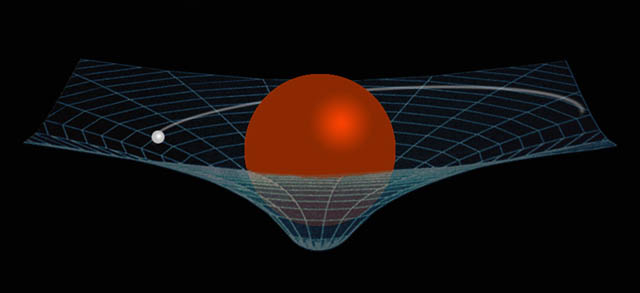
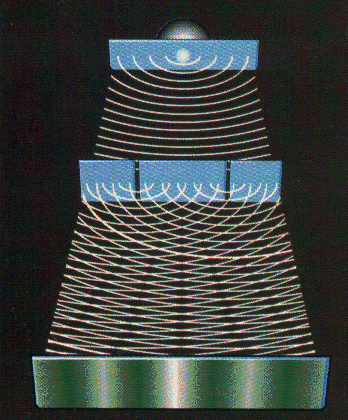

Bilinen evrende bir varlık aynı anda iki yerde birden bulunamaz, bir yerden bir yere ışınlanamaz veya kolaylıkla enerjiye veya maddeye dönüşme yeteneğine sahip değildir. Kuantum mekaniği keşfedilene dek bilinen gerçek buydu. Kuantum teorileriyle ilgili çalışma yapan bilimadamlarının "kuantum mekaniğini anlamamak" ile ilgili bolca özdeyişi vardır. Bunun nedeni insanın içinde yaşadığı boyutlarda varlığını kesinlikle kabul ettiği yasaların kuantum evreninde bambaşka hallere bürünmesi.

Yaklaşık 300 yıl önce Isaac Newton temel hareket ve çekim yasalarıyla ilgili teorilerini oluşturdu. O zamanlar bunları dahi anlayabilmek insanlar için çok zordu. Dünyaya hapis durumda olan insan sürtünme ve kütleçekim kuvvetleriyle fazlasıyla iç içeydi. Doğal olarak insanoğluna göre tüm maddeler daima ancak bir zemin üzerinde mevcut olabilir, yükseldiği an tekrar aynı zemine düşecek şekilde var olabilirdi. Bu yüzden kuşların hareketleri insanların en büyük tutkularından biri haline gelmişti. Fakat kuşlar da bu konudaki ayrıcalıklarına rağmen havada duramaz, onların yapabildiği tek hareket havayı iterek yükselmek ve o mesafeden süzülmektir.

Bunun dışında sürtünme de dünya üzerindeki hayatın çok önemli bir bölümünü oluşturan bir kuvvettir. O zamanın görüşüne göre bir madde hareket ediyorsa bir noktadan sonra muhakkak duracaktır. Hareket ekstra enerji isteyen bir ihtiyaçtı. Newton ve yararlandığı birçok eski bilimadamı bu durumların evrende bu şekilde gelişmediğini keşfetti. Kütlesi olan bir cisim bir diğerini çekiyordu, üstelik kendi kütlesinden bağımsız olarak. Dolayısıyla evrende maddeler bir zemin üzerinde var olmak durumunda değildi. Zemin ayrıca var olmuş büyük bir kütleden ibaretti.

Hareket konusuna gelince, maddeler hızında değişme olmadan sonsuza dek hareket edebilir veya konumlarını koruyabilirdi. Elbette bunlar boş uzay gibi, sürtünme kuvvetinin olmadığı ve maddenin kütleçekim yüzünden bir başka kütleye yapışmadığı durumlarda geçerliydi. Tabii uzay da sürtünme gibi kuvvetler açısından mükemmel değildir, fakat bu yasalar her duruma uyarlanabilir. Sürtünme veya kütleçekim gibi kuvvetlerin etkisi hesaplanarak bulunabilir. Bunlar o zamana göre anlaşılması çok kolay olmayan konular olsa da, yine de kavranabilecek durumdaki olaylardı. Uzay seyahatlari, uydu fırlatışları bu kanunların getirdiği hesaplama yöntemleriyle yapılmakta.

### Özel Görelilik ve Genel Görelilik

20.yüzyılın başlarında Albert Einstein genel görelilik ve özel görelilik kavramlarını ortaya attı. Basitçe açıklamak gerekirse, öncelikle özel göreliliğe göre uzay ve zaman birbirini tamamlayan bir bütündür. Uzayda çeşitli hızlarda yol almak gözlemlenen zamanı değiştirir. Zamanda farklı yönlerde yol almak mümkün olsaydı aynı durum uzaydaki gözlemlenen durumu şekillendirecekti, fakat bu evren için zaman yalnızca tek yönde akar.

Genel görelilik ise bu teoriye ek olarak bir cismin zaman algısının etkisinde olduğu kütleçekimle değişebileceğini söyler. Zaman daima tek yönde akar, fakat bu iki teoriye göre hiçbir zaman sabit bir hızla akmaz. Yakınında bulunulan kütlelerin büyüklüğü ve uzayda sahip olunan hız zamanın akış hızını değiştirir. Genel görelilik teorisinin en önemli içeriklerinden biri ise uzayzaman'ın manipüle edilebilen bir olgu olduğudur. Kütlelerin etraflarındaki zamanı bükebildiğini söyledik, dolayısıyla uzayı da bükebilirler. Bu sonuç neticesinde bu büküm kısmında diğer gök cisimleri hareket eder. Gezegenlerin Güneş, Ay'ın Dünya etrafında dönmesi bunun bir sonucudur.

Bu teorileri Einstein'ın insanlara kabul ettirmesi zor olmuştur. Sonuçta bunlar insan algılarını Newton'un kanunlarıyla kıyaslanamayacak kadar zorlayan teorilerdi. Fakat bugün bilindiği üzere bu teorilerin doğrulukları kanıtlanmış durumdadır. Örneğin sürekli yüksek hızda hareket eden GPS uydularının üzerlerinde bulunan saatler bu etkilerden dolayı Dünya üzerindeki herhangi bir saate göre daha farklı bir hızda çalışır. Bunun sonucu olarak doğru verileri sağlayabilmek için bu uyduların saatleri buna göre otomatik olarak ayarlanır.

### Çift Yarık Deneyi

Konu kuantum mekaniğine geldiğinde işler iyice çığrından çıkıyor. Kuantum boyutu madde ve enerjilerin bambaşka fizik kurallarıyla var olduğu bir yer. Einstein dahi kuantum mekaniğini defalarca reddetmiştir. Kuantumu anlatmaya çift yarık deneyinden başlayalım.

Üzerinde dikey bir yarık bulunan ince bir plaka düşünün ve zemin suyla kaplı olsun. Bu yarıktan bir miktar uzaklıktaki bir noktaya örneğin bir taş atılarak etrafa eşit hızlarla yayılan dalgalar oluşturulsun. Yarığa doğru ilerleyen dalgalar yarıktan geçtikten sonra tekrar yeni bir dalga şeklinde yayılır. Bu yarığın diğer tarafında tam karşıda bulunan bir perdede dalgaların bıraktığı etki incelenecek olursa tam yarığın karşısında büyük bir dikey çizgi oluşur. Bu dalganın en kuvvetli noktasının bıraktığı izdir ve kenarlara doğru gittikçe silikleşir.

Şimdi aynı düzeneği tekrar gözünüzün önüne getirin, fakat burada ortadaki plakada tek yarık yerine iki yarık bulunsun. Aynı dalga oluşturulduğunda bu sefer plakanın diğer tarafında yarıkların her birinde ayrı birer dalga oluşacaktır. Bu iki dalgadan birinin çukuru diğerinin tümseğini yok ederek ilerleyecek ve sonuç olarak perdede birçok farklı çizgiden oluşan bir girişim modeli ortaya çıkacaktır. Bu dalgaların bir veya iki delik ile karşılaştığında bulunduğu davranışa bir örnekti. Aynı düzenekte karşıya katı maddeler fırlatıldığında alışık olunduğu üzere tek yarıkta tek çizgi, çift yarıkta çift çizgi oluşacaktır.

Bu deney bilimadamlarınca yapılıyor ve su veya katı madde yerine elektron kullanılıyor. Elektron genel olarak parçacık şeklinde bilinen bir yapıtaşıdır, okullarda atom ile ilgili verilen ilk bilgilerde daima parçacık olarak ele alınır. Fakat bu deneyde bu işin bu kadar kolay olmadığı, hatta daha fazlası fark ediliyor. Karşıdan fırlatılan elektron çift yarıkla karşılaştığında tüm dalgalar gibi karşıda bir girişim modeli oluşturuyor. Parçacık olduğu bilinen elektronların tıpkı bir dalga gibi aynı anda iki yarıktan birden geçtiği fark ediliyor. Bunun nasıl olduğunu gözlemlemek için tam yarıkların önüne bir gözlem cihazı konuyor ve aynı deney tekrarlanıyor. Fakat bu sefer elektronlar bir parçacık gibi davranarak perdede yalnızca iki çizgi oluşturuyor. Bu deney birçok atomaltı parçacıkla, hatta büyük moleküllerle dahi denendiğinde sonuç aynı çıkıyor.

### Hem Dalga, Hem Tanecik Şeklinde Davranan Parçacıklar

Bir yapıtaşının bir özelliği ölçülmeye kalkıldığında dalga formundan parçacık formuna geçer. Örneğin atomlarda çekirdeğin çevresinde bulunan elektronlar normal şartlar altında atomu tamamen sarmış durumda olan dalgalar halinde bulunur. Dalga biçiminde bulunabilecekleri yörüngelerin biçimi enerji seviyelerine göre küre, balon, halka gibi farklı şekillerde olabilir. Bu elektronların konumu ölçülmeye çalışılırsa ise, tek bir noktada bir parçacık halinde oldukları görülür. Heisenberg'in belirsizlik ilkesine göre bir parçacığın konumu ölçülebilirse hızı, hızı ölçülebilirse konumu ölçülemez. Dolayısıyla nerede oldukları, nereye gidecekleri aynı anda belli değildir.

Einstein'ın kuantum mekaniğine karşı çıkmasının nedeni de fizikte daima olması gereken kesinlik kavramının kuantumda bu şekilde belirsiz bir boyut kazanmasıdır. Kuantumla birlikte durumlar aşırı sevimsiz bir mevzu olan olasılığa emanet edilmiştir. Olasılık denklemleriyle bir kuantum deneyinin sonucu büyük oranda doğru bilinebilir, fakat bir kesinlik söz konusu değildir.

### Schrödinger'in Kedisi Varsayımı

Evreni oluşturan tüm temel parçacıklar kuantum mekaniğine göre tamamen belirsiz durumda ve ancak belirli olasılıkla kısıtlı bir şekilde özellikleri tespit edilebilen yapıdadır. Bu parçacıklar gözlemlendiği anda konum, hız gibi özellikleri kesinleşir ve kesin fizik kurallarıyla işleyen bu evreni oluştururlar.

Gözlemin maddenin durumunu değiştirmesiyle ilgili olarak bir de Schrödinger'in kedisi isimli bir deney vardır. Bu fenomen aslında bir deney değildir; düşünce deneyi denebilecek, tamamen akıl yürütmeyle ilgili bir fenomendir. Bir kutu ve bu kutunun içine konmuş bir kedi düşünün. Kutunun içinde bir de 50% olasılıkla bozunması söz konusu olabilecek radyoaktif bir madde var. Bu madde ya bozunacak ve yaydığı radyasyon aracılığıyla başka bir düzeneği çalıştırarak kediyi öldürecek, ya da bozunmayacak ve kedi hayatta kalacaktır. Kutu açılana kadar kedinin canlı veya ölü olduğu bilinmeyecektir. Bu görüşe göre kedi bu durumda hem ölü, hem canlıdır ve kutu açıldığında tek bir duruma geçer. Sonuç olarak gözlemlendiği için ölü veya canlı olduğu belirlenmiş olunur. Tabii buradaki kedi, radyoaktif bir madde gibi kavramlar tamamen görselleştirme kaygısında olan imgelerden ibaret. Esas konu gözlemin kuantum evrenindeki varlıklara olan etkisidir.

Kuantum düşünce tekniği gibi zırvaların temeli buraya dayanır. Parçacıkların gözlemlendiklerinin farkında olduğu gerçeği ortaya çıkınca insanoğlu astroloji mevzusunda olduğu gibi buraya da atlamış, konuyu "demek ki evren bizi dinliyor"a getirmiştir. "İyi düşünürsek iyi olur" gibi bir felsefe uydurarak evrene mesaj yollamak gibi enteresan işlere kalkmış, tam tersi olarak da kanser çeşitleri gibi kaynağı belli ağır hastalıkların insanların kanser olmayı istediğinden gerçekleştiğine dair iddialar ortaya atmıştır. Bilimadamları kuantum bilgisayarları gibi hayatı tamamen değiştirecek çeşitli kuantum uygulamalarını hayata geçirmeye çalışırken, bunlar evde dizi izlerken bir yandan da kuantumda çığır açmayı başarmıştır.

### Kuantum Dolanıklık

Kuantum mekaniğinde kuantum dolanıklık isimli bir başka fenomen vardır. Buna göre birbirine dolanık iki parçacık aralarındaki uzaklık ne kadar fazla olursa olsun birbirini etkileyebilir. Bir parçacık ölçüldüğünde onun diğer çifti de ölçülmüş konuma, dolayısıyla tek bir duruma geçer. Bunu baz alarak ışınlanma ile ilgili çalışmalar yapılıyor. Kuantum dolanıklığa sahip parçacıklardan biri bir laboratuvara, diğeri ise ondan kilometrelerce uzak dünya üzerinde başka bir yere yerleştiriliyor. Laboratuvardaki parçacığa başka türden bir parçacık yaklaştırılarak özelliği kopyalanıyor ve arada herhangi bir bağ olmamasına rağmen çiftinin de bu parçacığın özelliğini aldığı görülüyor.

Bu teknolojinin ilerleyen zamanlarda daha komplike maddeler, ardından da canlılar için ışınlanma için kullanılabilmesi olası. Maddenin içerdiği tüm atomların bilgisi ölçülür ve diğer tarafta bulunan parçacıklara bu bilgiler aktarılır. Bilgisi ölçülen atomlar yok olurken diğer taraftaki atomlar canlıyı baştan oluşturur. Bilinç gibi benliği oluşturan faktörler ise beyindeki parçacıkların ve reaksiyonların içerdiği bilgilerin sonucu şekillendiğinden dolayı bir canlı vücudu tekrar yazılmış olmasına rağmen aynı canlı olarak kalır. Neticede maddeyi oluşturan şey parçacıklardan ziyade o parçacıkların taşıdığı bilgidir. Parçacıklar her yerde aynı özelliklere sahiptir.

### Kuantumun Farklı Boyutlardaki Farklı Etkileri

Mikro boyutlara inildiğinde kuantum özellikleri ile karşılaşılmasına rağmen makro boyutlarda neden bu etkilerin görülmediği kuantum için önemli bir sorudur. Kuantum her şeyden önce eksik , her geçen gün yeni yönleri keşfedilen bir teoridir ve bunun yanıtı halen keşfedilmemiş olabilir. Bu yanıta göre boyut büyüdükçe parçacığın bulunduğu durum sayısı bire kadar düşüyor olabilir. Bunun dışında bununla ilgili zaman konusunda olduğu gibi paralel evrenlere açılan başka bir görüş daha söz konusu. Buna göre aslına her durumun yaşandığı bir evren var ve bir insanın bilinci her an oluşan bu paralel evrenlerden yalnızca birinde yaşıyor. Küçük boyutlara inildikçe de bu evrenler arasındaki sınır git gide önemsizleşiyor.

Kuantum fiziği ile ilgili gelişmeler ve bilgisayar teknolojisindeki duraklama insanları qbit (kuantum bit) ve kuantum bilgisayarları geliştirmeye itiyor. Bu teknolojilere erişilebilirse insanoğlu bir anda muazzam bir çağ atlayışı yaşamış olacak. Fakat kuantum bilgisayarlar bu yazıda değil, gelecekte başka bir yazının konusu olarak ayrıntılı olarak işlenecek.
