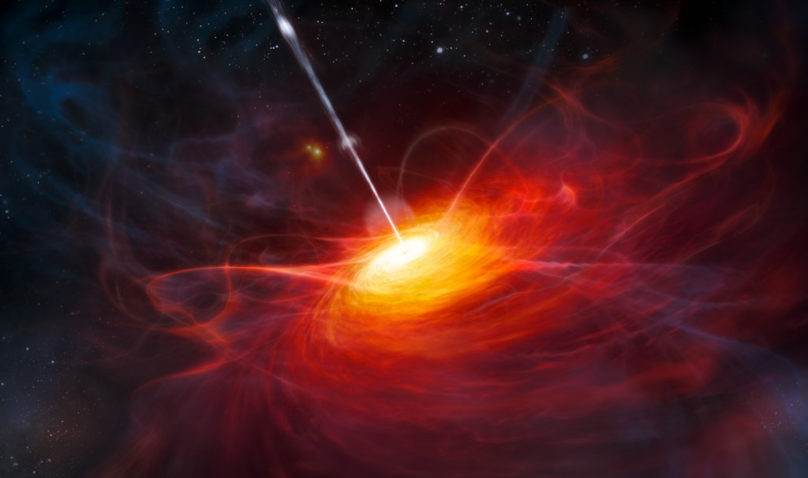

Evrenin geri kalanında yer alan gözlemlenebilir objelerle kıyaslandığında çevresine muazzam güçte enerji yayan gök cisimlerine kuasar deniyor. İngilizcede Quasar ismi "Yıldız benzeri radyo kaynağı" anlamına gelen "Quasi-stellar radio source" ifadesinden gelmekte. Standart bir galaksiye nazaran milyonlarca kat küçük boyutlarda olmalarına rağmen bu gök cisimleri bir galaksiden çok daha parlak ve yüksek enerjiye sahip olarak gözlemleniyor. Radyo dalgaları dahi yayabilen bu cisimler ilk keşfedildiklerinde bunların dünyanın gözlemlenebilir evreninde yalnızca en uzak köşelerde, en yaşlı gök cisimleri oldukları düşünülüyordu. Bundan dolayı galaksilerin en ilkel biçimleri olarak görülmüşlerdi. Bunun nedeni o zamanlarda keşfedilen bireylerinin yüksek kırmızıya kayma oranlarıydı. Kırmızıya kayma en basitinden bir nesnenin ne kadar hızlı uzaklaştığını gösteren bir hesaplama metodu. Işık dalgalarının uzaklaştıkça dalgaboyunun artmasına bağlı olarak renginin kırmızıya yaklaşmasından kaynaklanıyor.

Kuasarların akdelik olabileceğini düşünenler de vardı. Akdelikler evrende var olması mümkün olmamasına rağmen matematiksel hesaplara göre olabilecek gökcisimleri. Karadeliklerin tam tersi nitelik sergiliyor. Karadelikler çevresindeki bütün maddeyi emerken teorik bir akdelik ise etrafına sürekli olarak madde püskürtüyor. Solucan deliği fikri de buradan çıkıyor. Bir akdelik ve bir karadelik birbirine kısa bir yoldan bağlandığı zaman uzayzaman üzerinde bir geçit açılıyor. Bu geçit farklı iki zaman veya farklı iki mekan arasında olabilecek bir yol izliyor. Fakat karadelikler maddeyi yok etmez, yalnızca merkezindeki tekillikte biriktirirler. Akdeliklerin gerçek olabilmesi için karadeliklerin bu maddeyi fiziksel olarak varken yok edebilmesi gerekir ki bir akdelik de madde yaratabilsin. Bilinen fizik kurallarına göre madde ve enerji yoktan var, vardan yok edilemez; daima birbirlerine dönüşerek evrende sabit kalır. Bu hipotezler ancak bu evrenin fiziksel kurallarının geçerliliğini yitirdiği bir başka evrende gerçekleşebilir.

Bugün son yapılan gözlemlerin etkisiyle biliniyor ki, dünyadan birkaç yüz milyon ışıkyılı uzaklıkta kuasarlar da bulunmakta. Kuasarların mesafesindeki bu hesaplama yanlışı geçmişte kırmızıya kayma metodunun yanlış kullanımından kaynaklanıyor. Başka değişkenler hesaba katılmaksızın bir kuasarın uzaklığı direkt olarak kırmızıya kayma oranından ölçülemez. Geçmişte bu şekilde düşünüldüğünden dolayı böyle bir algı oluşmasına neden olundu. Galaksiler ve kuasarların birbirine uzak olmayarak birbiri ile madde alışverişi yaptığı gözlemlendiğinde bu algı artık yıkıldı. Fakat halen kuasarların yüksek kırmızıya kayma sergileme nedenleri hakkında bir teori mevcut değil.

Kuasarların bu yüksek enerjilerinin içlerinde bulunan dev kütleli karadelikten kaynaklandığı düşünülüyor. Karadelikler etrafındaki gazları yutarken etrafında tur attırarak emer. Böylece gazlar çok yüksek sıcaklığa ve enerjiye sahip olarak bu muazzam parlaklığa ulaşır.
