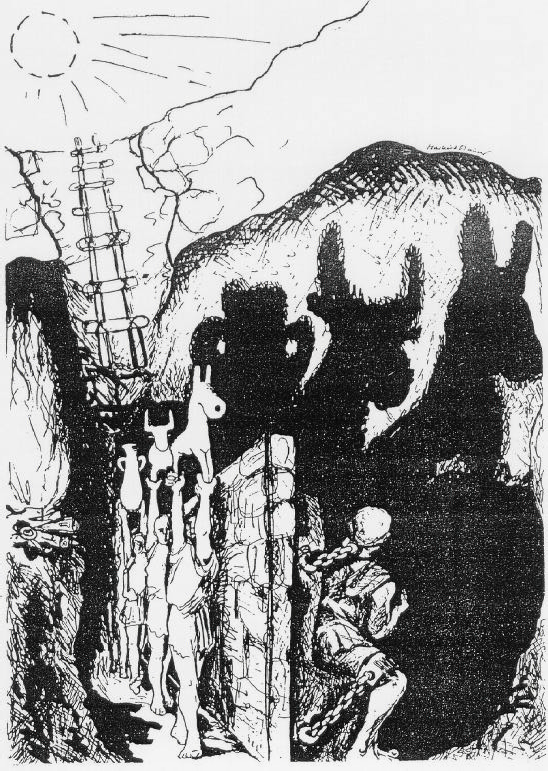

Toplum ile filozof arasındaki uçurumları en iyi şekilde anlatmış olan Platon aslında eski toplumlardan günümüze kadar olan bir durumu betimlemiştir. Düşüncenin ışığına ulaşmış olan filozoflar toplumlar tarafından tam olarak anlaşılmamıştır. Belirli kalıplara sıkışmış olan toplumlar farklı düşüncelere kapalı bir şekilde yaşamaya devam etmiştir. Düşüncenin ışığından yoksun yaşayan toplumlar farklı düşüncelere karşı düşmanca davranmış ve bu ışığa ulaşmış olan insanları da dışlamıştır. Platon'un Mağara Alegorisi bunu en iyi şekilde dile getirir.

#### Mağara Alegorisi nedir?

Alegoriye göre bir kaç insan bir mağara tutulmaktadır. Bu insanlar hiç bir şekilde mağaranın dışında olan herhangi bir şeyi hiç görmemiştir. Bu insanlar zincirlerle bağlıdır ve sağa sola hareket edemezler ve sadece önlerini görmektedirler. Dışarıdaki insanların ve diğer canlıların sadece mağaranın duvarında oluşan gölgelerini görebilmektedirler. Bu insanların algılarında oluşan gerçeklik, dışarıdaki hayatın bu gölgelerden ibaret olduğudur.

Bir gün bu mahkum tutulan insanlardan biri zincirlerinden kurtulur. Bu insan dışarı ilk defa çıktığında güneş ışığının etkisinden gözlerini dahi açamamaktadır ve gözleri acımaktadır. Fiziksel olarak farklı nesneler görmekte ve buna anlam verememektedir. Etrafındaki nesneleri, insanları incelediğinde gerçekliğin bu olduğunu kabullenememektedir. Çünkü bu zamana kadar gördüğü tek şey mağaradaki gölgelerdir. Ancak bir zaman sonra buna alışır ve gerçekliğin bu olduğunu kabullenir. Etrafını incelediğinde mağara gördüğü gölgelerin bu cisimlerin yansımaları olduğunu anlamıştır. Bunun bilincine varan mahkum gerçekleri mağaradaki diğer insanlara anlatmak için geri döner. Gördüklerinin sadece birer yansıma olduğunu ve gerçekliğin dışarıda olduğunu anlatır. Ancak  diğer insanlar onun deli olduğunu ve saçmaladığını düşünürler. Gördükleri tek şey olan gölgelerin gerçeklik olduğuna inanmaya devam ederler.

Aslında burada mağara ve içinde zincirlerle bağlı duran insanlar cahil kesimi temsil eder. Belirli kalıplardan çıkamayan ve gerçek dünyanın farkına varamayan toplumları temsil eder. Bu zincirlerden kurtulan, gerçekliğin farkına varan insan ve bunu diğer insanlara anlatmaya çalışan ise filozofları temsil eder. Düşüncenin ışığına ulaşmış, gerçekliğin farkına varmış ancak bunu toplumlara anlatmaya çalıştığında başarısız olmuştur. Filozofun başarısız olması aslında onun suçu değildir. Bunun nedeni zincirlerle bağlı olan, sadece gölgeleri gören, buna inanan, gerçekliğin bu olduğuna inan toplumların bu kalıplaşmış durumdan kurtulan insanlar olan filozoflara inanmak istememesi ve onları aklını kaçırmış insanlar olarak görmesidir. Platon bu alegori ile toplum ile filozof arasındaki farkı bu şekilde dile getirmiştir.
