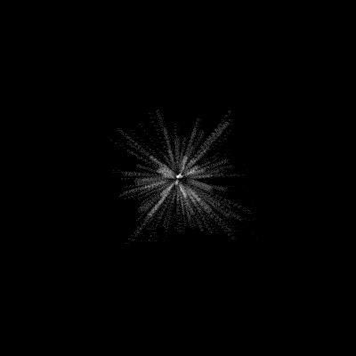
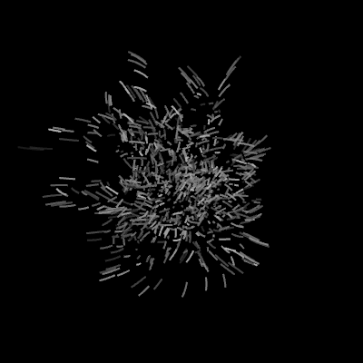

Sıcaklığı ölçmek için insanlık birçok standart geliştirmişse de bilimde kullanılan yegane birim Kelvin'dir. Kelvin birimi mutlak sıfır denen evrensel değer baz alınarak oluşturulmuştur. Mutlak sıfır olarak anılan değer 0 Kelvin ve aynı zamanda -273 santigrat dereceye denk düşer. Okullarda "Doğada bulunabilecek en düşük sıcaklık" diye anılsa da mutlak sıfır doğada bulunamaz, bu fizik kurallarının geçerli olduğu evrende bulunması mümkün değildir. Bu değer tamamen hesaplanarak bulunmuştur. Bunun nedenine gelecek olursak; her maddenin sıcaklığı düştükçe hacminde azalma meydana gelir. Mutlak sıfır noktasında yapılan hesaplamalara göre soğudukça büzüşen ideal gazların tamamen ortadan yok olması gerekir. Tüm maddelerin kendilerini oluşturan tanecikleri hareket halindedir. Katı haldeki cisimlerin tanecikleri bulundukları noktada titreşim hareketi yapar. Mutlak sıfır bu taneciklerin tamamen durması demektir. Hiçbir şekilde maddenin iç enerjisini oluşturan bu titreşimleri tamamen yok etmek mümkün değildir. Mutlak sıfır kavramsal açıdan ışık hızı birimi gibidir, hiçbir madde bu noktaya ulaşamaz ve bu sıcaklığa yaklaşan maddelerde tuhaf kuantum etkileri gözlemlenir. Örneğin süper iletkenlik denen dirençsiz yapıya sahip iletkenler mutlak sıfıra yakın soğutulmuş maddelerden ibarettir. Ulaşılabilmiş en düşük sıcaklık ise 4 pikokelvin olarak kayıtlara geçmiştir. Pikokelvin değeri 1 Kelvin'in milyarda birine denk düşer.

Çok büyük sıcaklıklarda ölçü birimi önemsiz kalır. Örneğin bir süpernova patlaması sırasında oluşan 55.000.000 derecenin Santigrat değerinden mi yoksa Kelvin mi olduğunun artık bir önemi yoktur. Bu sıcaklık birimleri dünya gibi canlı yaşamı için optimum durumdaki gezegen ortamları için işe yarar vaziyettedir. Evrenin geri kalanı söz konusu olduğunda yemez.

Kelvin biriminde tıpkı Santigrat'ta olduğu gibi suyun kaynama ve donma noktası arasında 100 derece fark vardır. Bu nedenle iki birim için de sıcaklık arası oranlar eşittir. Santigrat formundaki bir değerin Kelvin cinsinden dengini bulmak için 273 birim çıkartmak yeterlidir. Santigrat söz konusu olduğunda 0 derecede donan su Kelvin'de 273 derecede donarken, 100 derecede kaynayan su 373 derecede kaynar. Diğer sıcaklık ölçüm birimleriyle işlem ise bu kadar basit değil, oran hesabı gerektiren formüllere sahiptir.

Santigrat iki ölçüm değeri arasının 100 parçaya bölümüyle elde edilen değerin ismidir. Çoğu zaman Celcius olarak kullanılsa da, Celcius Kelvin'den 273,15 derece çıkarılmasıyla elde edilir.

Çok uç sıcaklıklarda tanecikler parçanabilecekleri en küçük parçacığa dek parçalanır. Enerjileri o kadar yüksek ve o kadar hareketlidirler ki birleşerek maddeyi oluşturamazlar. Big bang'den hemen sonra evren tamamen bu formda bulunmuştur. Genişleyip soğudukça parçacıklar sakinleşmiş ve daha yavaş hızlara ulaştıktan sonra bir araya gelerek hidrojen gibi basit elementleri oluşturmuştur. Kütleçekim etkisiyle bir araya gelen ve sıkışan hidrojen kütleleri ise bu basınçtan ileri gelen füzyonun etkisiyle enerji yaymaya başlar. Sıkışan hidrojen bulutunun merkezinde bulunan hidrojen atomları birleşerek helyum atomlarına dönüşür ve bu nükleer reaksiyondan açığa çıkan enerji uzaya ısı ve ışık olarak yayılır. Bu kütle her taraftan eşit şekilde çekildiğinden dolayı küre formunu alır ve böylece bir yıldız hayatına başlamış olur. Evrenin büyük kısmını kaplayan, görece olarak soğumuş olan hidrojen toplulukları bu süreç dolayısıyla tekrar ısılarını arttırmaya başlar. Bu derece sıcaklıktaki bir madde gaz halinden çok daha ötede bir faz yaşar. Yıldızlar yüksek sıcaklıklarından dolayı plazma halindedir. Plazma hali ise yüksek enerjiye, yüksek hıza sahip sahip atomların elektronlarını artık yörüngesinde tutamayacak duruma gelmesiyle, maddenin atomları arasında elektronların da yüzdüğü bir durumdur. Elektronlar serbest durumda olduğundan dolayı plazma halindeki bir madde elektrik akımını çok iyi geçirir. Plazma halinde bulunmak için yüksek sıcaklık birinci şart değildir. Radyoaktivite gibi etmenler de maddeyi plazma haline geçirebilir.

Evren Big bang kuramına göre hayatına çok yüksek sıcaklıkta başladı ve gittikçe soğumaya devam ediyor.  Daha önce bahsettiğim [kozmik mikrodalga arkaplan ışıması](http://sabahlatan.com/blog/evrenin-her-kosesini-kaplayan-enerji-kozmik-mikrodalga-arkaplan-isimasi/) gittikçe düşen bu sıcaklığın şu anki durumudur. Evren genişlemeye bu ivmeyle devam ederse evrende sıcaklıktan eser kalmayacak. Fakat evrenin bir noktadan sonra aynı hızla kendi içine çökmesinden bahseden Büyük çöküş (Big crunch) gibi teoriler söz konusu olduğunda evren zamanı tersten yaşarken git gide ısınacak ve Büyük patlama'nın gerçekleştiği ana geri dönecektir. Bu ana dönüldükten sonra tekrar bir Büyük patlama gerçekleşmesi olasıdır ve tüm bunlar art arda sürekli olarak gerçekleşen bir Big bang ve Big crunch silsilesinin tek bir elemanı olabilir.

 

 

 

 

 

 

 

 

 

 

Termodinamik fiziğin ısı alışverişlerini inceleyen alt bilim dalıdır ve Entropi adında bir kavram içerir. Entropi kısaca maddenin kaosa sürüklenme yatkınlığıdır. Her madde olabildiğince düzensizleşmek ve enerjisini minimum seviyeye indirmek ister. Porselen bir tabak yere düştüğünde kırılır, sıkılan bir parfüm mekanın her yanına yayılır. Bu süreçleri tersine çevirmek ise başlatmaktan çok daha fazla enerji ister. Bu yüzden bu evren dahilinde 100% verim olması mümkün değildir. Evrendeki her şey git gide bozunur. Zamanı oluşturan kavram da bir açıdan budur. Büyük çöküş söz konusu olduğunda entropi tersine işlemeye başlar ve evrendeki zaman tersinden yaşanır. Evren düzensizlikten düzene doğru yol alır.

