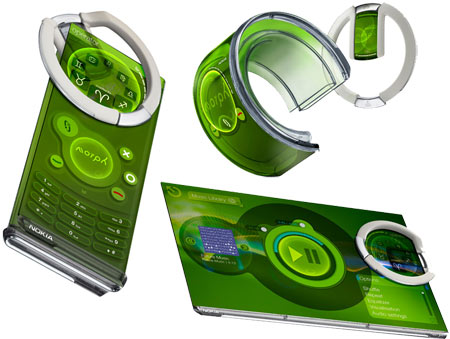

Bu yazı uzun süre önce aklımdaydı, fakat şu günler Nokia 3310 adı altında yeni bir telefonun piyasaya sürülmesi bunu şu an daha anlamlı kılacaktır. Bunun nedeni bu yazının içeriğinin Microsoft tarafından satın alınmadan önceki Nokia hakkında olması.

Hepsinden önce Nokia hakkındaki son gelişmelere bir göz atalım. Yeni tanıtılan telefonun Nokia 3310'la hiçbir alakası veya cezbedici hiçbir yanı yok, bunu fark etmişsinizdir. Aynı boyuttaki eski tuşlu telefon modelleri arasında, çeşitli markaların aynen bu şekilde cihazları mevcuttu. Gerek tuş formatı, gerek Bluetooth özelliği taşıması, gerek kamerası, gerek Snake gibi eski oyunlara lüzumsuz eklemeler yapmak gibi. Bu telefonun çıkarılma amacı "Alo desin yeter" kafasında olan insanlara yönelik olması olsaydı bir anlam ifade edebilirdi, fakat hayır. Bu telefon yalnızca 3310 nostaljisi üzerinden reklam yapma amacı taşımakta. Bu telefonun tanıtım lansmanında dahi sunucu lansman boyunca kimsenin umursamadığı o Nokia'nın yeni ve hiçbir yenilik sunmayan cihazlarını tanıtıyor, en son veda ederken "He bir de bu var" diyerek "Aha" deyip yeni 3310'u gösteriyor ve kısa bir video gösterimi yapıyor. Ardından sunum bitiyor. Bunun, Nokia'nın 3310'un dünya çapındaki nostaljik popülaritesini kullanarak bu yeni cihazlarını tanıtma çabası olduğu gayet açık. Android Samsung ve LG'nin tekelinde, bu firmalar her zaman yeni bir şey çıkararak birbiriyle yarışıyor. Bu açık kaynak kodlu işletim sistemini kullanan diğer firmalar ise fiyat / performans, su geçirmeme gibi özellikler sunarak bu piyasada tutunmaya çalışıyor. Nokia'nın da bu gidişatla yapabileceği tek şey bu, fakat Nokia fiyatı düşük olduğundan dolayı tercih edilecek cihazlara sahip bir marka olmamalı, mobil cihaz sektöründe önemli bir geçmişi var.

Bana göre Nokia 3310'un tekrar hayata döndürülmesi için 2 ideal seçenek vardı. Birincisi elbette eski 3310'u birebir olarak tekrar üretmeye başlamak. Bu şekilde çoğu kişi nostalji için buna sahip olmak isteyecekti. Artık Nokia 3310'u piyasada bulmak imkansız ve koleksiyon malzemesi olarak görüldüğünden fahiş fiyatlara satılıyor. İkinci seçenek ise bu haberin yeni yeni yayıldığı zamanlarda yapılan illustrasyonlarda görüldüğü gibi, kasa ve ekran yapısına sadık kalarak bir akıllı cihaz üretmek olabilirdi. Bir simulasyondan ibaret olsa da monokrom (monochrome) yani tek renkli, yeşil fon ekrana sahip bir cihaz çok ilgi çekici bir detay olurdu. Kamera ile çekilen fotoğrafların eski Nokia 3310'daki gibi piksel resimlerine dönüşmesi de güzel bir ayrıntı ortaya çıkarabilirdi.

Microsoft tarafından satın alınana dek, Symbian işletim sistemi kullanırken dahi arayüzlerindeki kendine özgü tasarımı bozmadan ilerledi Nokia. Akıllı telefonlardan önce, eskiden her telefonun firmware denen donanıma işlenmiş cihaz yazılımları her cihaz için kendine özgüydü. Her firma kendine özgü bir arayüze sahipti. Fakat Nokia'nın arayüzü görüldüğü an hemen tanınır bir biçimdeydi. Akıllı telefonlarla birlikte tüm firmalar telefonlarında tek bir arayüze sahip olup, bunun üzerinde ufak değişiklikler yaparak kendi cihazlarında kullandılar. Önemli değişiklikler yalnızca donanım tarafında oldu. Doğal olarak mobil teknoloji son derece sıkıcı bir hal aldı. Nereye baksanız aynı telefonun farklı bir türünü görüyorsunuz.

Bu yazıda sıkıcı, herkesin bildiği bilgileri yazmayı düşünmüyorum. Onun yerine, göz önünde olan detayların fark edilmeyen ilginç kökenlerinden bahsedilecek.

Nokia 3310 ve aynı seviyedeki telefonlarında çoğu kişi fark etmese de Mors alfabesine önem veriyordu. Herkesin aşina olduğu o alternatif mesaj melodileri aslında bir anlam içeriyor. Aşağıdaki videodan da görüleceği gibi, "Special" isimli kısa alternatif mesaj tonu aslında SMS harflerinin mors alfabesinde ifade ediliş biçimi.

Bahsettiğim bu kısa ton yine anlamını bilmeyenler için kulağa standart bir mesaj tonu gibi geliyor. Aynı şekilde ilk bakışta anlamsız görünen "Ascending" isimli o uzun melodi de mors alfabesiyle seslendirilmiş bir sözcük dizisi. Nokia'nın sloganı olan o "Connecting people" anlamına geliyor.

\[embed\]https://youtu.be/-uuG4ZCJmyU?t=30\[/embed\]

Yine Nokia'ya özgü, eski nesil tüm Nokia telefonlarının varsayılan zil sesi olan Nokia Tune ise Francisco Tárrega'nın solo gitar bestesi olan Gran Vals'ın bir bölümü.

\[embed\]https://www.youtube.com/watch?v=sKusTj2LiPE\[/embed\]

Dosya sistemi olan eski Nokia telefonlarına .jar uzantılı Java oyun ve uygulamaları yüklenip çalıştırılabiliyordu, bunun yanı sıra Python programlama dilinde de uygulama geliştirmek mümkündü.

Nokia'nın 2008 yılı civarında Nokia Morph diye konsept bir telefon tasarımı vardı. Bilim kurgu filmlerinden fırlamış gibi görünen bu cihaz Nokia Araştırma Laboratuvarı ve Cambridge Üniversitesi'nin ortak tasarımıydı. Nanoteknolojinin bütün nimetlerinden faydalanıyor, güneş ışığı ile şarj oluyor, kendi kendini temizleyebiliyor ve şekilden şekile girebiliyordu. Piyasaya çıkmış olsaydı son derece güzel ve sosyal teknolojinin yönünü değiştirecek bir cihaz olabilirdi. İnsanoğlu bunun yerine sıkıcı, tek tip geniş ekranlı telefonların ekranını parmaklamayı tercih etti.

\[embed\]https://www.youtube.com/watch?v=IX-gTobCJHs\[/embed\]

