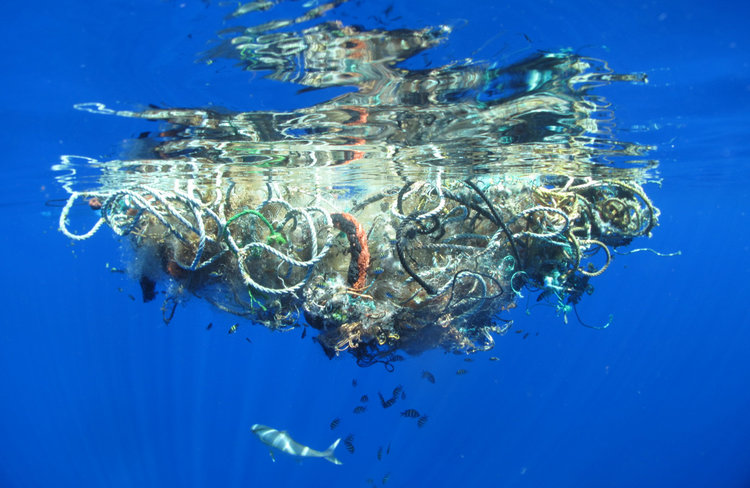

Dünya üzerindeki kirlilik devasa boyutlara ulaşmış durumda. Özellikle su kaynaklarındaki kirlenme canlılığı büyük oranda tehdit ediyor. Çöpler ve atıklar besin zincirlerinin içine her geçen gün daha fazla girmekte. Bu yüzden zincirin neresinde olursa olsun neredeyse tüm canlılık bundan kötü bir şekilde etkileniyor. Atıkların canlılara biyolojik etkilerinin yanı sıra direkt olarak olumsuz fiziksel etkileri de çok fazla. Başta kuşlar olmak üzere balıklar, kaplumbağalar ve sayısız canlı çöplerden dolayı telef oluyor.

İnsanlığın plastiği yoğun bir şekilde dünya çapında kullanmaya başlaması geçen yüzyılın yarısından daha öteye gitmese de, artık insanoğlu başa çıkamayacağı büyüklükte dev plastik çöp kütleleri oluşturmuş durumda. Bu çöpler okyanuslarda bir araya toplanarak adalar oluşturuyorlar. Bu adaların büyüklüğü yüzölçümü açısından çoğu ülkeyi geçiyor. Öte yandan bu çöp birikintileri büyük okyanus girdaplarının ortasında oluştuğundan dolayı her birine tek bir ada, hatta kıta denmesi de mümkün. Fakat büyük kısmı okyanus tabanına çöktüğünden ve diğer bir kısmı da 2 milimetreden küçük mikroplastiklerden oluştuğundan dolayı yüzeyde gözlemlenen kısımlar daha çok ada benzeri ayrık yapılar oluyor. Aynı şekilde seyrek yapılarından dolayı şu anlık bu adaları uzaydan görebilmek mümkün değil.

Bu oluşumlar çöp adaları, çöp girdapları, çöp yamaları, çöp alanları gibi birçok farklı adla anılıyor. Atlantik Okyanusunda, Pasifik Okyanusunda ve Hint Okyanusunda bilinen 5 büyük çöp girdabı var. Bunlardan en büyüğü Kuzey Pasifik'te yer alan Büyük Pasifik Çöp Alanı. Aynı şekilde Pasifik Çöp Adası diye de adlandırılıyor.

Bu çöp adaları hakkında farkındalığı arttırmak için, bunların kamuoyunda dikkat çekmesi için çeşitli eylemlerde bulunan insanlar var. Örneğin geçtiğimiz aylarda Ben Lecomte isimli bir Fransız aktivist Pasifik Çöp Girdabı'nın da içinden geçeceği bir yüzme sürecine başlamıştı. Bu yüzme eylemi Japonya'dan ABD'ye, 8 kilometre boyunca, 6 ay sürecek.

### Çöp Adasına Ülke Kurmak

Bu eylemlerden en dikkat çekeni muhtemelen yüzölçümü olarak Fransa'yı geçmek üzere olan Pasifik Çöp Adasının bir ülke olması için Birleşmiş Milletlere başvuruda bulunulmuş olması. Trash Isles, yani Çöp Adaları isimli bu ülke için pasaport, para ve bayrak hazırlandı. Bu proje çok fazla destek gördü ve şu anda Change.org üzerinde yaklaşık 240.000 kişi bunu desteklemiş durumda. Elbette amaç okyanus ortasındaki bir çöp yığınını ülkeye çevirmek değil, insanların bu ülkeden haberdar olmasını sağlamak.

