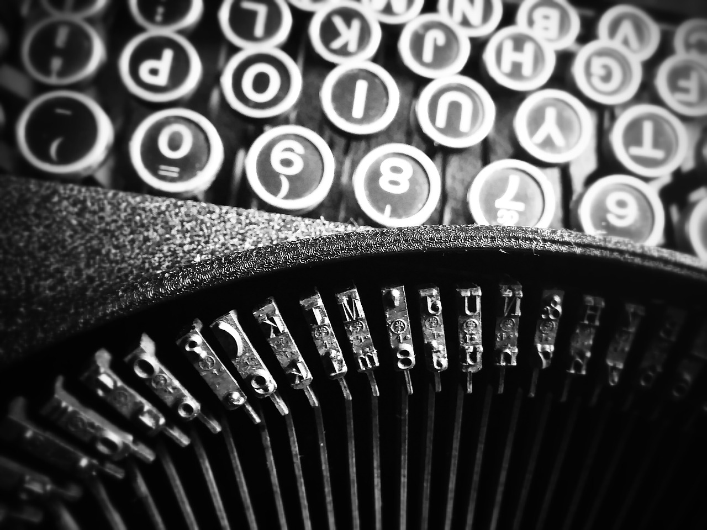

Q klavyenin, ya da QWERTY klavyenin kullanım popülaritesi ve insanların Q klavyeye olan yüksek alışkanlıkları tartışılmaz bir gerçek. Bilgisayar kullanan hemen herkes belli bir süreç sonrasında bu klavye türüne gittikçe alışıyor ve kullanırken son derece hızlı yazmaya başlıyor. Türkiye'deki devlet kurumlarında milli klavye olarak kabul edilen F klavyenin yaygınlaştırılma çabası elbette çoğu kişinin hoşuna gitmiyor. Q klavye üzerindeki tuşlara yerinde basmak artık bir refleks haline gelmişken bambaşka bir klavye türünü kullanmak insanları ters köşeye yatırıyor. İlk bilgisayar kullanılan yıllarda olduğu gibi "K neredeydi lan" gibi cümleler kullanmayı elbette kimse istemeyecektir. Fakat yaygınlık ve bunun sonucunda alışkanlık konusunda lider olan Q klavyenin ortaya çıkarılışındaki amaç hızlı yazmaya uygun bir klavye olması değil, tam tersi kullanıcıyı yavaş yazmaya itmekti.

### Q klavyenin harf dizilimi

Bu sayfaya herhangi bir bilgisayar veya geniş ekranlı bir akıllı telefon üzerinden bağlanıyorsanız muhtemelen Q klavye kullanıyorsunuzdur. Klavye kullanırken dikkat edilecek olursa orta kısımlardaki tuşlar çok az kullanılıyor. Oysa elin hızlı ulaşması konusunda en uygun pozisyona bu tuşlar sahiptir. Q klavyede en yaygın tuşlar klavyenin en uç noktalarına dizilmiştir. Harfler kullanım sıklığının aksine en alakasız yerlere sahiptir. Amaç hızlı ve rahat yazmak olduğunda klavye tuşları ellerin en uygun yerleşeceği noktalara yerleştirilir. Bu yüzden klavye tuşları alfabe baz alınarak "A, B, C..." şeklinde dizilmez.

### Daktilo ile başlayan tarihi

Q klavyedeki bu aykırı tuş yerleşimlerinin nedeni daktilo tarihinde yatıyor. Daktilolar üzerinde çok fazla girdi noktası yani tuş barındıran mekanik cihazlar olduklarından dolayı mekanik aksamı gayet karmaşık ve kolay bozulabilir yapıdadır. Her tuşa basıldığında kağıda sertçe vurarak harf baskısı yapacak bir düzenek harekete geçer. Dolayısıyla daktilo üzerinde hızlı yazılacak olduğunda iki ayrı harf düzeneğinin birbirine girmesi kaçınılmaz olur. Her bir harfe basıldığında ufak bir miktar beklenmek zorundadır. Fakat bu hataya düşmemek insanın elinde değil, omurilik bir noktadan sonra klavyedeki tuşların yerlerini refleks biçiminde kaydeder ve insan artık basılacak tuşları düşünmesine gerek kalmadan yazmaya başlar. Bu noktada ister istemez hızlanacaktır. Buna bir nebze engel olmak için ise Q klavye ortaya çıkarılmıştır.

### Hızlı yazınca bozuluyor diye yavaş yazdırmak

Q klavyedeki tuşlar alakasız yerleşimlerinden dolayı, İngilizce metin yazan birini gayet yavaşlatacak şekilde bir dizayna sahiptir. Yavaşlayan kullanıcı hatayı minimuma düşürecektir. Fakat her ne olursa olsun omurilik ister istemez buna alışır ve diğerlerine nazaran daha yavaş ilerlese de insan Q klavye kullanırken de bir noktadan sonra hızlanır. Ancak bunun bir sınırı var, parmakların yerleşimi eninde sonunda yazma hızını bir noktaya kadar düşürüyor. Q klavye İngiliz alfabesindeki harf sıklıklarına göre hazırlanmış bir klavye olsa da Latin Alfabesi kullanan çoğu [dil](https://sabahlatan.com/blog/kategori/dil/) de harfler için hemen hemen aynı sıklığı kullandığından diğer dilleri de aynı miktarda etkiler.

### İdeal alternatifler

F klavye Türkçedeki harflerin kullanım sıklığına göre hazırlanmış bir klavyedir. Alışıldığında Türkçe bir metni Q klavyeyi çok iyi kullanan birinin erişemeyeceği bir hızda yazmayı sağlayacaktır. Bunun dışında geçtiğimiz aylarda Boğaziçi Üniversitesi'ndeki bir ekip tarafından, Türkçe'ye diğer klavyelerden daha uygun olduğu söylenerek tasarlanmış E klavye bulunuyor.

