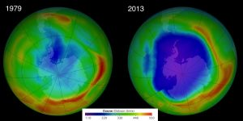

Dünya atmosferinde yer alan ozon tabakasının, diğer adıyla ozonosferin biyosfer yani Dünya üzerindeki yaşam için ne kadar önemli olduğunu biliyorsunuzdur. Dünya için kalkan görevi gören iki tabaka, ozonosfer ve manyetosfer canlılığı yok edebilecek radyoaktif ışınlardan biyosferi büyük oranda koruyor. Bir atmosfer tabakası olmayan Dünya manyetosferine daha sonra başka bir yazıda gireriz.

Öncelikle ozon molekülünden bahsedelim. Trioksijen adı da verilen ozon, 3 adet oksijen atomunun bağ yaparak oluşturduğu bir oksijen allotropu. Renksiz bir gaz olan ozon kolay kolay stoklanamaz çünkü sıcaklık arttıkça oksijene dönüşmeye başlar. Atmosferin üst katmanlarındayken canlıların sağlığı için önemli yer tutan ozon, zemin seviyesinde ise canlı hayatı için tehlikeli olabilir. Solunması astım gibi solunum sistemi hastalıklarını daha da kötü bir hale getirebilir.

Ozon tabakasının canlılar için en önemli özelliği morötesi (ultraviyole) ışınlardan en tehlikeli tür olan UV-C ışınlarını süzmesi. Bu tabakayı oluşturan ozonlar UV-C ışınlarının bölgedeki oksijeni ozona dönüştürmesiyle oluşuyor, bu tepkime UV-C ışınlarının Dünya yüzeyine ulaşmasını engelliyor. Ozon molekülleri atmosferin üst katmanlarında morötesi ışınlarla oluşabildiği gibi, daha aşağıdaki katmanlarda yıldırım düşmesi gibi yoğun elektrik akımının ortaya çıktığı atmosferik bir olayla da oluşabilir.

Stratosfer, yani ozon tabakasının bulunduğu katmanda oluşan ozon gazının Dünya'yı koruduğunu biliyorsunuz.

Ozon tabakasının ortalama kalınlığı 300 Dobson. 1 Dobson birimi ise milimetrenin yüzde biri, yani 0.01 milimetreye denk geliyor. Sonuç olarak ozon tabakası yaklaşık olarak **3 milimetre** kalınlığında. Ozon deliği diye adlandırılan, ozon tabakasının inceleştiği bölgelerin kalınlığı ise yaklaşık olarak **1 milimetre**.

İnsan yapımı olan, ozon tabakasının yapısını bozan maddelere ozon tüketen maddeler (ozone-depleting substances - ODS) adı veriliyor. Eskiden yoğun şekilde üretilen parfüm gibi aerosolların içinde, eski buzdolaplarında soğutucu gaz olarak kullanılan kloroflorokarbon gazları bunlardan en ünlüsü. Artık büyük oranda ozon tabakasına herhangi bir zararı gözlemlenmeyen gazlara geçilmiş durumda. Ozon tabakası kendini tamir edebiliyor, yeniden oluşturabiliyor fakat bu süreç tahrip olmasına nazaran daha yavaş bir şekilde gerçekleşiyor. Ozon tüketen maddeler atmosferde yeterince arttığında güneşten gelen morötesi ışınlar onları parçalar ve içlerindeki klor, brom ve diğer serbest radikalleri serbest bırakır. Bu serbest radikaller ozonla tepkimeye girer ve tepkime sonucunda bunlara ait bir bileşik ve oksijen ortaya çıkar.

UV-A, UV-B ve UV-C şeklinde üç sınıfa ayrılan morötesi radyasyondan ilki olan UV-A canlılık için en az zararlı olanıdır. UV-B güneş yanıklarına neden olabilir, fazla maruz kalınması durumunda DNA yapısını bozarak deri kanseri oluşumuna neden olabilir ve göz merceğinin saydamlığını azaltarak gözlerde katarakt oluşumuna neden olabilir. Ozon tabakası UV-B ışınlarının az bir bölümünü filtreler. UV-C ışınları ise bunlar arasındaki en tehlikeli radyasyondur ve tamamına yakını ozon tabakası tarafından süzülür.
