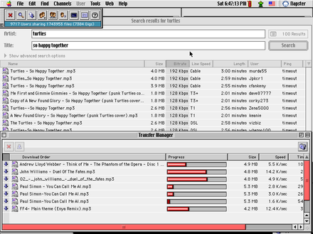
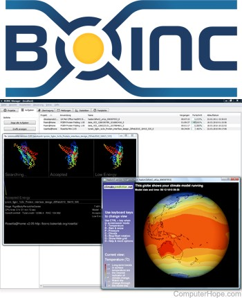

Merhabalar, bu yazımızda çokça duyduğunuz bir kavram hakkında bilgiler vereceğim. Konu P2P, yani peer to peer, Türkçesi ile eşten eşe bağlantı. P2P bir çeşit ağ mimarisidir. 1999 yılında Napster adlı dosya paylaşım sistemi, bu mimarinin yaygınlığını büyük ölçüde arttırmıştır. P2P sisteminde temel olarak bir takım bilgisayar ve cihazlar, birbirleri ile bir ağ oluştururlar. Bu ağ üzerindeki her cihaz, diğerleri ile aynı haklara ve görevlere sahiptir. Herhangi bir eş bir diğerine göre ayrıcalıklı değildir ve ağın merkezinde diğerlerine göre öncelikli olan bir yönetici cihazı yoktur. Bu durumda her eş aynı zamanda hem sunucu hem de istemcidir. Yalnız, yazı içerisinde çoğu P2P sistemi örneği için katı veya saf P2P sistemi olmadıklarını ifade edeceğim. Bunun sebebi için ise özel bir cihazın talep yolladığını veya gerekli görev ve istekler yaptığını söyleyeceğim. Bunu şöyle düşünün, işleyen P2P mekanizmasında herkes eşit ve aynı işi yapıyor, fakat hepsi aynı zamanda başka bir ağ üzerinden bir takım makinalarla da bu P2P mekanizmasının koordinasyonu hakkında iletişime geçiyorlar. Yani ortada işleyen bir P2P sistemi bir şekilde sağlanıyor.

Ayrıca “node” kelimesini “düğüm “olarak yazdım, “peer” kelimesini de “eş “olarak yazdım. Geri kalan pek çok yabancı terimi parantez içinde belirttim, ayrıca araştırma gereksinimi duyarsanız mutlaka yabancı kelimeleri kullanınız.

### **P2P sistemler nerelerde kullanılır?**

P2P sistemlerinin kullanım alanları çok geniştir. Kaynak paylaşımı (işlemci, disk, bant genişliği vb.), cihazlar arası kolaborasyon(ortaklaşa bir iş halledilmesi) ve en yaygın kullanım şekli olan dosya paylaşımı P2P sistemlerinin kullanım amaçlarına örnek olarak verilebilir. P2P sistemlerinde cihazlar eş zamanlı olarak dosyaları hem gönderip hem de indirebiliyor olduklarından dolayı, dosya paylaşımı için idealdir.

 

### **Neden P2P?**

Bir P2P sistemini durdurmanız, kapatmanız çok zordur. Bunu yapmak için bütün eşleri kapatmalı veya bağlantılarını bir şekilde sonlandırmalısınız. Bundan dolayı sistemlerin sağlam olduğunu söyleyebiliriz. Bunun yanında, P2P sistemler yüksek seviyede ölçeklenebilirdir. Birinin sisteme dahil olması için merkezi bir sunucuda, merkezi bir ayarlama yapılması gerekmez. Ayrıca, dosya paylaşımı konusunda, ağ ne kadar kalabalıklaşıyorsa o kadar hızlanıyordur. Bunun sebebi, bir dosyayı parça parça birden fazla kişiden aynı anda indirebilmenize olanak sağlamasıdır.

 

### **Yan Bilgi: Ağ Tarafsızlığı**

Tükçe’de ayrıca “İnternet Tarafsızlığı”, İngilizce’de ise çoğunlukla “Network Neutrality” ya da “Net Neutrality” denilen kavram, 2003 yılı itibariyle temelleri atılmış bir kavramdır. Bu kavram, İnternet Servis Sağlayıcılarılarının(ISP), İnternet üzerindeki bütün iletişime eşit davranması gerektiğini savunan bir prensiptir. Amaçlanan, ISP’lerin bir takım internet içeriklerini bilerek yavaşlatma veya engellemelerinin mümkün olmamasını sağlamaktır. P2P sistemleri üzerinde yol alan verilerin kontrol edilmesi neredeyse imkansızdır. Bunun sebebi, en temelinde iki cihazın doğrudan birbirleriyle iletişiyor oluşudur. Bu sebepten dolayı P2P, Ağ Tarafsızlığı için önemli bir kavramdır.

 

### **P2P sistemlerinin temel fonksiyonları nelerdir?**

Öncelikle, taksonomi kavramından biraz bahsedeyim. Taksonomi, neredeyse sınıflandırma kelimesiyle aynı anlama gelmektedir. Taksonomilerde amaçlanan şey, elementleri benzerlikleri üzerinden çalışıp, karşılaşılacak sorunlara çözüm üretmek için daha çok potansiyel bilgiye sahip olmaktır. Bu kavramdan bahsetmemin amacı şu, bir konuyu çalışıyorken, ana başlıklara veya kategorilere ayrıştırıldığını görürsünüz, P2P sistemleri için bu durum biraz daha karışmış durumda.

Şimdi anlatacağım 2 temel fonksiyon, taksonomilerin sınıflandırırken hesaba katılmaz. Çünkü her P2P sisteminde mutlaka bulunmalıdır.

Not: P2P sistemine bağlanan her bir eşe aynı zamanda düğüm diyeceğiz.

**Kaydolma Fonksiyonu(Enrollment Function):**  Düğümler sisteme dahil olmak için bazı bilgilere sahip olmalılar. Kaydolma Fonksiyonu, düğümlerin bilgilerinin doğrulanmasını ve izinlerinin kontrol edilmesini sağlar.

**Eş Keşfetme Fonksyionu(Peer Discovery Function):** Bir düğüm, eş olabilmek için, sistemdeki bir veya daha fazla cihazla bağlantı kurmalıdır. Eş Keşfetme Fonksiyonu, yeni düğümlerin sisteme dahil olabilmeleri için halihazırda sistemde olan eşleri bulmalarını sağlar.

Yukarıda bahsetmiş olduğumuz bu iki fonksiyon, bazı sistemlerde merkezileştirilmiş olarak bulunur. Yani merkezi bir sunucu, yukarıdaki iki fonksiyonu hallediyordur. Bahsettiğim bu sunucu tipine “bootstrap” sunucusu denilir.

Sırada anlatacağım fonksiyonlar P2P sistemine göre değişirler, yani her P2P sistemi aşağıda belirteceğim 4 fonksiyonun tamamına sahip olmayabilir. Genellikle taksonomiler, bu fonksiyonlara göre oluşturulurlar.

**Veri İşaretleme Fonksiyonu(Data Indexing Function):** Sistemin içinde kaydedilen verinin işaretlenmesini sağlar.

**Veri Saklama Fonksiyonu(Data Storage Function):** Sistemde veri saklanması veya sistemden veri getirilmesini sağlar.

**Hesaplama Fonksiyonu(Computation Function):** Sistemin yapacağı hesaplamaları halleden fonksiyondur. Veri işleme, gerçek zamanlı medya işleme gibi örnekler verilebilir.

**Mesaj İletim Fonksiyonu(Message Transport Function):** Sistemdeki eşler arasında mesaj değiş tokuşunu halleder. Merkezi bir sunucuyla gerçekleşen veya direkt eşler arasında gerçekleşen protokol mesajları buna örnek olarak verilebilir.

 

### **P2P sistemlerinin çeşitleri nelerdir?**

P2P sistemleri için farklı yazar ve araştırmacılar, ortak bir karar alamamış gibi görünüyorlar. Bu sebepten dolayı, çeşitli kaynaklarda birbirinden farklı taksonomilerle karşılaşabilirsiniz. Ben burada en çok anlatılan 3 çeşit taksonomiden bahsedeceğim.

#### **Verinin nasıl işaretlendiğine bakılarak:**

**Merkezileştirilmiş İşaretleme(Centralized Index):** Merkezi bir sunucu, eşlerdeki verilerin referans adreslerini tutar. (Napster)

**Yerel İşaretleme(Local Index):** Her eş, kendi verisine ait bir referans adresi tutar. (Gnutella’nın eski versiyonları.

**Dağıtık İşaretleme(Distributed Index):** Veri referanslarının, birden fazla düğümde tutulduğu işaretleme. (Distributed Hash Table)

Buralarda bahsettiğimiz işaretlemeler(index), Anlamsal(semantic) ve Anlamsal Olmayan(semantic-free) işaretlemeler olarak düşünülebilir. Anlamsal işaretleme, veri ile metadata arasında ilişki bulunan işaretlemelerdir.

#### **Merkezileştirilme seviyesine bakılarak:**

**Karma P2P Sistemleri(Hybrid P2P Systems):** Servisin sağlanılması için merkezi bir oluşum olmalıdır. Merkezileştirilmiş İşaretleme kullanan P2P sistemler, Karma P2P Sistemleridir.

**Saf P2P Sistemleri(Pure P2P Systems):** Bu tarz sistemlerden rastgele olarak cihaz ayırsak, sistemi bozmayacaktır. Yerel İşaretleme ve Dağıtık İşaretleme kullanan P2P sistemler, Saf P2P Sistemleridir.

#### **Yapılandırma seviyesine bakılarak:**

**Yapılandırılmamış Sistemler(Unstructured Systems):** Bu sistemlerde eşler, kendilerini diğer eşlere bağlayarak ağa katılırlar. Eski Yapılandırılmamış Sistemler’de Yerel İşaretleme kullanılırdı, şimdiki Yapılandırılmamış Sistemler ise bir miktar yapıya sahip Dağıtık İşaretleme kullanan sistemlere evrildiler.

**Yapılandırılmış Sistemler(Structured Systems):** Eşler, yerel tanımlayıcılar tarafından iyi tanınmış eşlere bağlanırlar. Eski Yapılandırılmış Sistemler, Dağıtık İşaretleme kullanıyorlardı.

Günümüzde Yapılandırılmış ve Yapılandırılmamış Sistemler arasındaki fark iyice belirsizleşmiş halde. Bütün bu taksonomiler arasında en dayanaklı olanı verinin nasıl işaretlendiğine bakılarak oluşturulmuş taksonomiler gibi görünüyor.

Pek çok insanın kafasında oluşan fikre karşın, P2P dosya paylaşım sistemlerinin yasa dışı olduklarını söyleyemeyiz. Bazı kaydedilmiş TV programları, Linux dağıtımları, oyun güncellemeleri, Canlı TV’ler vb. yasa dışı olmayan içerik dağıtımları bulunmaktadır.

Bir P2P sisteminin karakteristiğini belirten önemli bir aşama eş seçim aşamasıdır. İçerik Teslim Ağı(Content Delivery Network – CDN) operatörleri, sistemin daha güvenilir olması için, eşlerin öncelikli olarak içeriğin en zor bulunan parçasına sahip olan eşlere bağlanmalarını ister ve bunu sağlar.

Ağ operatörleri, eşleşme ve dağıtım anlaşmaları kötü etkilenmesin diye, eşlerin kendi ağları içlerinde yerel transfer yapmalarını tercih ederler.

****

 

**ZebraNet Örneği:** P2P içerik paylaşımı ve Gecikme Toleranslı Ağ(Delay-tolerant Networking) yöntemleri ile hazırlanılmış bir sensör ağıdır. Amaçlanan şey, doğadaki zebraların takip edilmesidir. Sisteme göre her zebra bir kolye takar, bu kolye çeşitli bilgiler barındırır ve bir P2P ağına bağlıdır. Mobil istasyonlar kablosuz bir şekilde kolyelerle iletişir ve kolyeler birbirleri arasında topladıkları veriyi paylaşırlar. Bu sisteme katı bir P2P sistem diyemeyiz, çünkü cihazlar sadece istasyondan gelen bir talebi işliyorlar.

 

### **P2P ağlarda dağıtık hesaplama nedir?**

Diyelim ki büyük bir hesaplama yapılması lazım, yüksek seviyede işlemci gücü istiyor. Bu hesaplamaya görev diyelim. Bu görev, birbirinden bağımsız, paralel bir şekilde hesaplanabilecek alt görevlere bölünür ve eşlere görevler dağıtılır. Eşler alt görevleri tamamlar ve sonuçları geri getirir. Bütün alt görevler tamamlandığında, ana görevin sonucunun alınması için tamamlanmış alt görevler birleştirilir. Bu sayede bir grup sıradan bilgisayar, güçlerini birleştirip çok daha gelişmiş bir bilgisayar performansı sergileyebilir. Bunların da katı P2P sistemleri olduğunu söyleyemeyiz, çünkü ana görevler genellikle merkezi bir makinadan verilir.

**P2P botnets Örneği:** Spam yapan ya da Denial of Service (DoS) saldırıları yapan, dağıtık hesaplama örneklerinden biridir.

**SETI@home Örneği:** Açılımı “Search for Extra-Terrestrial Intelligence”, yani “Uzaylı Zekası Arayışı” olan bir başka dağıtık hesaplama örneği. Bu sistemde bir çok bilgisayar, radyo teleskop verilerini analiz etmek için çalıştırılıyor.

 

 

### **P2P ağlarda kolaborasyon nedir?**

Voice over IP(VoIP) ve Anlık Mesajlaşma(IM) sistemleri gibi sistemler P2P kolaborasyon sistemlerine örnek verilebilir. Bu tarz kolaborasyon uygulamaları randevu, NAT geçişi(Network Address Translation) ve bir grup medya ile alakalı fonksiyonlarla çalışır. P2P randevu sistemleri herhangi bir altyapı yokken iyi iş görür. İnsanlar herhangi bir internet bağlantısına gerek duymadan, aralarında veri paylaşımı yapabilirler.

 

### **Bazı çıkarımlar**

P2P teknolojileri yasal uygulamalarda da kullanılabilirler.

Herhangi bir altyapı yokken, P2P uygulamaları iyi bir seçenektir.

P2P sistemlerinin ana özelliklerinden biri ölçeklenebilir olmasıdır.

Sağlamlık ve güvenilirlik çoğu sistem için önemli özelliklerdir. P2P sistemindeki eşlerin ulaşılabilir olması çok beklenmez.

P2P sistemleri, sistemin güvenilirliğini arttırmak için veri yineleme, lüzumsuz yönlendirme tablosu gibi teknikler kullanır. Bir düğüm kopsa, sakladığı veri kaybolmaz ve hala sistem içerisinde bulunabilir haldedir.

Sunucu tabanlı sistemlere göre orantılandığında, P2P sistemlerin performansı yapılacak olan göreve göre değişir. Eğer alt görevler oluşturup, paralel olarak çalıştırmamız mümkünse, bir süper bilgisayardan daha performanslı bir performansa da sahip olabiliriz.

Sistemdeki eşler arasındaki kolaborasyonun bozuk olması, P2P sistemini negatif etkileyebilir.

Ölçeklenebilirlik, sağlamlık ve güvenilirlik sistem konfigürasyonuna göre birbirinin üzerine binebilir veya birbirine egale edebilir.

P2P sistemleri merkezi sunucu gereksinimlerini azaltır veya ortadan kaldırır, bu da bir yüksek seviyeli enerji tüketimini(örneğin sunucu çiftlikleri) ortadan kaldırmaya yardımcı olur.

 

### **Güvenlikle alakalı bazı fikirler**

Sistemdeki düğümlerin güvenilir olup olmadığını bilmiyoruz. Bazı sistemler için, dağıtık sahiplik, merkezi kontrol eksikliği sebebiyle bu önemli bir ayrıntıdır.

P2P sistemleri saldırganlar tarafından IP toplama amacıyla kullanılabilir.

Saldırganlar, P2P sistemin yönlendirme mekanizmasına saldırabilirler. Bir saldırgan, yönlendirme mekanizmasını yol üzeri saldırılar yapmak için düzenlemeye çalışabilir.

Merkezi mimarilerdeki merkezi elementler saldırılar için açık hedeflerdir. P2P sistemler merkezi elementleri minimize ederler.

 

### **BitTorrent**

2001 yılında, ilk implementasyonu Python dilinde yazılmıştır. BitTorrent, büyük dosya paylaşım protokolleri arasında en meşhurlarındandır. Şubat 2012 tarihinde, küresel çapta internet üzerinde dosya paylaşımı, tüm internetin %6’ sını kapsıyordu. Aynı tarihte BitTorrent, tüm internet üzerindeki dosya paylaşımının %3.35’ lik kısmını kapsamıştı, bu tüm dosya paylaşımının yarısından fazlası demek.

 

#### **BitTorrent Nasıl Çalışır?**

Bittorrent, merkezileştirilmiş bir P2P ağıdır. Bir torrent oluşturmak istediğinizde, paylaşmak istediğiniz dosyanın içine küçük bir “torrent tanımlama dosyası” oluşturmanız gerekmektedir. Bu dosyayı oluşturduktan sonra bir torrent işaretleme sitesine yollamalısınız.

Dosyayı indirmek istediğinizde, bu “torrent tanımlama dosyasını” indirip, bir torrent programıyla açmalısınız.

Kullanıcı dosyayı indirmek istediğinde, en başta bir izleyiciye(tracker) bağlanır. İzleyici, yollayıcıların(seeder) ve eşlerin(peer) ip adreslerini yığına(swarm) ekler.

Torrent tanımlama dosyası, izleyici listesini ve metadata bilgisini barındırır.

Tüm dosyaya sahip olan ve anlık olarak paylaşan kullanıcılara yollayıcı(seeder) denir.

Dosyaları indiren kullanıcıya eş(peer) denir. İndirmesini tamamlayan eş, yollayıcı vazifesi görmeye başlar. Genellikle bir eş, aynı zamanda indirdiği kısmı paylaşır da.

BitTorrent dosyaları topaklara(chunk) böler, bu topakların boyutu 256 KB ile 1 MB arasında değişir. Bu topaklar, aktarımdan sonra her parçanın orijinal olup olmadığını kontrol etmek için, geri dönüşümsüz şifrelenir(hash). Bu geri dönüşümsüz şifreler torrent tanımlama dosyasında tutulur. Torrent mekanizmasında herkes bu topakları birbirine yollar. Her topağın bir geri dönüşümsüz şifrelenmiş metni hali hazırda torrent tanımlama dosyasında olduğu için, alınan topak tekrar şifrelenir ve iki şifrenin birbiriyle uyuşup uyuşmadığına bakılarak, bu küçük dosya parçacığı doğrulanmış olur. Tüm indirme bittiğinde tüm topaklar birleştirilip ana dosya elde edilmiş olur.

 

#### **Torrent tanımlama dosyası neleri içerir?**

- **Announce:** İzleyicinin URL(adres) bilgisi.
- **Info:** Files düğümünün ebeveyn düğümü. Dosya yapısını tutan bir sözlüktür.
    - **Files:** Files düğümü sadece birden fazla dosya tutulacağında vardır. Files dosya bilgilerini tutan sözlüklerden oluşur. Her sözlük 2 bilgi tutar.
        - **Length:** Dosyanın byte cinsinden boyutu.
        - **Path:** Dosyanın tam konumu ve ismi.
    - **Name:** Önerilen klasör ismi.
    - **Pieces Length:** Her topağın byte cinsinden boyutu. (256 KB topaklar için, 262,144 B civarı bir sayı)
    - **Pieces:** Tüm topakların geri dönüşümsiz şifre listesi. BitTorrent ,SHA-1 geridönüşümsüz şifreleme algoritmasını kullanır, oluşan şifreler 160 bit boyutunda olur. Her topak için oluşan şifre 20 byte civarı olur.

 

### **Blockchain**

2009 yılında Satoshi Nakamoto tarafından icat edilmiştir. Satoshi Nakomoto, ayrıca Blockchain teknolojisiyle, ilk dijital kripto para birimi olan Bitcoin birimini oluşturmuştur.

Blockchain, güvenlik, şeffaflık ve merkezileşmeme kriterlerini sağlayan aktarım kayıtlarının tutulduğu veri yapısı olarak tanımlanabilir. Blockchain, bir otorite tarafından kontrol edilemeyen, bloklar şeklinde tutulan kayıt zincirlerinden oluşur. Bir bankayla para aktarımı yaptığınızı düşünün, banka aktarım ücreti isteyecektir, ayrıca bir saldırgan ağı bozup paranızı çalabilir. Blockchain’ deki tüm bilgi halka açıktır ve merkezileşmeme kriterini sağlar ve herhangi bir ücreti yoktur. Bilgi tek bir konumda tutulmaz, bu da bozulumunu engelleyen faktördür.

Blockchain’ de bilgi blokları bulunur ve her blok geri dönüşümsüz şifrelenmiştir(hash). Ağın içerisinde aktarımları işleyen ve doğrulayan düğümler vardır. Bu düşümlere madenci(miner) denir. Ağdaki madenciler matematiksel aktarım işlemlerini çözerler. Eğer başarırsa, madenci Bitcoin cinsinden bir ödül alır. Blockchain, ağ katılımcılarının aktarımların birebir kopyasını tuttuğu, makinelerin kararıyla onayların verildiği bir P2P protokolünü kullanır.
