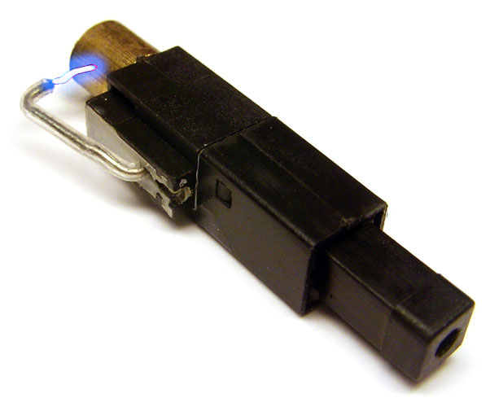

Elektrik akımı denen fenomen aslında çok basit bir şekilde oluşur. Mevzu tamamen iki nokta arasındaki gerilim, yani elektron miktarları arasındaki farkın varlığından dolayı elektronların bir noktadan diğer noktaya atlamasından ibarettir. Tabii bunun için bu iki yoğunluk farkı olan noktayı elektronların ilerleyebileceği bir yol ile, yani bir iletken ile birbirine bağladıktan sonra bu mümkün. Doğada geçebilecek yol bulan her madde yüksek yoğunluktan düşük yoğunluğa geçer, daha sık bölgelerden kurtularak daha seyrek bölgelere doğru yol alır. Bu kavrama difüzyon adı altında rastlamışsınızdır.

Elektrik bu kadar basit bir kavram olduğundan dolayı doğada elektrik üretmek için çok fazla yol vardır. Işık ile, ısı ile, basınç veya titreşim ile, manyetizma ile, kimyasal tepkimeler ile ve sınırsız sayıda madde ve enerji etkileşimi ile elektrik üretilebilir. Tek yapılması gereken elektronları koparıp rahat hareket etmelerini sağlamaktır. Tabii manyetizma ve kimyasal enerji dışındaki neredeyse hiçbir metod verimli ve sürekli bir şekilde iş görmez. Bu yüzden insanoğlu bu zamana kadar genel enerji ihtiyacını manyetizmadan ve kimyasal enerjiden karşılar. Barajlara, rüzgarlı yerlere kurulan jeneratörler hareket enerjisini manyetik alan yardımıyla alternatif elektrik akımına dönüştürerek şehirlere dağıtır. Piller ise kimyasal enerji ile elektrik üreterek şebekeden bağımsız küçük cihazların çalışmalarına yardımcı olur. İçlerinde bulunan çeşitli çözelti ve onların bünyelerinde bulunan iyonlar iki kutuptaki potansiyel farkı oluşturur. Çok çeşitli pil türleri vardır. Ancak güneş enerjisi yani ısı ve ışık etkisi de yeteri kadar olmasa da bir diğer sık kullanılan elektrik üretme yoludur. Burada anlatılacak olan konu ise basınç ile elektrik üretme şekli olan piezoelektrik. Bu özelliğe sahip maddeler tam tersi şekilde üzerlerine gerilim uygulandığında bunu mekanik enerjiye, yani hareket enerjisine çevirebilir.

Manyetolu çakmakları bilirsiniz. Çakmaktaşı kullanarak kıvılcım üretip bütan gazını tutuşturmayı sağlayan klasik çakmakların aksine bir düğmeye sahiptirler ve bu düğmeye basıldığında altlarında bulunan kablonun uçlarında bir ark, yani elektrik akımı atlaması oluşarak bütan gazını tutuştururlar. Aslında bu çakmaklarda manyeto denen cihaz bulunmaz. Manyeto denen alternatif akım üretecinin bu konuyla zerre alakası yok. Bunlara piezo çakmak demek daha doğru, fakat halk arasında bu isimle yaygınlaştığından dolayı yazıda da isimlerini bu şekilde kullanmak daha uygun olacak. En az bir manyetolu çakmağı söküp içine baktığınızı varsayıyorum. Tabii konumuz çocukken bununla kendinizi veya arkadaşlarınızı nasıl çarptığınıza dair anılar değil. Bu çakmakların içinde bulunan manyeto isimli bu mekanizmanın nasıl çalıştığını düşünmüşsünüzdür. Kimisine göre içinde pil var ve akımı o üretiyor. Bunun aksine manyetonun içinde pil gibi, sürekli elektrik üreten bir yapı mevcut değil. Manyetolar piezoelektrikle çalışır. İçinde bulunan kristale düğmeye sertçe basarak anlık bir basınç uygularsınız ve o gördüğünüz ark oluşur. O an içinde kablonun ucunda onbinlerce volt değerinde gerilim oluşuyor. Çakmak manyetosuyla çarpılıp ölen hiçbir insan görmediğinize göre buradan elektrik çarpmalarında önemli olan parametrenin gerilim olmadığı çıkarımını yapabilirsiniz. Elektrik akımını tehlikeli yapan şey akım, yani yol üzerinden anlık olarak geçen elektron sayısıdır.

Tabii piezoelektrik kaydadeğer bir şekilde, tutarlı olarak elektrik üretimi için kullanılamaz. Yıldırımı düşünün. Yıldırımlardan elektrik üretilememesinin nedeni bir anda çok yüksek bir yük boşalımı gerçekleştiriyor olmasıdır. Bu yük depolanıp azar azar kullanılamaz.

Piezoelektriğin bir de diğer yönü olduğundan bahsetmiştik. Üzerine gerilim uygulanan piezoelektrik bir kristal titreşim hareketi sergiler. Dijital saatlerin çalışma prensibi bunlara dayanır. Bunların içerisinde bulunan kristal osilatör içinde kuvars (quartz) kristali taşır. Bu bildiğiniz kumdur aslında, çok saf silisyumdioksit minerallerinden ibarettir. Çakmak manyetoları dahil bu prensiple çalışan birçok aletin içinde kuvars kristali bulunur. Kuvarsa voltaj uygulandığında belli süreler içerisinde belli salınım hareketi yapar, yani titreşir. Bu titreşim sayısı ölçülerek uygun değerlere bölündüğünde ise saat, dakika ve saniye değerleri hesaplanır ve ekranda bir saniyede bir saniyelik değişim görüntülenir.

Piezoelektrik özellik taşıyan malzemeler eski tip telefonlarda, basit mikrofonlarda, buzzer denen devre elemanlarında da kullanılıyor. Ortak yönleri tıpkı dijital saatlerde olduğu gibi üzerine voltaj uygulandığında titreşim üreten kuarz gibi piezoelektrik kristallerde yatıyor.
