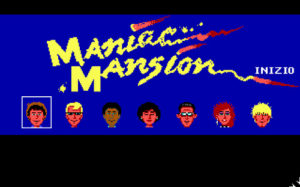
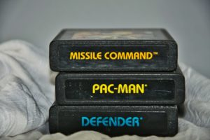

Retro; kasten yakın geçmişin moda, film, oyun, müzik vb. türeten veya taklit eden tarzdır. Türetilen ya da taklit edilen şeyin ise üzerinden en azından bir 20 yıl geçmesi gerekir. Örnek vermek gerekirse üzerinden bir, iki sene geçmiş bir filmin taklidi retro sayılmaz ancak üzerinden 34 sene geçmiş bir film olan Terminatör (ilk filmi) taklit edilebilir.

_Hani şu bir evin yakınına meteor düşüyordu...Hani arkadaşlarınızla o eve gidiyordunuz..._

Retro oyunlardan bahsetmek istiyorum. Retro bakımından günümüzde tasarım olarak kendisini gösteren en iyi oyunlardan birisi (biraz eskidi gerçi) FarCry: Blood Dragon. Bu oyunda her şey retro. Evet herşey. Müzikler, parıl parıl mavi, mor, kırmızı renkler, ışıklar, senaryo ve senaryonun anlatım tarzı. Bir düşman öldürdüğünüzde 10000 experience point (xp) 100000 xp gelmesini olağan dışı karşılamamanız gerekir.

Çünkü bu retrodur. Aynı tarzı kullanan başka bir oyun ise Out Drive. Bu oyunda ise bir çatışmada yanlış olmasın ana karakterin kız arkadaşı/sevgilisi bir çatışmada vuruluyor. Ana karakter kız arkadaşını arabasında bir cihaza bağlıyor. Cihazda arabaya bağlı. Araba durursa kız ölüyor. Bildiği kadarıyla yol hiç bitmiyor. Oyundaki renk paletleri, çalan müzikler, oyun içi atmosfer tamamen retro.

Retro sayılan eski oyunlardan bahsetmek gerekirse Metal Gear eski serileri, Half Life, Maniac Mansion ve daha adını sayamadığım bir çok oyun.

Retro filmlere dönelim. Yakın yıllarda çıkan Mad Max Fury Road, Blade Runner 2049 gibi filmleri kimileriniz ilk defa çıkmış bir film sanabilir. Ancak şu bir gerçek ki bu filmlerin ilk serileri de unutulmaz. Av filminin ilk filmini kim unutabilir. Hani şu ormandan fırlayan uzaylı. Bunlar hep retro (Eski Anlamda) film. Evil Dead filminin ikincisi beni hep güldürmüştür.

Güzel bir retro (eskiyi taklit eden) şarkı dinlermiyiz? Carpenter Brut Turbo Killer iyi gider. Gerçekten eski bir şarkı alırmıydınız? Miklos Rozsa El Cid

Kısaca özet geçmek gerekirse retro eski olan bir şeyin taklitidir. Kalkar eski kamera lensiyle bir film çekip eski müzikleri kattığınız zaman eski filmlere saygı duruşu olarak güzel bir retro film çekebilirsiniz. Bir gömleği veya saç tarzınıda retro sınıfına sokabilirsiniz.

Bu yazıyı burada bitirmek istiyorum. Daha güzel bir yazı olabilirdi. İyi günler.

