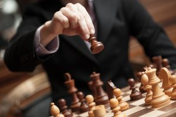

Satranç, kimilerine göre kumar, kimilerine göre de şeytan icadı olmuştur. Ve lakin ikisi de değildir. Satranç 8x8'lik kare şeklindeki bir tahta parçasında, çeşitli görevlere sahip taşlar ile oynanan bir oyundur.

Hayatımızın her alanında bu oyunun yansımasını gördüğümüzü düşünüyorum. Atacağımız her adım 'hayat' tahtasında oynayacağımız bir hamledir. Bu yüzdendir ki toplumun her kesiminden insan bu oyunu keyifle oynar.

Bu oyun öyle cinsiyete de bakmaz. Zira ilkokulda yenemediğim tek oyuncu bir 'Simge' adında bir kızdı. Rekabetimiz sadece tahta başındaydı. Daha sonra aynı takımda maçlara katıldık.

Eğer ki satranç maçına çok kaptırdıysanız zamanın nasıl geçtiğini anlayamazsınız.  Hele ki karşınızdaki rakip size denkse değmeyin keyfinize! İzlemesi ayrı keyifli, oynaması ayrı keyiflidir kendisinin. Bilen bilir.

Öyle okey, batak gibi oyunlara benzemez. Kimse size keşke şu hamleyi yapsaydın diyemez. Zira sonsuz tane ihtimal vardır. Sen başka bir hamleyi görürsün ama beklemediğin bir hamle şahı düşürür.

Bütün amacımız şahı korumak ve rakip şahı devirmek. Hayatta kalmanın tek yolu bu. Ancak ne gerçek hayatta ne de satranç tahtasında tek başına bunu başaramazsın. Hep birlikte koordineli bir biçimde hareket edeceksin. Başarı bu şekilde gelir sana. Yoksa kaybedersin.

Satrançta sahip olunan taşlar değer bakımından şöyle sıralanır: Vezir, kale, fil, at, piyon. Piyon deyip geçmeyin ama, o da bir gün vezir olabilir. Ancak vezir olana kadar her an tehlikededir ve en kolay harcanacak olan odur. Eğer bir piyonsanız ve satranç maçının tam ortasındaysanız çok ama çok dikkatli olmak zorundasınız. Yoksa direk tahtanın kenarını boylarsınız.

Önünüzde bir ordu var. Tam bir düzen içerisinde karşınızda duruyor. Eğer ki bu düzeni yok ederseniz ordu da dağılacaktır. Önünüzde hiç bir engel kalmayacaktır. İstediğinizi yapın.

Rakibin zihninde olmak zorundasınız. Kendinizle sürekli muhattap olma durumu satranççıların kaderidir. Kendimizden sıkılamayız, bıkamayız. Çünkü kendimizden başka kimsemiz yoktur bir maçta.

Peki bir maç ne kadar sürer? Tanrı bilir. Profesyonel turnuvalarda günlerce süren maçlar alışılagelmiş bir durumdur. Bu yüzden sadece rakip ile değil sabrınız ile de mücadele etmek zorundasınız. Bu noktada satranç kısmına kısa bir mola verip sizi "Sakarya Savaşı"na götüreceğim.

Savaş en kanlı bir biçimde ilerliyordu. Yunan cephesinde durumlar aslında iyi görünüyordu. Bütün stratejik tepeler ellerindeydi. Ama ne yapılırsa yapılsın Türkler geri çekilmiyordu. 1 gün geçti 2 gün geçti 3,4,5... Bir türlü Türkler pes ettirilemiyordu. En sonunda Papulas'ın sabrı tükendi ve askerlerini geri çekmek zorunda kaldı.

Satrançta da durum aynen böyle ilerler. Kimin sabrı tükenirse kaybeder. Sakince oynamalısınız. En ince ayrıntısına kadar düşünüp öyle hareket etmelisiniz.

Arkadaş camiasında oynanan satranç ile profesyonel bir maç tabi ki de bir değildir. Hem ortamı hem de basit uygulamaları ile biraz daha farklı bir boyut kazanır. Mesela "Notasyon" dediğimiz kağıda hem kendiniz hem de karşınızdakinin hamlelerini yazarsınız. Bana çok saçma gelmişti ama bu konuda çok uyarı aldım ve dikkatlice doldurdum. Ayrıca profesyonel maçlar saat ile oynanır. Hamle bittikten sonra saat durur karşı tarafın süresi başlar. Bu da ister istemez gerer insanı.

Ama nerede olursanız olun yanınıza kahve, kitap, bir dost ve satranç takımı almayı unutmayın. Bunlar akıllı insanların nazarında hatırı sayılır zenginliklerdir. Bu zenginliklere sahipseniz aklınıza başka hiç bir maddi değer gelmeyecektir. Ha bu arada; pelerinli, sarıklı zerzevat takımının dediklerine aldırmayın. Yıllardan beri oynuyorum ve çarpılmadım. Çarpılan da görmedim. Hepinize bol şahlı matlı günler dilerim.
