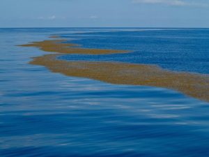
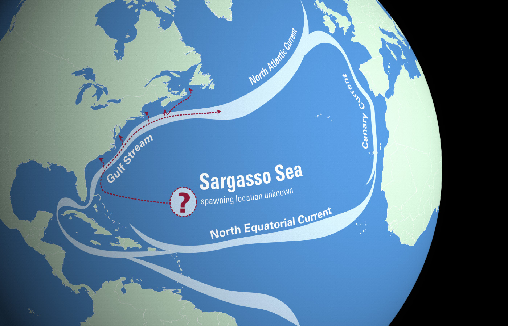

Dünya üzerindeki uzaktan bakıldığında en kolay seçilen, en büyük su kütlelerine okyanus adı veriliyor. Okyanus, tanımı gereği çok belirsiz bir kavram, dolayısıyla dünyanın çeşitli yerlerinde okyanuslar farklı şekillerde sınıflandırılmakta. Denizler ise okyanusların karaların içlerine giren parçaları olarak tanımlanıyor. İnsanlık tarafından tarih boyunca defalarca unutuluyor olsa da, dünya yüzeyindeki tüm su kütleleri karaların boşluklarını dolduran, dünya için oldukça ince bir tabakadan ibaret. Doğal olarak denizler de dahil her su kütlesinin karalarla kıyısı olmak zorunda. Fakat Sargasso Denizi bu tanıma uymamakta.

Sargasso Denizi adı verilen bölge okyanus ortasındaki izole yapısından dolayı, hiçbir karaya kıyısı olmayan deniz olarak adlandırılıyor. Atlantik (Atlas) Okyanusu'nun kuzey kesiminde bulunan, Bermuda Şeytan Üçgeni'nin de bir kısmını kapsayan bu yapı kendine özgü bir yapıya sahip. Çevresinde sürekli olarak dönen akıntılar var ve yoğun şekilde Sargassum adlı kahverengi algleri, yani su yosunlarını barındırıyor. Okyanus akıntıları bölgeyi izole ediyor ve bölge kendine özgü ekosistemini korumaya devam ediyor. Saat yönünde dönen okyanus akıntılarının çevrelediği bu bölge görece durgun bir yapıya sahip. Batıda Körfez Akıntısı, kuzeyde Kuzey Atlantik Akıntısı, doğuda Kanarya Akıntısı ve güneyde Kuzey Ekvator Akıntısı ile çevrelenmekte. Kuzey Atlantik sert soğuk bir iklime sahip olsa da, burası enteresan bir şekilde sıcak.

### Sargasso Denizi ve Coğrafi Keşifler

Bütün bu özelliklerinden dolayı yolu bu coğrafyaya düşen denizciler çok zor durumda kalıyor. Kuzey Amerika'nın hemen doğusunda büyük bir alan kapladığından dolayı ilk olarak Kristof Kolomb ve tayfası tarafından, Coğrafi Keşifler sırasında gözlendi. 1492 yılında ilk kez Amerika kıtasına gitmek için yelken açan mürettebat, bu bölgenin içine girene kadar neyle karşı karşıya olduğunu bilmiyordu. Bölgenin yüzeyi [algler](https://sabahlatan.com/blog/etiket/algler/)le kaplı olduğundan karaya yaklaştıklarını düşünmüşlerdi.

Elbette buraya kıyısız deniz demek mantıken mümkün değil, çünkü kıyı tanımı direkt olarak içinde kara kavramını barındırır. Fakat literatüre bu şekilde girmiş durumda ve karşılaşacağınız kaynaklarda veya sorularda bu özelliğine vurgu yapıldığını görmeniz mümkün. Tüm bu nedenlerden dolayı bu bölgeye dünyadaki kıyısız tek deniz diyebiliriz.
