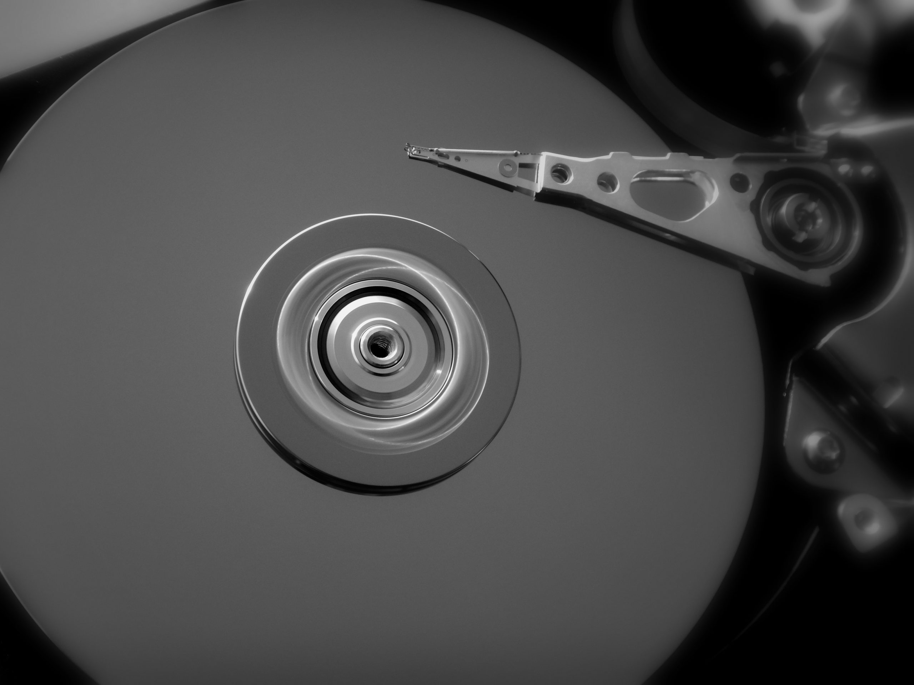

Uzun zaman oldu bir şeyler yazmayalı, değil mi? Bu yazıda bilgisayarların ve akıllı cihazların dosya silme ve silinen dosyalar mevzusuna nasıl baktığını inceleyelim. Öncelikle bilgisayarlar ve akıllı cihazlar dememin tek nedeni daha anlaşılır olabilmesi, yoksa iki ayrı cihazdan bahsetmiyorum. Akıllı telefonlar veya tabletler de birer bilgisayardır. İşlemci mimarileri farklı olsa da, genel bilgisayar yapısı olarak aynı mimariye sahiptirler. Bu konu hakkında başka bir yazı yazarız, şimdi dosya silme konusuna dalalım. Elbette bu yazıda konuyu daha teorik ve genel bir şekilde anlatacağım fakat duruma göre var olan sistemlerden örnekler de verebiliriz.

Cihazınız üzerinden silinen dosyaların geri getirilebilmesini sağlayan programlar veya uygulamalar görmüş olabilirsiniz. Umarım bunun nasıl olduğunu merak etmişsinizdir. Bunu anlayabilmek için dijital silme konusuna daha farklı bir açıdan bakmak gerekiyor. Bir verinin yok edilebilmesi için üstüne başka bir veri yazılması gerekir. Bu, bilinçli olarak yapıldığında gerçek anlamda silmeye en yakın eylem denebilir. Kimi işletim sistemleri ve yazılımlar ek bir seçenek olarak bunu "derin silme" gibi adlarla kullanıcıya sunabiliyor. Anlaşıldığı üzere bu, işlem gücü açısından ekstra maliyetli bir yol. İşletim sistemleri genel olarak, dosyanın geri getirilmek istenmeyeceğini varsayarak hareket eder. Silinen dosyalarının gerçek anlamda silinmemesi işletim sistemlerinin dosya sistemi yapılarının [teknolojik](https://sabahlatan.com/blog/kategori/teknoloji/) olarak buna göre oluşturulmuş olmasından kaynaklı.

### Dosya ve Klasör Kavramları Aslında Düşündüğünüzden Çok Farklı

Dosya ve klasör dediğimiz yapılar aslında tek parça halinde, bir bütün olarak diskte saklanmaz. İşletim sistemleri dosyayı ve klasörü diski gezerek bulmaz, veya bulduğu dosyanın adresini not etmez. Sistem aslında ters yönde çalışır. İşletim sistemi bir dosya oluşturulduğunda, onun adını ve diğer tanımlayıcı bilgilerini dosyaların çeşitli bilgilerinin tutulduğu bir tabloya kaydeder. Daha önceden elindeki tabloya göre dosyaların yerini ve boyutunu belirlemiş olan işletim sistemi, bu sayede yeni dosya için disk üzerinde nerenin boş olduğuna bakarak o dosyayı oraya konumlandırır. Dosyanın diskteki adresi ve boyut gibi bilgileri tabloda tutulur ve işletim sistemi dosyaya ulaşmak için artık bu tablodan adresi bulacak, o adrese giderek dosyanın boyutu kadar veri okuyacaktır. Silinen dosya ise aslında bilgileri tablodan silinmiş olan dosyadan ibarettir. Artık adresi ve boyutu olmadığı için işletim sistemleri ve dosya yönetme uygulamaları için varlığı da yoktur.

Klasörler ise farklı dosyaların ve yolların birbirleriyle ilişkilendirildiği bir tablo verisinden ibarettir. Klasörler tamamen soyuttur, fiziksel olarak bir varlığından söz edilemez. Bu yüzden çoğu dosyaların geri getirilebilmesini sağlayan recover uygulaması klasörleri, dolayısıyla yolları bulamaz.

### Dosya Sistemleri

Dosya sistemleri birbirinden çok farklı şekillerde çalışabilir ve örneğin bir dosyayı parçalar halinde diskin farklı kısımlarında Voldemort gibi saklayabilir. O an hangi durum uygunsa ona göre hareket edecektir. Tabloda da buna göre tutacak ve gerektiğinde dosyaya bu şekilde ulaşacaktır. Windows'ta yer alan Disk Birleştirici gibi programlar, dosyaları saçıldıkları bu yerlerden alır ve düzgün bir sıraya koyup tek parça haline gelmesini sağlarlar. Parçalı dosyalar her zaman düzenli bir şekilde tutulamayacağı için, diske tam olarak sığamama gibi sorunlar doğabileceği için aralarında boşluklar oluşabilir. Bu ise, diskte kullanılamayan ve boş duran alanlar oluşturur. Bundan dolayı bu tip disk birleştirmeler dosyalara daha hızlı ulaşmayı ve disk alanını daha verimli kullanmayı sağlar, boş disk alanınız artabilir.

Burada önemli olan nokta, diskin bir bölümünde anlamlı sayılabilecek veriler yazılı olsa da dosya tablosunda adresi yer almadığı takdirde hiçbir anlamı olmadığıdır. İşletim sistemi tabloda olmayan her kısmı boş kabul eder. Bu yüzden diski boşaltmak diye bir tabir yoktur. Diskler, teknolojisine göre farklı çalışsa da, dosyaları saklama biçimleri temelde aynıdır. İçlerinde bulunan, veri taşıyan en küçük birimlerinin değeri değiştirilir. Örneğin genelde 0 ve 1 için birer durum vardır ve diskte bunları temsil edecek olan binlerce, milyonlarca ve milyarlarca bölümün değeri dosyanın içeriğine göre değiştirilir. Dolayısıyla temel olarak diskin boş durumu olamayacağı gibi, diski boşaltmanın da teoride bir yolu yoktur. Dosya tablosu olmadığı takdirde disk zaten boş sayılacaktır.

### Dosyaları Kalıcı Olarak Silmek

Pratikte ise tüm diske herhangi anlam taşımayan veriler yazılabilir ve eski verilere ulaşılamaması sağlanabilir. Örneğin tüm disk sıfırlarla veya rastgele sayılarla doldurulabilir. Bunu, GNU/Linux dağıtımları gibi işletim sistemlerinde sunulan yapılar sayesinde kendiniz de rahatça yapabilirsiniz. Derin silme yapan uygulamaların yaptığı da budur, birkaç defa eski dosyanın üzerine yazarlar ve önceki verinin ulaşılmaz hale gelmesini sağlarlar. Birkaç defa olmasının nedeni ise fiziksel etkiler. Örneğin harddiskler manyetik olarak durumu değiştirilen yapılar ile verileri tutar. Bu yüzden gerçekten iyi bir şekilde izi sürülürse, eski verinin gölgesine ulaşılabilir.

### Silinen Dosyalar Nasıl Geri Getirilir

Buraya kadar bir çıkarımda bulunmuşsunuzdur, fakat yine de üzerinden geçelim. Silinen dosyaları geri getiren uygulamalar, tablo olmaksızın diskte anlamlı veriler bulabilmek için diski tarar. Dosyaları header bilgilerine göre ve dosya türlerinin tipik özelliklerine göre seçmeye çalışır. Header bilgileri dosyanın en başında bulunan ve dosyanın türünü ve özelliklerini belirleyen kısımdır ve dosya için çok önemlidir. Eğer dosyanın bir kısmının üzerine yazılmışsa, o dosya bozuk halde gelir. Bu tür uygulamaların çoğu zaman resimleri bozulmuş, bir kısmı gri renge bürünmüş bir şekilde getirmesinin nedeni de budur.

#### İlgili Draje

>  
> 
> View this post on Instagram
> 
>  
> 
> [Silinmeyen dosyalar . . #sabahlatan #sabahlatandraje #bilim #bilgisayar #bilişim #bilgi #bilişim #donanım #yazılım #tuhaf #enteresan #turkish #türkçe #ilginç #ilginçbilgiler](https://www.instagram.com/p/B-hZFqrh4sN/?utm_source=ig_embed&utm_campaign=loading)
> 
> A post shared by [Sabahlatan](https://www.instagram.com/sabahlatan/?utm_source=ig_embed&utm_campaign=loading) (@sabahlatan) on Apr 3, 2020 at 7:16am PDT

