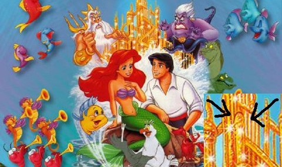
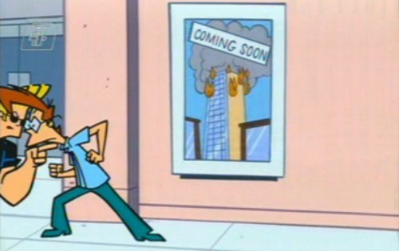

Teknoloji ve film sektörünün gelişmesiyle beraber görüntü teknikleri de zamanla gelişti. Bunlardan biri olan subliminal mesaj insanı kalıcı olarak etkileyebilen bir tekniktir. Subliminal mesaj; bilinçaltını etkileyen gizli mesajlardır diyebiliriz. Ses veya görüntülerle çok kısa bir şekilde bilinçaltına bir mesaj gönderilebilir. Bilinçaltına gönderilen bu mesajlar insan hayatını, karakterini etkileyecek bir şekilde kalıcılaşır.

#### Peki ya bilinçaltı nedir?

Bilinçaltı buz dağının altıdır. Bilinçaltı hayatımızın her anıdır. Biz farkında olmadan çalışır. Beş duyumuzla algıladığımız her şeyi kaydeder. Biz farkında olmasak bile o sürekli çalışır. Örnek vermek gerekirse; 2,3 ya da 4 yaşlarında bir köpeğin saldırısına uğradınız diyelim. Bunu hatırlamazsınız. Ancak bu yaşadığınız olayın ses ve görüntüleri bilinçaltına kazınır ve orada bir korku olarak kalır. İlerleyen yaşlarda eğer sebepsiz yere bir köpekten korkuyorsanız sebebi aslında budur. Bilinçaltına kazınan köpek korkusudur. Ayrıca bilinçaltı günümüzde hala sırrı çözülemeyen bir durumdur. Bilinçaltına kazınan bir olayı hatırlamazsınız. Ancak onlar sizi yine de etkiler. Bilinçaltına yönelik mesajlar bu yüzden tehlikelidir. Yani subliminal mesaj görüntüsünü göz görür, beyin algılar ancak bu görüntünün geçişi çok hızlı olduğu için siz fark edemezsiniz. Bu yöntemle 25. Kare tekniği uygulanır.

#### 25\. Kare Tekniği Nedir?

Anlık bir görüntü 24 küçük kareden oluşur. 25. kare fark edemediğimiz ancak beynin algıladığı ve bilinçaltına kazınan daha hızlı geçen yani flaş gibi patlayan bir karedir. Yani 25. kareye herhangi bir görüntü yerleştirdiğinizde o görüntü fark edilmez ancak beyin algılar ve bilinçaltına yerleşir. Bu yöntemi kullananlar bu 25. kareye genellikle cinsellik içeren mesajlar yerleştirirler. Bunun tehlikeli boyutu ise cinsellik içere bu subliminal mesajların genellikle çizgi filmlerde olmasıdır. Dikkatli olarak bu çizgi filmlere baktığınız da bunu fark edebilirsiniz. Çokça cinsellik içeren subliminal mesaj çocukların izlemesi için yapılmıştır. Çünkü çocukların eğilimi bu yönde olursan karakterleri de bu yönde gelişir.

20\. yüzyılda geliştirilen bu teknik yasaklanmış olmasına rağmen bir çok film, çizgi film, diziler, reklamlarda mevcuttur. Sadece cinsellik değil ekonomik ve ideolojik amaçlar içinde kullanılmaktadır. Reklamlarda kullanılarak satışların arttırılması dahi yapılmıştır. Sinemalarda kullanılarak da ürün satışı yapılmıştır. Bir örnek daha vermek gerekirse 11 Eylül olaylarından önce pek çok filmde kulelerin yıkıldığı subliminal mesajlar ile gösterilmiştir.

#### Çocuklara Yönelik Cinsel İçerikli Subliminal Mesaj

Çocuklar için düzenlemiş bu çizgi filmlerdeki subliminal mesajlar yetişkinlerin dahi fark edemeyeceği bir durumdur. Bu yüzden kolaylıkla çocuklara bu tür cinsellik içeren subliminal mesajlar verilmektedir.

,

**11 Eylül saldırılarından önceki bazı film ve çizgi filmlerde ilginç noktalar fark edildi.**

**Örneğin 1999 yılında  vizyona giren Matrix adlı filmde 11 eylül saldırılarının tarihinin yazılması gibi.** 

**Nisan 2001 tarihinde yayınlanan Johnny Bravo adlı çizgi filmin bu bölümünde ikiz kulelerin vurulduğunun resmedilmiş olması**

Bunlara benzer pek çok film, çizgi film, reklam, dergi ve ya afiş bulunmaktadır. Subliminal mesaj günümüzün en iyi sinema tekniği konumundadır.
